---
# Generert fra Google Slides-decket "Paragliding i himalaya" av
# _source/build_qmd.py. All geometri er i EMU (lerret 9144000 x 5143500).
# Annotasjonene ligger som inline <svg viewBox="0 0 9144000 5143500">, sa
# tallene er raa EMU: en sirkel flyttes ved aa endre ett tall.
title: "Paragliding i himalaya"
author: "Simen Eide"
lang: no
comments: false
html-math-method: plain
resources:
  - video/
  # poster= spores ikke av Quarto sin ressursjakt slik src= gjoer, saa
  # plakatbildene maa listes eksplisitt for aa havne i docs/.
  - img/poster-*.jpg
# Slide 1 er selve tittelsliden, sa Quarto sin auto-genererte skjules.
title-slide-attributes:
  data-visibility: hidden
format:
  revealjs:
    theme: default
    css: custom.css
    slide-number: true
    width: 1280
    height: 720
    margin: 0
    min-scale: 0.2
    max-scale: 2.0
    transition: fade
    auto-stretch: false
    controls: true
    progress: true
    hash: true
    include-after-body: video-fallback.html
---

##

<!-- slide 01 -->

```{=html}
<div class="gslide">
<div class="fr" style="left:50.0000%;top:0.0000%;width:50.0000%;height:100.0000%">

</div>
<div class="fr" style="left:0.0000%;top:0.0000%;width:50.0000%;height:100.0000%">

</div>
<div class="tb slab title centered anchor-bottom" style="left:0.0000%;top:20.6046%;width:96.2762%;height:38.0636%;font-size:49.8px;color:#ff5722">
<p style="font-size:71.1px">Paragliding i himalaya</p>
</div>
</div>
```

##

<!-- slide 02 -->

```{=html}
<div class="gslide">
<div class="fr" style="left:17.2308%;top:0.0000%;width:65.5385%;height:100.0000%">
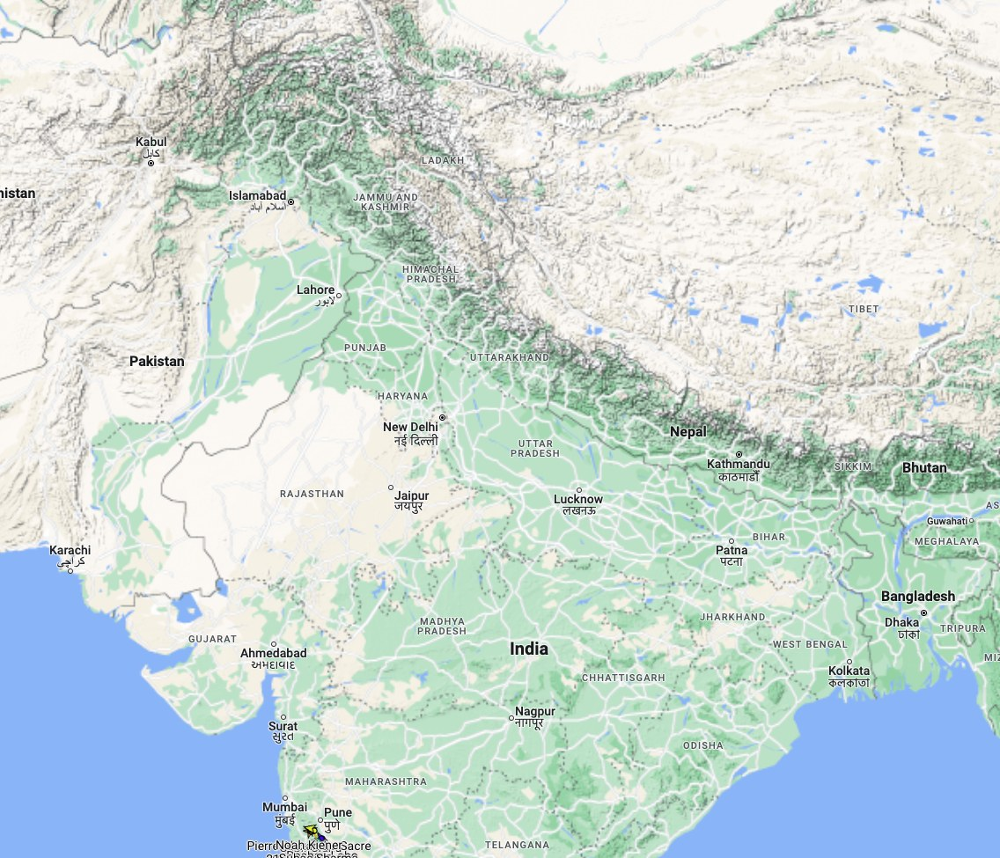
</div>
</div>
```

##

<!-- slide 03 -->

```{=html}
<div class="gslide">
<div class="fr" style="left:17.2308%;top:0.0000%;width:65.5385%;height:100.0000%">

</div>
<svg class="ann" viewBox="0 0 9144000 5143500" preserveAspectRatio="none">
<defs>
<marker id="ah3_0" viewBox="0 0 5 4" refX="4.4" refY="2" markerWidth="5" markerHeight="4"
        markerUnits="strokeWidth" orient="auto"><path d="M0,0 L5,2 L0,4 z" fill="#ff0000"/></marker>
<marker id="as3_0" viewBox="0 0 5 4" refX="0.6" refY="2" markerWidth="5" markerHeight="4"
        markerUnits="strokeWidth" orient="auto"><path d="M5,0 L0,2 L5,4 L3.8,2 z" fill="#ff0000"/></marker>
</defs>
  <ellipse cx="4156425" cy="1655475" rx="301050" ry="265200" fill="none" stroke="#ff0000" stroke-width="76200"/>
</svg>
</div>
```

##

<!-- slide 04 -->

```{=html}
<div class="gslide">
<div class="fr" style="left:0.0000%;top:-0.0000%;width:100.0000%;height:100.3602%">

</div>
</div>
```

##

<!-- slide 05 -->

```{=html}
<div class="gslide">
<div class="fr" style="left:0.0000%;top:-2.5328%;width:103.4104%;height:122.5303%">
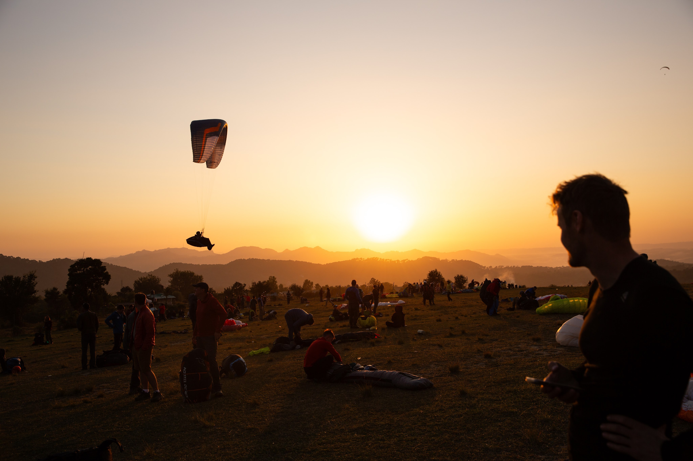
</div>
</div>
```

##

<!-- slide 06 -->

```{=html}
<div class="gslide">
<div class="fr" style="left:0.0000%;top:0.0000%;width:112.5437%;height:100.0000%">
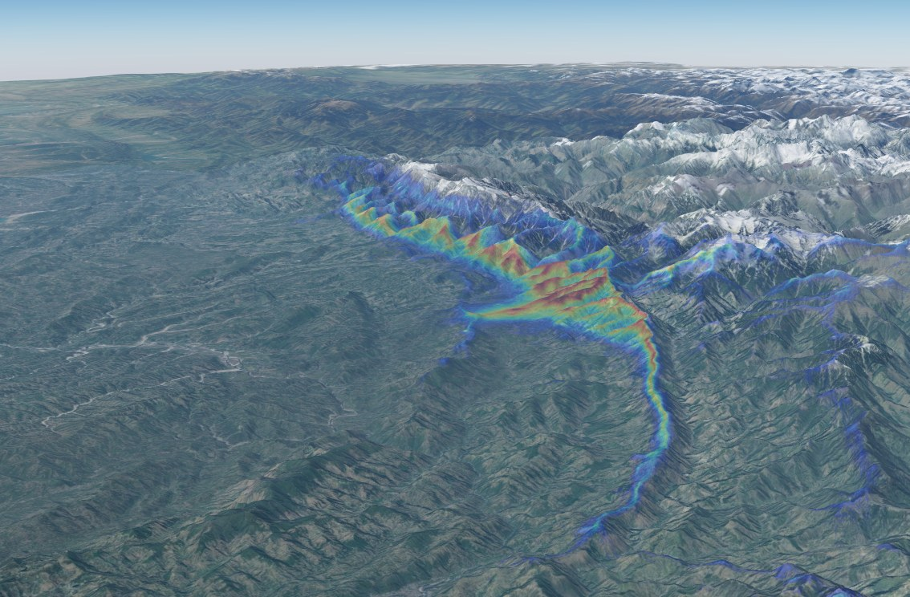
</div>
<div class="tb slab body" style="left:3.4941%;top:82.3121%;width:65.6037%;height:11.6419%;font-size:32.0px;color:#ff5722">
<p style="font-size:53.3px">Flying on the front ridge</p>
</div>
</div>
```

##

<!-- slide 07 -->

```{=html}
<div class="gslide">
<div class="fr" style="left:0.0000%;top:0.0000%;width:112.5437%;height:100.0000%">

</div>
<div class="tb slab body" style="left:3.4941%;top:82.3121%;width:65.6037%;height:11.6419%;font-size:32.0px;color:#ff5722">
<p style="font-size:53.3px">Flying on the front ridge</p>
</div>
<svg class="ann" viewBox="0 0 9144000 5143500" preserveAspectRatio="none">
<defs>
<marker id="ah7_0" viewBox="0 0 5 4" refX="4.4" refY="2" markerWidth="5" markerHeight="4"
        markerUnits="strokeWidth" orient="auto"><path d="M0,0 L5,2 L0,4 z" fill="#ff0000"/></marker>
<marker id="as7_0" viewBox="0 0 5 4" refX="0.6" refY="2" markerWidth="5" markerHeight="4"
        markerUnits="strokeWidth" orient="auto"><path d="M5,0 L0,2 L5,4 L3.8,2 z" fill="#ff0000"/></marker>
</defs>
  <ellipse cx="6813875" cy="2412700" rx="301050" ry="265200" fill="none" stroke="#ff0000" stroke-width="76200"/>
</svg>
</div>
```

##

<!-- slide 08 -->

```{=html}
<div class="gslide">
<div class="fr" style="left:50.0000%;top:0.0000%;width:50.0000%;height:100.0000%">

</div>
<div class="fr" style="left:0.0000%;top:0.0000%;width:50.0000%;height:100.0000%">
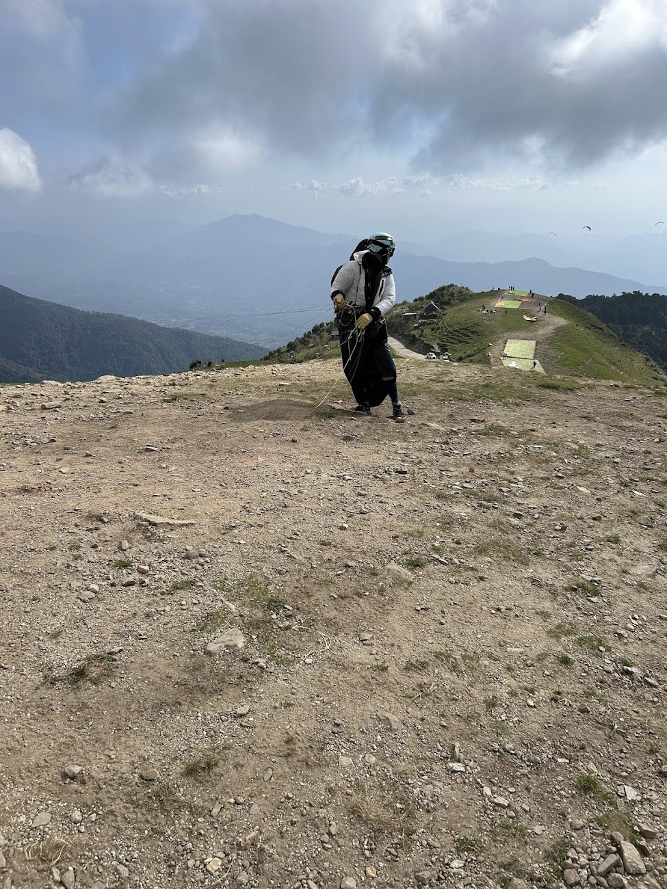
</div>
</div>
```

##

<!-- slide 09 -->

```{=html}
<div class="gslide">
<video class="vid" style="left:0.0000%;top:0.0000%;width:100.0000%;height:100.0000%" src="video/slide09.mp4"
       poster="img/poster-slide09.jpg"
       controls preload="metadata" playsinline></video>
</div>
```

##

<!-- slide 10 -->

```{=html}
<div class="gslide">
<div class="fr" style="left:50.0000%;top:0.0000%;width:50.0000%;height:100.0000%">

</div>
<div class="fr" style="left:0.0000%;top:0.0000%;width:50.0000%;height:100.0000%">
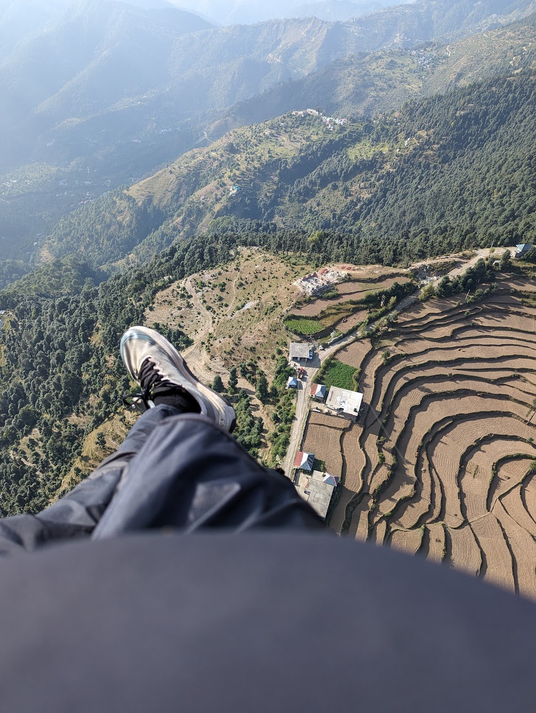
</div>
</div>
```

##

<!-- slide 11 -->

```{=html}
<div class="gslide">
<div class="fr" style="left:0.0000%;top:0.0000%;width:100.0000%;height:100.0000%">

</div>
<div class="tb slab title" style="left:3.4088%;top:8.6522%;width:93.1824%;height:11.1344%;font-size:49.8px;color:#ff5722">
<p>Første flycamping</p>
</div>
</div>
```

##

<!-- slide 12 -->

```{=html}
<div class="gslide">
<div class="fr" style="left:0.0000%;top:0.0000%;width:112.5437%;height:100.0000%">

</div>
<svg class="ann" viewBox="0 0 9144000 5143500" preserveAspectRatio="none">
<defs>
<marker id="ah12_0" viewBox="0 0 5 4" refX="4.4" refY="2" markerWidth="5" markerHeight="4"
        markerUnits="strokeWidth" orient="auto"><path d="M0,0 L5,2 L0,4 z" fill="#ff0000"/></marker>
<marker id="as12_0" viewBox="0 0 5 4" refX="0.6" refY="2" markerWidth="5" markerHeight="4"
        markerUnits="strokeWidth" orient="auto"><path d="M5,0 L0,2 L5,4 L3.8,2 z" fill="#ff0000"/></marker>
</defs>
  <ellipse cx="6780750" cy="2396125" rx="301050" ry="265200" fill="none" stroke="#ff0000" stroke-width="76200"/>
  <line x1="6780750" y1="2140611" x2="8580750" y2="1765611" stroke="#ff0000" stroke-width="38100" stroke-dasharray="114300 76200" marker-end="url(#ah12_0)"/>
</svg>
</div>
```

##

<!-- slide 13 -->

```{=html}
<div class="gslide">
<div class="fr" style="left:16.5518%;top:0.0000%;width:66.8963%;height:100.0000%">
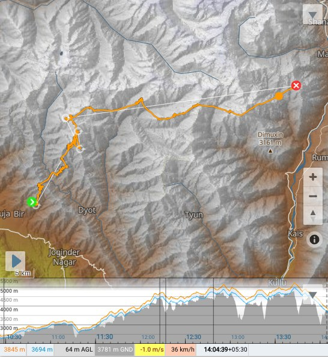
</div>
</div>
```

##

<!-- slide 14 -->

```{=html}
<div class="gslide">
<div class="fr" style="left:16.5518%;top:0.0000%;width:66.8963%;height:100.0000%">

</div>
<svg class="ann" viewBox="0 0 9144000 5143500" preserveAspectRatio="none">
<defs>
<marker id="ah14_0" viewBox="0 0 5 4" refX="4.4" refY="2" markerWidth="5" markerHeight="4"
        markerUnits="strokeWidth" orient="auto"><path d="M0,0 L5,2 L0,4 z" fill="#ff0000"/></marker>
<marker id="as14_0" viewBox="0 0 5 4" refX="0.6" refY="2" markerWidth="5" markerHeight="4"
        markerUnits="strokeWidth" orient="auto"><path d="M5,0 L0,2 L5,4 L3.8,2 z" fill="#ff0000"/></marker>
</defs>
  <ellipse cx="2622875" cy="3174700" rx="301050" ry="265200" fill="none" stroke="#ff0000" stroke-width="76200"/>
</svg>
</div>
```

##

<!-- slide 15 -->

```{=html}
<div class="gslide">
<div class="fr" style="left:0.0000%;top:-0.0000%;width:100.0000%;height:100.0000%">
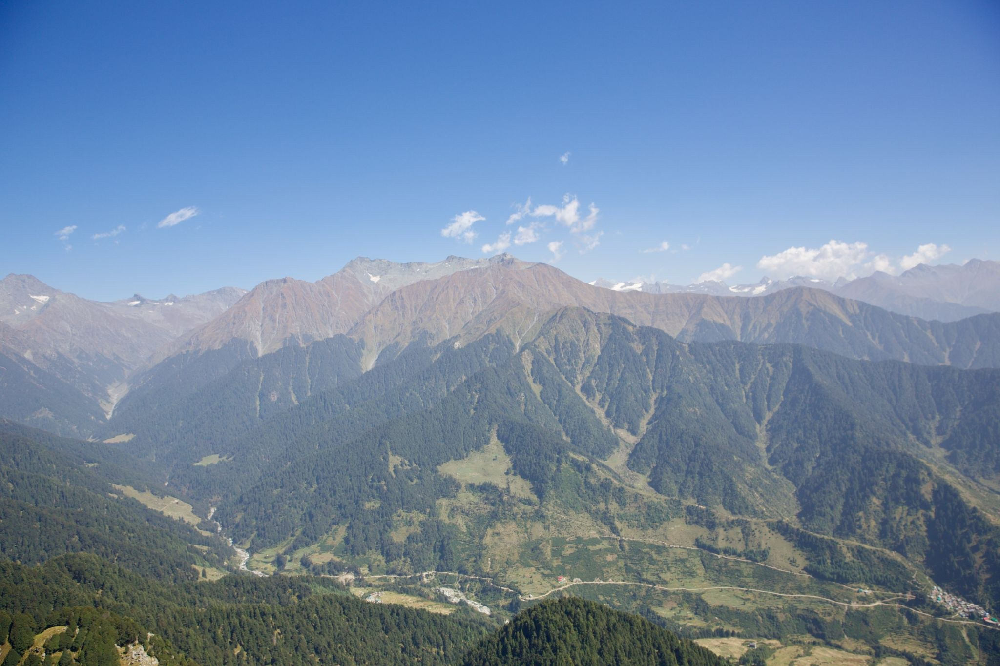
</div>
</div>
```

##

<!-- slide 16 -->

```{=html}
<div class="gslide">
<div class="fr" style="left:16.5518%;top:0.0000%;width:66.8963%;height:100.0000%">

</div>
<svg class="ann" viewBox="0 0 9144000 5143500" preserveAspectRatio="none">
<defs>
<marker id="ah16_0" viewBox="0 0 5 4" refX="4.4" refY="2" markerWidth="5" markerHeight="4"
        markerUnits="strokeWidth" orient="auto"><path d="M0,0 L5,2 L0,4 z" fill="#ff0000"/></marker>
<marker id="as16_0" viewBox="0 0 5 4" refX="0.6" refY="2" markerWidth="5" markerHeight="4"
        markerUnits="strokeWidth" orient="auto"><path d="M5,0 L0,2 L5,4 L3.8,2 z" fill="#ff0000"/></marker>
</defs>
  <ellipse cx="2923850" cy="2571750" rx="301050" ry="265200" fill="none" stroke="#ff0000" stroke-width="76200"/>
</svg>
</div>
```

##

<!-- slide 17 -->

```{=html}
<div class="gslide">
<video class="vid" style="left:0.0000%;top:0.0000%;width:100.0000%;height:100.0000%" src="video/slide17.mp4"
       poster="img/poster-slide17.jpg"
       controls preload="metadata" playsinline></video>
</div>
```

##

<!-- slide 18 -->

```{=html}
<div class="gslide">
<div class="fr" style="left:0.0000%;top:0.0000%;width:100.0000%;height:100.0000%">
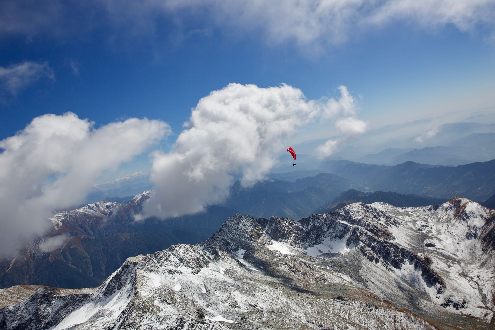
</div>
</div>
```

##

<!-- slide 19 -->

```{=html}
<div class="gslide">
<div class="fr" style="left:16.5518%;top:0.0000%;width:66.8963%;height:100.0000%">

</div>
<svg class="ann" viewBox="0 0 9144000 5143500" preserveAspectRatio="none">
<defs>
<marker id="ah19_0" viewBox="0 0 5 4" refX="4.4" refY="2" markerWidth="5" markerHeight="4"
        markerUnits="strokeWidth" orient="auto"><path d="M0,0 L5,2 L0,4 z" fill="#ff0000"/></marker>
<marker id="as19_0" viewBox="0 0 5 4" refX="0.6" refY="2" markerWidth="5" markerHeight="4"
        markerUnits="strokeWidth" orient="auto"><path d="M5,0 L0,2 L5,4 L3.8,2 z" fill="#ff0000"/></marker>
</defs>
  <ellipse cx="5016300" cy="2077750" rx="745350" ry="386550" fill="none" stroke="#ff0000" stroke-width="76200"/>
</svg>
</div>
```

##

<!-- slide 20 -->

```{=html}
<div class="gslide">
<div class="fr" style="left:0.0000%;top:0.0000%;width:100.0000%;height:100.0000%">

</div>
</div>
```

##

<!-- slide 21 -->

```{=html}
<div class="gslide">
<div class="fr" style="left:0.0000%;top:0.0000%;width:100.0000%;height:100.0000%">

</div>
<div class="scrim" style="left:0.0000%;top:0.0000%;width:100.0000%;height:100.0000%;background:#bebebee3"></div>
<div class="tb sans body" style="left:52.8478%;top:22.4064%;width:43.7434%;height:66.4217%;font-size:24.9px;color:#666666">
<ul>
<li style="font-size:24.9px">Vær forberedt<br>&nbsp;</li>
<li style="font-size:24.9px">Ha med riktig utstyr<br>&nbsp;</li>
<li style="font-size:24.9px">Buddysystem<br>&nbsp;</li>
<li style="font-size:24.9px">Satelittkommunikasjon<br>&nbsp;</li>
<li style="font-size:24.9px"><strong>Større marginer</strong></li>
</ul>
</div>
<div class="tb slab title" style="left:3.4088%;top:8.6522%;width:93.1824%;height:11.1344%;font-size:49.8px;color:#ff5722">
<p>Flyging uten infrastruktur</p>
</div>
<div class="tb sans body" style="left:3.4088%;top:22.4064%;width:43.7434%;height:66.4217%;font-size:32.0px;color:#666666;padding-left:78px">
<ul>
<li style="font-size:24.9px">Høydesyke<br>&nbsp;</li>
<li style="font-size:24.9px">Få landingsalternativer<br>&nbsp;</li>
<li style="font-size:24.9px">Topplanding<br>&nbsp;</li>
<li style="font-size:24.9px">Ingen pub på landing<br>&nbsp;</li>
<li style="font-size:24.9px">Nødskjerm/ankelbrudd<br>&nbsp;</li>
<li style="font-size:24.9px">Må sette deg i situasjoner du ikke vil gjort hjemme<br>&nbsp;</li>
</ul>
</div>
</div>
```

::: {.notes}
Flyteknisk  ganske likt, meeen:\
Floor is lava\
Risiko snus på hodet, du gjør ting i lufta du ikke ville gjort om du kunne landet og tatt en taxi til pubben\
Eksempler: Skru 500m i sky, skru i (skikkelig) turbulent leside, fly i regn\
Alltid mer “basismargin” fordi konsekvens er større\
Skysug (det pleier å gå fint)\
“Derfor bør du ha gode distanseskills og mulighet til å endre plan underveis”
:::

##

<!-- slide 22 -->

```{=html}
<div class="gslide">
<video class="vid" style="left:0.0000%;top:-0.0000%;width:100.0000%;height:100.0000%" src="video/slide22.mp4"
       poster="img/poster-slide22.jpg"
       controls preload="metadata" playsinline></video>
</div>
```

##

<!-- slide 23 -->

```{=html}
<div class="gslide">
<div class="fr" style="left:16.5518%;top:0.0000%;width:66.8963%;height:100.0000%">

</div>
<svg class="ann" viewBox="0 0 9144000 5143500" preserveAspectRatio="none">
<defs>
<marker id="ah23_0" viewBox="0 0 5 4" refX="4.4" refY="2" markerWidth="5" markerHeight="4"
        markerUnits="strokeWidth" orient="auto"><path d="M0,0 L5,2 L0,4 z" fill="#ff0000"/></marker>
<marker id="as23_0" viewBox="0 0 5 4" refX="0.6" refY="2" markerWidth="5" markerHeight="4"
        markerUnits="strokeWidth" orient="auto"><path d="M5,0 L0,2 L5,4 L3.8,2 z" fill="#ff0000"/></marker>
</defs>
  <ellipse cx="7028875" cy="1605625" rx="353100" ry="386550" fill="none" stroke="#ff0000" stroke-width="76200"/>
</svg>
</div>
```

::: {.notes}
DAGFINN TAR LANDING: tissehistorie og reidar
:::

##

<!-- slide 24 -->

```{=html}
<div class="gslide">
<div class="fr" style="left:0.0000%;top:-0.0000%;width:100.0000%;height:100.0000%">
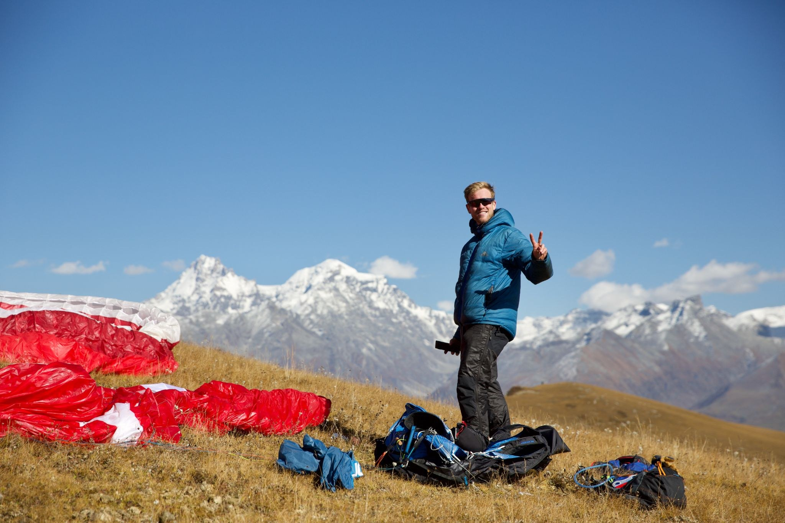
</div>
</div>
```

##

<!-- slide 25 -->

```{=html}
<div class="gslide">
<div class="fr" style="left:-0.0000%;top:-9.2447%;width:100.0000%;height:118.4894%">
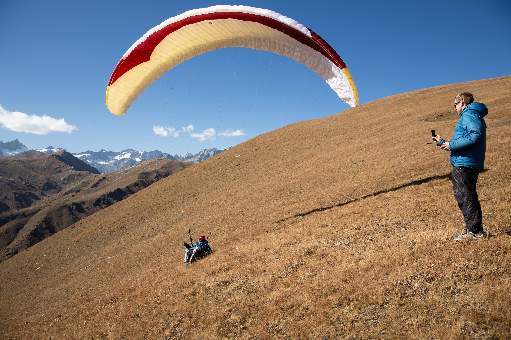
</div>
</div>
```

##

<!-- slide 26 -->

```{=html}
<div class="gslide">
<div class="fr" style="left:-0.0000%;top:-9.2447%;width:100.0000%;height:118.4894%">
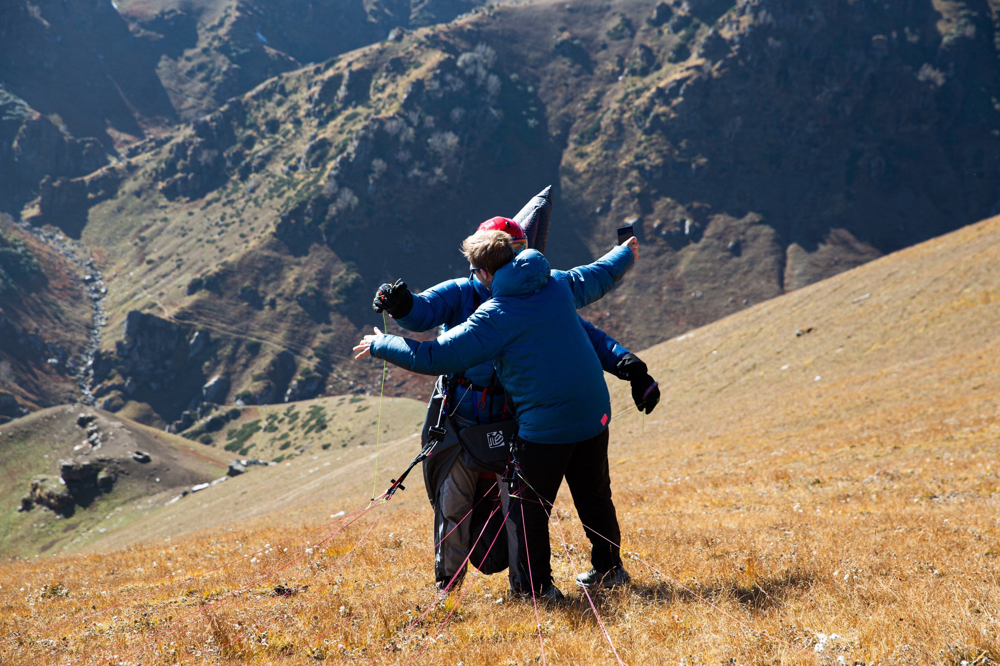
</div>
</div>
```

##

<!-- slide 27 -->

```{=html}
<div class="gslide">
<div class="fr" style="left:0.0000%;top:0.0000%;width:100.0000%;height:100.0000%">
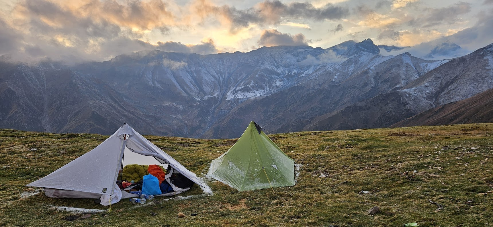
</div>
</div>
```

##

<!-- slide 28 -->

```{=html}
<div class="gslide">
<div class="fr" style="left:0.0000%;top:0.0000%;width:100.0000%;height:100.0000%">

</div>
<div class="scrim" style="left:0.0000%;top:0.0000%;width:100.0000%;height:100.0000%;background:#bebebee3"></div>
<div class="tb slab title" style="left:3.4088%;top:8.6522%;width:93.1824%;height:11.1344%;font-size:49.8px;color:#ff5722">
<p>Camping uten infrastruktur</p>
</div>
<div class="tb sans body" style="left:3.4088%;top:22.4064%;width:43.7434%;height:66.4217%;font-size:32.0px;color:#666666">
<ul>
<li style="font-size:35.6px">Langt fra bilvei (og pub)<br>&nbsp;</li>
<li style="font-size:35.6px">Høydesyke<br>&nbsp;</li>
<li style="font-size:35.6px">Skader<br>&nbsp;</li>
<li style="font-size:35.6px">Ville dyr</li>
</ul>
</div>
<div class="tb sans body" style="left:52.8478%;top:22.4064%;width:43.7434%;height:66.4217%;font-size:32.9px;color:#666666">
<ul>
<li style="font-size:32.9px">Mat og vann for en uke<br>&nbsp;</li>
<li style="font-size:32.9px">Førstehjelp<br>&nbsp;</li>
<li style="font-size:32.9px">Det er når du ikke er der du har planlagt som er problemet<br>&nbsp;</li>
<li style="font-size:32.9px">Det er bare camping(?)<br>&nbsp;</li>
<li style="font-size:32.9px">Neste takeoff</li>
</ul>
</div>
</div>
```

::: {.notes}
God pilot med marginer:\
Topplanding\
Skru i lesider


Floor is lava:\
Flipsiden på hva som skjer når du ikke kan/vil lande.

Når du først er på bakken kan du være skikkelig i villmarka.\
Camping pro mode\
Skadet?\
Simon landet in the back på 4500m ikke akklimatisert.

Pakk for\
Mat og vann for en uke


Satelittkommunikasjon


Marginer
:::

##

<!-- slide 29 -->

```{=html}
<div class="gslide">
<div class="fr" style="left:0.0000%;top:0.0000%;width:100.0000%;height:100.0000%">
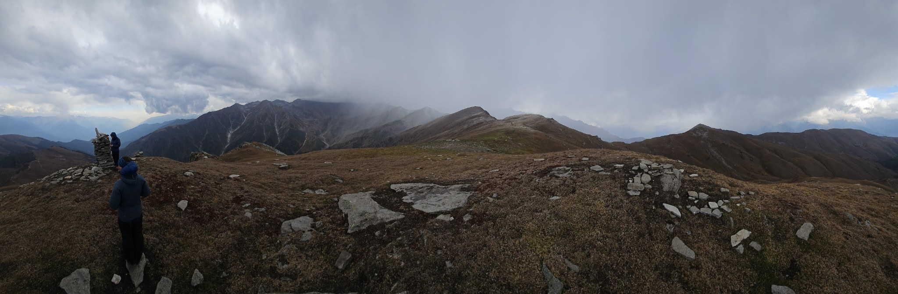
</div>
</div>
```

::: {.notes}
Land i tide: Simon hadde ikke høyde og måtte skru seg opp og landet rett før haglebygen
:::

##

<!-- slide 30 -->

```{=html}
<div class="gslide">
<div class="fr" style="left:0.0014%;top:0.0000%;width:99.9973%;height:100.0000%">
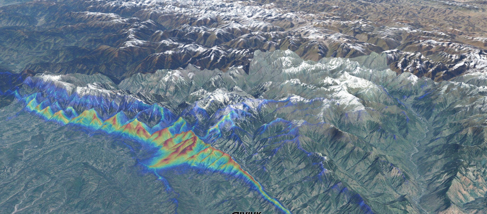
</div>
<div class="tb slab title" style="left:2.4122%;top:84.8197%;width:93.1824%;height:11.1344%;font-size:49.8px;color:#ff5722">
<p>Dag 2: Shikah Beh</p>
</div>
</div>
```

##

<!-- slide 31 -->

```{=html}
<div class="gslide">
<div class="fr" style="left:0.0014%;top:0.0000%;width:99.9973%;height:100.0000%">

</div>
<div class="tb slab title" style="left:2.4122%;top:84.8197%;width:93.1824%;height:11.1344%;font-size:49.8px;color:#ff5722">
<p>Dag 2: Shikah Beh</p>
</div>
<svg class="ann" viewBox="0 0 9144000 5143500" preserveAspectRatio="none">
<defs>
<marker id="ah31_0" viewBox="0 0 5 4" refX="4.4" refY="2" markerWidth="5" markerHeight="4"
        markerUnits="strokeWidth" orient="auto"><path d="M0,0 L5,2 L0,4 z" fill="#ff0000"/></marker>
<marker id="as31_0" viewBox="0 0 5 4" refX="0.6" refY="2" markerWidth="5" markerHeight="4"
        markerUnits="strokeWidth" orient="auto"><path d="M5,0 L0,2 L5,4 L3.8,2 z" fill="#ff0000"/></marker>
</defs>
  <ellipse cx="5159400" cy="1393000" rx="682650" ry="504000" fill="none" stroke="#ff0000" stroke-width="76200"/>
  <line x1="5823625" y1="1554075" x2="7511375" y2="3158300" stroke="#ff0000" stroke-width="38100" stroke-dasharray="1 95250" stroke-linecap="round" marker-start="url(#as31_0)"/>
</svg>
</div>
```

##

<!-- slide 32 -->

```{=html}
<div class="gslide">
<div class="fr" style="left:0.0000%;top:0.0000%;width:66.6908%;height:100.0000%">
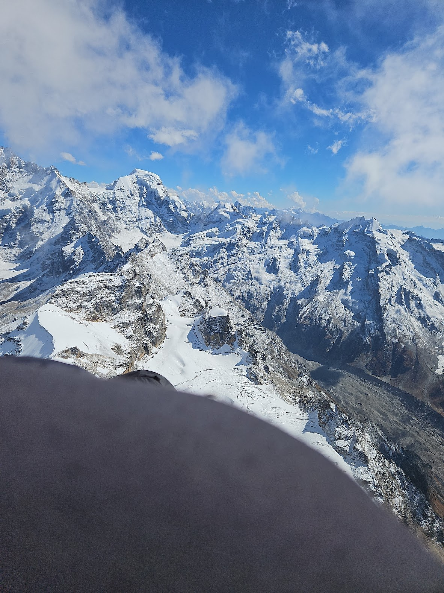
</div>
<video class="vid" style="left:64.7843%;top:0.0000%;width:35.2157%;height:100.0000%" src="video/slide32.mp4"
       poster="img/poster-slide32.jpg"
       controls preload="metadata" playsinline></video>
</div>
```

##

<!-- slide 33 -->

```{=html}
<div class="gslide">
<video class="vid" style="left:0.0000%;top:0.0000%;width:100.0000%;height:100.0000%" src="video/slide33.mp4"
       poster="img/poster-slide33.jpg"
       controls preload="metadata" playsinline></video>
</div>
```

##

<!-- slide 34 -->

```{=html}
<div class="gslide">
<div class="fr" style="left:0.0000%;top:0.0000%;width:100.0000%;height:100.0000%">

</div>
</div>
```

##

<!-- slide 35 -->

```{=html}
<div class="gslide">
<div class="fr" style="left:0.0000%;top:0.0000%;width:100.0000%;height:100.0000%">
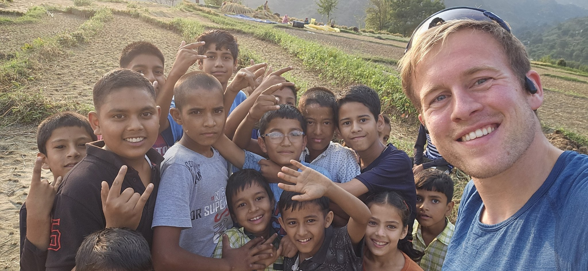
</div>
</div>
```

##

<!-- slide 36 -->

```{=html}
<div class="gslide">
<div class="tb slab title" style="left:3.4088%;top:8.6522%;width:93.1824%;height:11.1344%;font-size:49.8px;color:#ff5722">
<p>Hva skal til for å fly i Himalaya?</p>
</div>
<div class="tb sans body" style="left:3.4088%;top:22.4064%;width:46.5912%;height:66.4217%;font-size:32.0px;color:#666666">
<ul>
<li>Hvem kan gjøre dette?<br>&nbsp;</li>
<li>Hvem kan gjøre dette <strong>trygt</strong>?</li>
</ul>
</div>
</div>
```

::: {.notes}
Dagfinn regi, simen sidekick
:::

##

<!-- slide 37 -->

```{=html}
<div class="gslide">
<div class="fr" style="left:12.6459%;top:0.0000%;width:74.7082%;height:100.0000%">
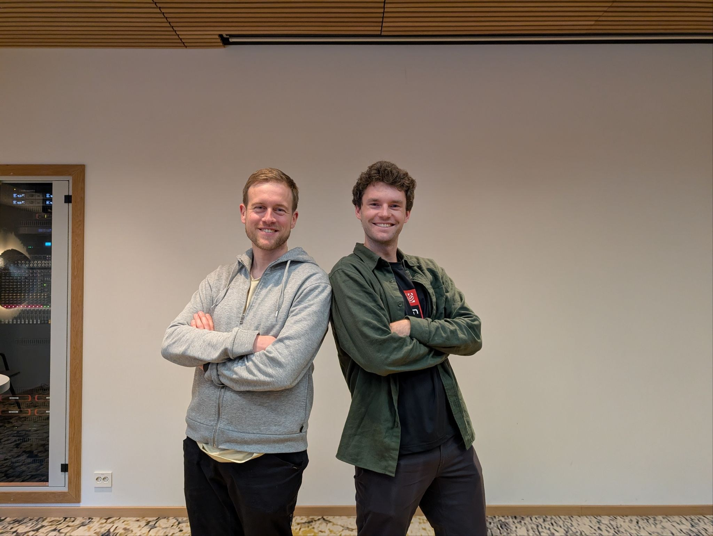
</div>
</div>
```

## {background-color="#ff5722"}

<!-- slide 38 -->

```{=html}
<div class="gslide" style=background:#ff5722>
<div class="tb sans body" style="left:3.4941%;top:82.3121%;width:65.6037%;height:11.6419%;font-size:32.0px;color:#666666">
<p>BONUS</p>
</div>
<div class="tb slab title" style="left:5.3614%;top:10.2333%;width:62.1588%;height:79.5334%;font-size:85.3px;color:#ffffff">
<p style="font-size:85.3px">BONUS</p>
</div>
</div>
```

::: {.notes}
Dagfinn regi, simen sidekick
:::

##

<!-- slide 39 -->

```{=html}
<div class="gslide">
<video class="vid" style="left:-0.0000%;top:0.0000%;width:100.0000%;height:100.0000%" src="video/slide39.mp4"
       poster="img/poster-slide39.jpg"
       controls preload="metadata" playsinline></video>
</div>
```

##

<!-- slide 40 -->

```{=html}
<div class="gslide">
<div class="fr" style="left:0.0014%;top:0.0000%;width:99.9973%;height:100.0000%">

</div>
<div class="tb slab title" style="left:2.4122%;top:84.8197%;width:93.1824%;height:11.1344%;font-size:49.8px;color:#ff5722">
<p>Dag 2: Shikah Beh</p>
</div>
<svg class="ann" viewBox="0 0 9144000 5143500" preserveAspectRatio="none">
<defs>
<marker id="ah40_0" viewBox="0 0 5 4" refX="4.4" refY="2" markerWidth="5" markerHeight="4"
        markerUnits="strokeWidth" orient="auto"><path d="M0,0 L5,2 L0,4 z" fill="#ff0000"/></marker>
<marker id="as40_0" viewBox="0 0 5 4" refX="0.6" refY="2" markerWidth="5" markerHeight="4"
        markerUnits="strokeWidth" orient="auto"><path d="M5,0 L0,2 L5,4 L3.8,2 z" fill="#ff0000"/></marker>
</defs>
  <ellipse cx="5159400" cy="1393000" rx="682650" ry="504000" fill="none" stroke="#ff0000" stroke-width="76200"/>
</svg>
<video class="vid" style="left:25.0000%;top:0.0000%;width:75.0000%;height:100.0000%" src="video/slide40.mp4"
       poster="img/poster-slide40.jpg"
       controls preload="metadata" playsinline></video>
</div>
```

::: {.notes}
Start mot shikah beh
:::

##

<!-- slide 41 -->

```{=html}
<div class="gslide">
<video class="vid" style="left:36.9970%;top:0.0000%;width:26.0060%;height:100.0000%" src="video/slide41.mp4"
       poster="img/poster-slide41.jpg"
       controls preload="metadata" playsinline></video>
</div>
```

##

<!-- slide 42 -->

```{=html}
<div class="gslide">
<video class="vid" style="left:0.0000%;top:0.0000%;width:99.9998%;height:100.0000%" src="video/slide42.mp4"
       poster="img/poster-slide42.jpg"
       controls preload="metadata" playsinline></video>
</div>
```

##

<!-- slide 43 -->

```{=html}
<div class="gslide">
<div class="fr" style="left:0.0014%;top:0.0000%;width:99.9973%;height:100.0000%">

</div>
<div class="tb slab title" style="left:2.4122%;top:84.8197%;width:93.1824%;height:11.1344%;font-size:49.8px;color:#ff5722">
<p>Dag 2: Shikah Beh</p>
</div>
<svg class="ann" viewBox="0 0 9144000 5143500" preserveAspectRatio="none">
<defs>
<marker id="ah43_0" viewBox="0 0 5 4" refX="4.4" refY="2" markerWidth="5" markerHeight="4"
        markerUnits="strokeWidth" orient="auto"><path d="M0,0 L5,2 L0,4 z" fill="#ff0000"/></marker>
<marker id="as43_0" viewBox="0 0 5 4" refX="0.6" refY="2" markerWidth="5" markerHeight="4"
        markerUnits="strokeWidth" orient="auto"><path d="M5,0 L0,2 L5,4 L3.8,2 z" fill="#ff0000"/></marker>
</defs>
  <ellipse cx="5159400" cy="1393000" rx="682650" ry="504000" fill="none" stroke="#ff0000" stroke-width="76200"/>
</svg>
<video class="vid" style="left:64.9305%;top:0.0000%;width:31.6406%;height:100.0000%" src="video/slide43.mp4"
       poster="img/poster-slide43.jpg"
       controls preload="metadata" playsinline></video>
</div>
```

##

<!-- slide 44 -->

```{=html}
<div class="gslide">
<video class="vid" style="left:0.0000%;top:0.0000%;width:100.0000%;height:100.0000%" src="video/slide44.mp4"
       poster="img/poster-slide44.jpg"
       controls preload="metadata" playsinline></video>
</div>
```

##

<!-- slide 45 -->

```{=html}
<div class="gslide">
<video class="vid" style="left:0.0000%;top:0.0000%;width:100.0000%;height:100.0000%" src="video/slide45.mp4"
       poster="img/poster-slide45.jpg"
       controls preload="metadata" playsinline></video>
</div>
```

##

<!-- slide 46 -->

```{=html}
<div class="gslide">
<div class="fr" style="left:0.0000%;top:-18.4893%;width:100.0000%;height:118.4894%">

</div>
<div class="tb slab title" style="left:3.4088%;top:2.3719%;width:93.1824%;height:11.1344%;font-size:49.8px;color:#ff5722">
<p>Oktober 2024?</p>
</div>
</div>
```

##

<!-- slide 47 -->

```{=html}
<div class="gslide">
<div class="tb slab title" style="left:2.4125%;top:6.8810%;width:93.1824%;height:11.1344%;font-size:49.8px;color:#ff5722">
<p>Why Bir?</p>
</div>
<div class="tb sans body" style="left:3.4088%;top:22.4064%;width:46.5912%;height:66.4217%;font-size:32.0px;color:#666666">
<ul>
<li>Sykeste terrenget du noen gang kommer til å fly i<br>&nbsp;</li>
<li>Sesongen er i oktober/nov - hva annet skal du finne på?<br>&nbsp;</li>
<li>Eventyr<br>&nbsp;</li>
<li>Flybilletten er dyr, resten er billig</li>
<li class="l2" style="font-size:24.9px">Middag: 20-60kr</li>
</ul>
</div>
<div class="fr" style="left:53.3333%;top:20.2902%;width:46.6667%;height:55.2952%">

</div>
</div>
```

##

<!-- slide 48 -->

```{=html}
<div class="gslide">
<video class="vid" style="left:0.1710%;top:-0.0000%;width:100.0002%;height:100.0000%" src="video/slide48.mp4"
       poster="img/poster-slide48.jpg"
       controls preload="metadata" playsinline></video>
</div>
```

##

<!-- slide 49 -->

```{=html}
<div class="gslide">
<div class="tb slab title" style="left:2.4125%;top:6.8810%;width:93.1824%;height:11.1344%;font-size:49.8px;color:#ff5722">
<p>Why Bir?</p>
</div>
<div class="tb sans body" style="left:3.4088%;top:22.4064%;width:46.5912%;height:66.4217%;font-size:32.0px;color:#666666">
<ul>
<li>Sykeste terrenget du noen gang kommer til å fly i<br>&nbsp;</li>
<li>Sesongen er i oktober/nov - hva annet skal du finne på?<br>&nbsp;</li>
<li>Eventyr<br>&nbsp;</li>
<li>Flybilletten er dyr, resten er billig</li>
<li class="l2" style="font-size:24.9px">Middag: 20-60kr</li>
</ul>
</div>
<div class="fr" style="left:53.3333%;top:0.0000%;width:46.6667%;height:55.2952%">

</div>
<div class="fr" style="left:57.6442%;top:0.0000%;width:42.3559%;height:100.0000%">
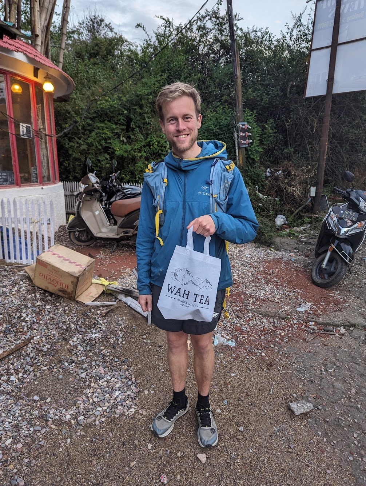
</div>
</div>
```

##

<!-- slide 50 -->

```{=html}
<div class="gslide">
<div class="tb slab title" style="left:2.4125%;top:6.8810%;width:93.1824%;height:11.1344%;font-size:49.8px;color:#ff5722">
<p>Why Bir?</p>
</div>
<div class="tb sans body" style="left:3.4088%;top:22.4064%;width:46.5912%;height:66.4217%;font-size:32.0px;color:#666666">
<ul>
<li>Sykeste terrenget du noen gang kommer til å fly i<br>&nbsp;</li>
<li>Sesongen er i oktober/nov - hva annet skal du finne på?<br>&nbsp;</li>
<li>Eventyr<br>&nbsp;</li>
<li>Flybilletten er dyr, resten er billig</li>
<li class="l2" style="font-size:24.9px">Middag: 20-60kr</li>
</ul>
</div>
<div class="fr" style="left:53.3333%;top:0.0000%;width:46.6667%;height:55.2952%">

</div>
<div class="fr" style="left:57.6442%;top:0.0000%;width:42.3559%;height:100.0000%">

</div>
<video class="vid" style="left:50.0000%;top:0.0000%;width:50.0000%;height:100.0000%" src="video/slide50.mp4"
       poster="img/poster-slide50.jpg"
       controls preload="metadata" playsinline></video>
</div>
```

