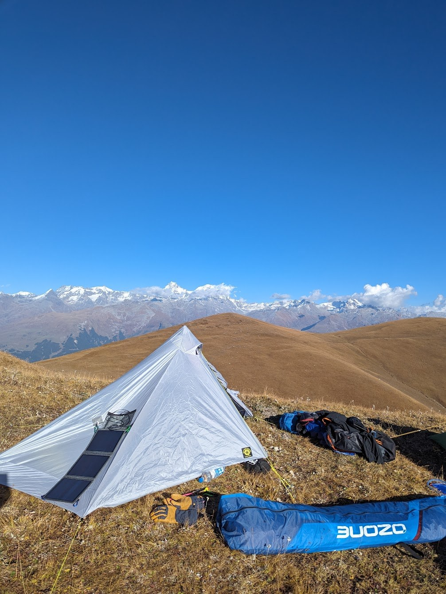
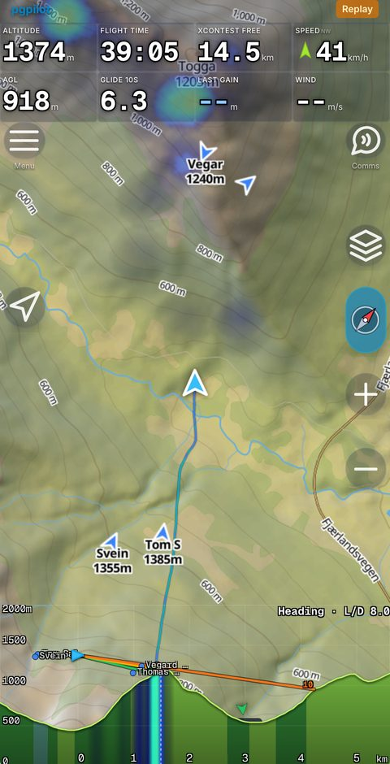
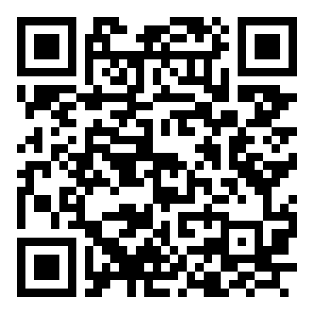
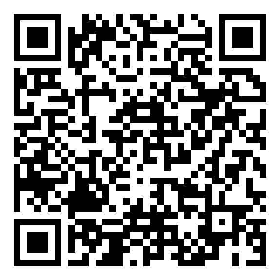
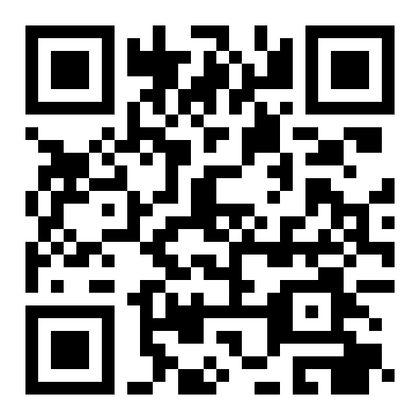
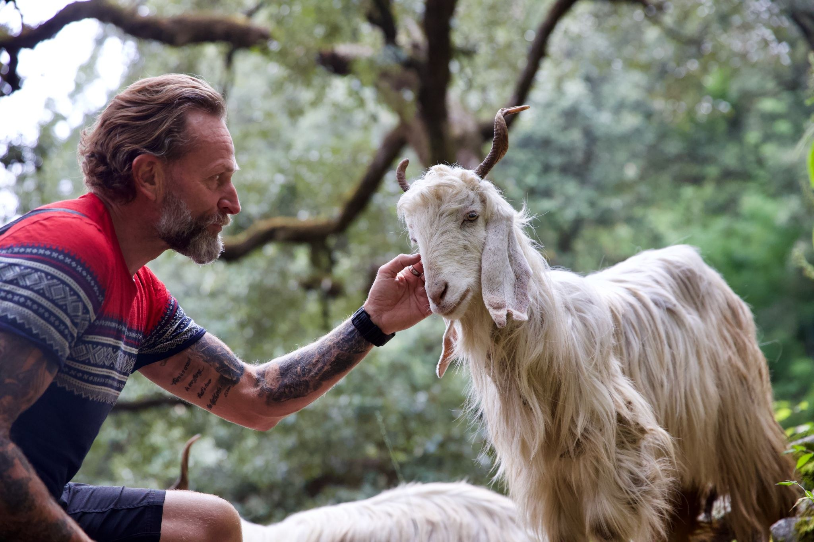

# Bli med på turen {.act-divider .hero-slide}

```{=html}
<div class="hero">
  
  
  <div class="hero-text">
    <p class="hero-kicker">pgpilot og India</p>
    <p class="hero-title">Bli med på turen</p>
  </div>
</div>
```

::: {.notes}
Samme apningsbilde som Loen-decket, sa de to henger sammen.

Ikke snakk lenge her. Bildet og setningen gjor jobben, sa gar du rett paa
"hvor er India?".
:::

## Hvor er India? Hvor er Bir?

```{=html}
<video class="fullbleed" src="voss-video/hvor-er-bir.mp4"
       poster="img/poster-hvor-er-bir.jpg"
       data-autoplay muted playsinline></video>
```

::: {.notes}
Klippet gjor hele bevegelsen: starter paa Voss med ring rundt, zoomer ut til
halve kloden, flytter seg ostover og lander med BAADE Bir og Delhi i bildet.

Det er poenget med sluttbildet: Delhi nede paa sletta, Bir oppe ved foten av
fjellkjeden. Da ser folk hvor langt inn i landet du maa for aa komme dit, og
hvor brat overgangen fra flatt til Himalaya er.

IKKE loop paa denne. Den skal bli staaende paa sluttbildet: Bir i ringen, med
Himalaya rett bak og slettene under. Det bildet ER argumentet for Bir, saa la
det staa mens du snakker.

Si avstanden hoyt mens den zoomer. Effekten er at avstanden blir fysisk i
stedet for et tall.
:::

# Installer appen {.act-divider}

[Akt 1]{.act-num}

[5 min · DECK → APP]{.act-meta}

::: {.notes}
Akten har EN jobb: at alle far appen pa telefonen. Ikke gruppa, ikke featurene.
Bare installasjonen. Gruppa kommer i akt 2, der den hoerer hjemme sammen med
PTT.

Meld i klubbkanalen kvelden for: "last ned pgpilot for du kommer". App
Store-nedlastingen er det eneste i hele opplegget du ikke kontrollerer.
:::

## Ta opp telefonen {.center}

::: {.say}
Vi skal fly denne turen sammen. Da trenger dere appen.
:::

::: {.notes}
Her bytter du til telefonen. Alt-tab. Trykk `b` forst, sa svartlegges decket og
skiftet ser tilsiktet ut.
:::

## Last ned

```{=html}
<div class="install">
  <div class="install-shot">
    
  </div>
  <div class="install-links">
    <div class="store">
      
      <div class="store-name">Android</div>
      <div class="store-sub">Google Play</div>
    </div>
    <div class="store">
      
      <div class="store-name">iPhone</div>
      <div class="store-sub">App Store</div>
    </div>
    <div class="store store-web">
      
      <div class="store-name">Eller bare</div>
      <div class="store-sub">pgpilot.app</div>
    </div>
  </div>
</div>
```

::: {.notes}
La denne staa lenge. Den er ikke en illustrasjon, den er en oppgave salen skal
gjore mens du snakker.

Tre veier, og den tredje er den viktigste for de som nler:
  - Google Play
  - App Store
  - pgpilot.app i nettleseren: visningsnavn og ingenting mer. Ingen e-post,
    ingen konto, ferdig paa under et halvt minutt.

Nettleserveien er redningen for alle som ikke gidder aa installere noe, og for
de som har fullt lager paa telefonen.
:::

# På startplassen i Billing {.act-divider}

[Akt 2]{.act-num}

[10 min · APP, LIVE]{.act-meta}

::: {.notes}
Vi star pa 2428 meter. Sivilisasjonen rett nedenfor, og NETTET VIRKER. Sa her
gjor vi alt det vanlige, det de ville gjort pa Voss en tirsdag.

Hele denne akten er live app. Decket er bare hvilepute mellom punktene.
:::

## Hvor er vi [APP]{.where .where-app}

```{=html}

```

::: {.notes}
Dette er appen som staar paa startplassen i Billing, 2424 moh, hentet fra
pgpilot.app.

Alt er ekte: terrenget, hoydekotene, stedsnavnene nedover mot Bir og Gunehar,
og luftrommet i oransje og gult. Panelene rundt er instrumentet slik det ser ut
i lufta.

Zoomet to hakk ut, saa du ser dalen og fjellkjeden bak, ikke bare et utsnitt.

Glidekjeglene er synlige: L/D 6, 8 og 10 som stiplede linjer. De sier hvor langt
du rekker, og de er en gratis forsmak paa akt 3 klipp 4.

Termikk-overlegget (KK7) er paa, men det tegner tynt akkurat her. Det er et
globalt kart, saa dataene finnes, men Bir er ikke Alpene.

Ikke snakk om startplassdatabasen. Bare la kartet staa og fortell hvor vi er.
:::

## Koble på varioen [APP]{.where .where-app}

```{=html}

```

::: {.notes}
Skjermdump fra telefonen. Den finnes ikke i webversjonen i det hele tatt, fordi
BLE-koden er laast bak isNative().

Tre ting er tilkoblet samtidig her, og det er verdt aa peke paa: BLE-varioen,
PTT-knappen, og KV4P VHF-radioen. Det er hele maskinvarehistorien paa ett bilde.
:::

## Bli med i gruppa

```{=html}
<div class="joinbox">
  
  <div>
    <p class="join-url">pgpilot.app/join/<strong>voss</strong></p>
    <p class="join-sub">Skann, skriv navnet ditt, ferdig.</p>
  </div>
</div>
```

::: {.notes}
Flyttet hit fra akt 1 med vilje: gruppa gir ingen mening for de har appen, og
den hoerer sammen med PTT-demoen som kommer rett etterpaa.

GRUPPA LAGES NAAR DU RIGGER, IKKE FOR. Reaperen arkiverer grupper som har vaert
stille i fire timer, og join filtrerer paa archived=false, saa en gammel gruppe
gir en QR-kode som leder til ingenting. Join tupper aktiviteten, saa naar de
forste er inne holder den seg selv i live. Se STRUKTUR.md.

Si tydelig at de skal la appen ligge paa. Akt 4 avhenger av det.
:::

## Prat sammen [APP]{.where .where-app}

```{=html}

```

::: {.notes}
Si eksplisitt: ALLE LYTTER, EN SNAKKER. Ikke slipp tretti mikrofoner los.

Dette er oyeblikket der salen skjonner hva appen er: du sier noe, og det kommer
ut av tretti telefoner samtidig.
:::

## Lag tasken [APP]{.where .where-app}

::: {.todo}
Live: du setter ruta, den lander på deres telefon med "Load task".
:::

::: {.notes}
Det fineste oyeblikket i akten: de ser at DU gjorde noe og DERES telefon endret
seg.
:::

## Hvorfor Bir?

```{=html}

```

::: {.notes}
Geita er med vilje. I Loen-decket er "Why Bir?" en oppbygging over slide 47, 49
og 50 med akkurat dette bildet, saa dette ER svaret ditt paa sporsmaalet.

Vil du ha hele oppbyggingen: slide 49 legger til img/cbb1a7ce.jpg ved siden av.

Snakk over den: sesong i oktober og november, fjellkjede som ikke tar slutt,
startplass paa 2400.
:::

::: {.notes}
Sesong i oktober og november, fjellkjede som ikke tar slutt, startplass pa 2400.
Snakkes over mens kartet star.
:::

# Vi tar av {.act-divider}

[Akt 3]{.act-num}

[14 min · DECK, KLIPP]{.act-meta}

::: {.notes}
17. oktober 2024, Bir mot Saurkundi.

Formuleringen som gjor poenget uten a motsi videoen du staar og viser:

  "Dette er ikke en video av flyturen. Det er et opptak av APPEN som flyr den pa
   nytt. Alt dere ser av tall og piler regnes ut mens sporet spilles av."

Samme kode i replay som live. Si det rett ut, ingen gjetter det selv.

Tre minutter video i en akt pa fjorten. Klippene er illustrasjoner til det du
sier, ikke omvendt.
:::

## 1. Start fra Billing [KLIPP]{.where .where-clip}

```{=html}
<video class="clip" src="voss-video/klipp-start.mp4"
       poster="img/poster-start.jpg"
       data-autoplay playsinline></video>
```

::: {.notes}
Her staar vi. Terrassene under, fjellet som fortsetter bakover. Kartet er zoomet
ut, saa dere ser hele dalen vi skal ut i.

LYD PAA DENNE. Det er appens egen takeoff-lyd, den samme som gaar av i lomma
naar den skjonner at du har lettet. Ikke snakk over de forste sekundene, la den
komme.

Klippet looper ikke med vilje: lyden skal spille EN gang, saa blir bildet
staaende mens du snakker.
:::

## Vi flyr [KLIPP]{.where .where-clip}

```{=html}

```

::: {.notes}
Her er det ekte. Ikke et kart, ikke et skjermopptak: dette er hva du faktisk ser
naar du er i lufta over Bir.

Ryggen rett under, og fjellkjeden som bare fortsetter bakover i bildet. Det er
hele argumentet for aa reise dit, og det trenger ingen forklaring.

La den staa noen sekunder for du gaar videre til tallene.
:::

## 2. Termikkboblen [KLIPP]{.where .where-clip}

```{=html}
<video class="clip" src="voss-video/klipp-termikk.mp4"
       poster="img/poster-termikk.jpg"
       data-autoplay loop muted playsinline></video>
```

::: {.notes}
Den mest overbevisende enkeltbiten, og de tre tingene hoerer sammen i samme
oyeblikk: varioen piper, appen tegner opp bobla, og vindpila strammer seg mens
du sirkler.

Si det som ett poeng: den vet ikke vinden naar du tar av. Den laerer den av
sirklene dine, og den husker hvor det steg.

Lyd paa dette klippet.
:::

## 3. Sideview [KLIPP]{.where .where-clip}

```{=html}
<video class="clip" src="voss-video/klipp-sideview.mp4"
       poster="img/poster-sideview.jpg"
       data-autoplay loop muted playsinline></video>
```

::: {.notes}
4677 meter paa det hoyeste. Der oppe er det kaldt og tynt.
:::

## 4. Glide range på kartet [KLIPP]{.where .where-clip}

```{=html}
<video class="clip" src="voss-video/klipp-glide.mp4"
       poster="img/poster-glide.jpg"
       data-autoplay loop muted playsinline></video>
```

::: {.notes}
Glide range-konturene er de stiplede linjene rundt piloten: gronn L/D 6, gul
L/D 8, oransje L/D 10. De viser hvor langt du rekker fra der du er.

At de manglet foer var ikke en innstilling, men timing: useGlideRange returnerer
tidlig naar terrengflisene for hele rekkevidden ikke er cachet ennaa. Opptaket
venter naa til laget faktisk har data.

GLIDE 10S staar rundt 12, og glidestraalene L/D 6, 8 og 10 treffer bakken
ved 2,5 km med stoppunktet markert. Glide range staar paa hoy kvalitet.

Kartet er zoomet to hakk ut fra der replay foelger piloten, saa rekkevidden faar
plass i ramma. AA sette zoomen gjennom kartobjektet ble overstyrt av
foelg-logikken; minus-knappen mens replayet staar paa pause er det som sitter.
:::

::: {.notes}
Dette er ikke bare en feature, det er et SPORSMAL. Still det, la det henge, og
ga til akt 4 uten a svare. Det er der historien snur.
:::

# Innover i fjellene {.act-divider}

[Akt 4]{.act-num}

[12 min · DECK + ett app-innhopp]{.act-meta}

::: {.notes}
VENDEPUNKTET. Vi passerer siste rygg. Nettet dor.
:::

## Floor is lava {.center}

::: {.notes}
> Risiko snus pa hodet. Du gjor ting i lufta du ikke ville gjort om du kunne
> landet og tatt en taxi til pubben.

Marginer, hoydesyke, buddysystem, mat og vann for en uke.
:::

## Hjemme har du alt. Her har du ingenting.

::: {.todo}
Tabellen fra STRUKTUR.md: Voss vs Bir. Luftrom, varsel, vindstasjoner,
NOTAM = nei. Startplasser, kart, vario, gruppe = ja.
:::

::: {.notes}
Sjekket mot prod, ikke antatt. Luftrom over Bir gir EN polygon: Delhi FIR.
Varsel (MEPS/ICON-EU) og vindstasjoner stopper i Europa. NOTAM har 19
europeiske kilder.

Poenget er ikke at appen er mangelfull. Poenget er at India stripper den ned til
kjernen, og det som staar igjen er det som baerer.
:::

## Det som står igjen

::: {.todo}
Offline-kart, VHF over KV4P, FLARM, Meshtastic, InReach, buddies.
Ett slide hver, eller ett samleslide. Bestem når innholdet skrives.
:::

::: {.notes}
OGN og FLARM-bakkestasjoner finnes knapt i Himalaya. Derfor er direkte
pilot-til-pilot det som baerer der nede.
:::

## Dere er fortsatt i gruppa [APP]{.where .where-app}

::: {.todo}
Kort innhopp til appen: kartet med alle prikkene i rommet.
:::

::: {.notes}
Samme mekanisme som holdt oss sammen over ryggen, bare med bedre dekning.

Dette er det eneste app-innhoppet i akt 4. Alt-tab, vis, alt-tab tilbake.
:::

# Landing og hjem {.act-divider}

[Akt 5]{.act-num}

[6 min · DECK]{.act-meta}

::: {.notes}
Vi lander ved teltplassen. Dag 1 lander 200 meter fra der dag 2 starter, og det
er ikke tilfeldig, det er teltet.
:::

## Etter landing

::: {.todo}
IGC ut, automatisk XContest-opplasting, feeden, profiler, kudos.
:::

## AreaContest

::: {.todo}
Kartet over Voss-området. Hvem eier hvilke ruter?
:::

::: {.notes}
Beste retensjonsmekanikken du har, og et Voss-publikum er nøyaktig folk som vil
krangle om dette.
:::

# Bli med i 2026 {.act-divider}

[Akt 6]{.act-num}

[3 min · DECK]{.act-meta}

## {.center}

::: {.todo}
Hent slide 46, 49, 50 fra India-decket.
Slide 46 sier fortsatt "Oktober 2024?" og MÅ oppdateres.
:::

##

::: {.clip-slot}
Tandoori-videoen. Avslutt her, ikke på en punktliste.
:::

::: {.notes}
Siste ord bor vaere en oppfordring, ikke en takk: appen er gratis, den ligger pa
telefonen deres na, og du vil ha tilbakemelding fra folk som flyr pa Voss.
:::
