<!-- ```{=html}
<style>
/* DEV: vis canvas-ramme (1280x800) under iterasjon. Fjern før produksjon. */
.reveal .slides {
  outline: 2px dashed rgba(255, 0, 0, 0.6);
  outline-offset: 0;
}
</style>
``` -->


# Velkommen

- Maskinlæring for jurister
- Tre bolker
- Live-kurs, spør underveis

##
<!-- Teknologjuristen slide -->
{fig-align="center" style="max-height: 600px;"}


## Hvem er vi (Siv Henriksen)

::: {.columns}
::: {.column width="40%"}
{style="border-radius: 16px; display: block;"}
:::
::: {.column width="60%"}
Jurist innenfor personvern, teknologi og AI

- 2025 - NHO
- 2022-2025 Oda
- 2016-2022 Schibsted
- 2010-2016 Equinor
:::
:::
## Hvem er vi (Simen Eide)?

::: {.columns}
::: {.column width="40%"}
{style="border-radius: 16px;"}
:::
::: {.column width="60%"}
**"Algoritmemaker"**

- Finansiell risikomodellering
- 8 år i FINN/Schibsted - anbefalingssystemer + AI enablement
- PhD i AI (UiO) - anbefalinger, språkmodeller og usikkerhet
- I dag: Freelance (eide.ai)
:::
:::
## Program
- Introduksjon
- **Bolk I:** Hva er AI?
- *Pause*
- **Bolk II:** Teknologi møter juss
- *Pause*
- **Bolk III:** Generativ AI og språkmodeller 
  - \+ caseoppgave

# Hva er AI?
Bolk 1

## AI er overalt {.smaller}

```{=html}
<div style="position: relative; width: 100%; aspect-ratio: 16/9; background: url('img/hype-12.png') center/cover no-repeat; border-radius: 6px; overflow: hidden; font-family: 'Helvetica Neue', sans-serif;">

  

  <div class="fragment" data-fragment-index="2" style="position: absolute; left: 50%; top: 8%; width: 22%; padding: 10px 14px; background: #8a7a1f; color: #fff; border-radius: 18px; transform: rotate(-2deg); font-size: 0.95em; line-height: 1.2; box-shadow: 0 6px 14px rgba(0,0,0,0.3);">
    "AI kommer til å ta [noen andres] jobb"
  </div>

  <div class="fragment" data-fragment-index="3" style="position: absolute; left: 73%; top: 14%; width: 22%; padding: 10px 14px; background: #b15b8c; color: #fff; border-radius: 18px; transform: rotate(2deg); font-size: 0.9em; line-height: 1.2; box-shadow: 0 6px 14px rgba(0,0,0,0.3);">
    "Språkmodeller er bare et gjennomsnitt av internett"
  </div>

  <div class="fragment" data-fragment-index="4" style="position: absolute; left: 4%; top: 62%; width: 30%; padding: 10px 14px; background: #b9d5a3; color: #222; border-radius: 10px; transform: rotate(-3deg); font-size: 0.8em; line-height: 1.25; box-shadow: 0 6px 14px rgba(0,0,0,0.3);">
    "Once we have a really powerful superintelligence, addressing <b>climate change will not be particularly difficult</b>"<br>
    <span style="font-size: 0.85em;">- Sam Altman</span>
  </div>

  <div class="fragment" data-fragment-index="5" style="position: absolute; left: 37%; top: 60%; width: 30%; padding: 10px 14px; background: #1a1a1a; color: #fff; border-left: 6px solid #d92121; border-radius: 6px; transform: rotate(1deg); font-size: 0.85em; line-height: 1.25; box-shadow: 0 6px 14px rgba(0,0,0,0.5);">
    <div style="font-size: 0.75em; color: #d92121; font-weight: 700; letter-spacing: 0.05em; margin-bottom: 4px;">FOX BUSINESS · NOV 2025</div>
    <b>"Chinese hackers weaponize Anthropic's AI in first autonomous cyberattack"</b>
  </div>

  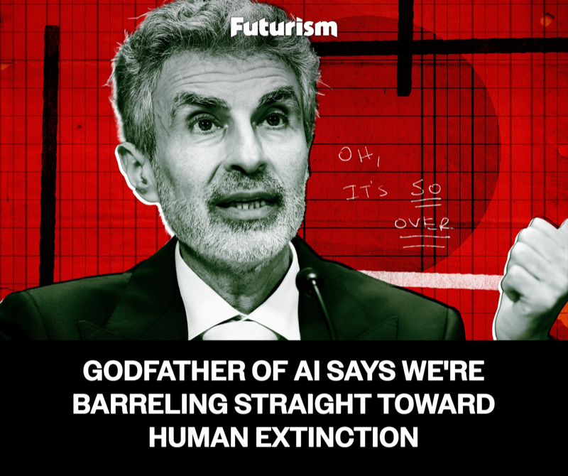

  <div class="fragment" data-fragment-index="7" style="position: absolute; left: 30%; top: 36%; width: 44%; padding: 12px 16px; background: #fff; color: #111; border-radius: 6px; transform: rotate(-2deg); font-size: 0.95em; line-height: 1.25; box-shadow: 0 8px 18px rgba(0,0,0,0.35);">
    <div style="font-size: 0.7em; color: #c0392b; font-weight: 700; letter-spacing: 0.08em; margin-bottom: 4px;">MIRAFLOW · APRIL 2026</div>
    <b>"Kimi K2.6: Moonshot AI's open-source model TIES GPT-5.5 on coding"</b>
  </div>

  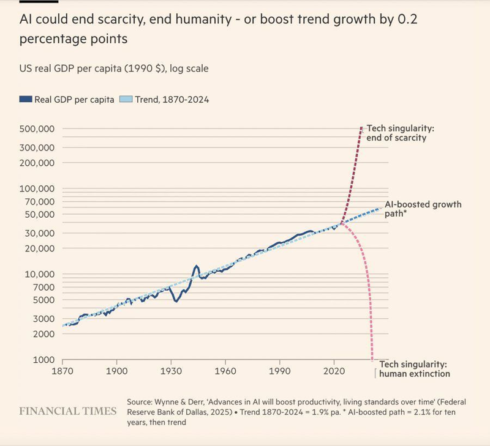

  <div class="fragment" data-fragment-index="9" style="position: absolute; left: 12%; top: 72%; width: 76%; padding: 10px 16px; background: #d92121; color: #fff; border-radius: 8px; font-size: 1.6em; font-weight: 800; text-align: center; box-shadow: 0 6px 14px rgba(0,0,0,0.4);">
    Hva er egentlig AI?
  </div>
</div>
```

::: {.notes}
- En vegg av overskrifter, charts, demoer, agenter
- Poenget er ikke å gå gjennom dem - det er at dere allerede har sett alt dette
- LinkedIn flommer over med dette: AI vil ende verden, AI vil drive 10x produktivitet, ny modell hver uke
- Det er enkelt å få bredden. Det er vanskelig å få dybden.

Referanser:
- DeepSeek (VG, Shazia Majid): https://www.vg.no/nyheter/i/8qz2bw/deepseek-et-globalt-vendepunkt
- Anthropic GTG-1002 (Fox Business): https://www.foxbusiness.com/fox-news-politics/chinese-hackers-weaponize-anthropics-ai-first-autonomous-cyberattack-targeting-global-organizations
- Anthropic egen rapport: https://www.anthropic.com/news/disrupting-AI-espionage
- Kimi K2.6 (Miraflow): https://miraflow.ai/blog/kimi-k2-6-explained-moonshot-ai-open-source-model-ties-gpt-5-5-coding
- Kimi K2.6 (MarkTechPost): https://www.marktechpost.com/2026/04/20/moonshot-ai-releases-kimi-k2-6-with-long-horizon-coding-agent-swarm-scaling-to-300-sub-agents-and-4000-coordinated-steps/
- Futurism Bengio: https://futurism.com/artificial-intelligence/yoshua-bengio-ai-extinction
- FT/Dallas Fed GDP: https://www.dallasfed.org/research/economics/2025/0624
:::

## Hva får dere ut av bolk 1?

- Mental modell av hva ML faktisk er
- Knagger for juridiske vurderinger
- Vokabular for å snakke med utviklere
- "ML er ikke magi"


## Statistikk, ML, AI, KI?!

::: {.columns}
::: {.column width="48%"}
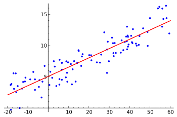{style="height: 360px; width: 100%; object-fit: contain;"}
:::
::: {.column width="48%"}
{style="height: 360px; width: 100%; object-fit: contain;"}
:::
:::

- Kjært barn, mange navn
- Lære (og bruke) en modell av verden ved å bruke data
- Fokus her: probabilistiske modeller

# Tre business-cases

## Vi skal følge tre organisasjoner

::: {.columns}
::: {.column width="32%"}
{style="height: 160px; width: 100%; object-fit: cover; border-radius: 8px;"}

**Rekrutteringsbyrå**
:::
::: {.column width="32%"}
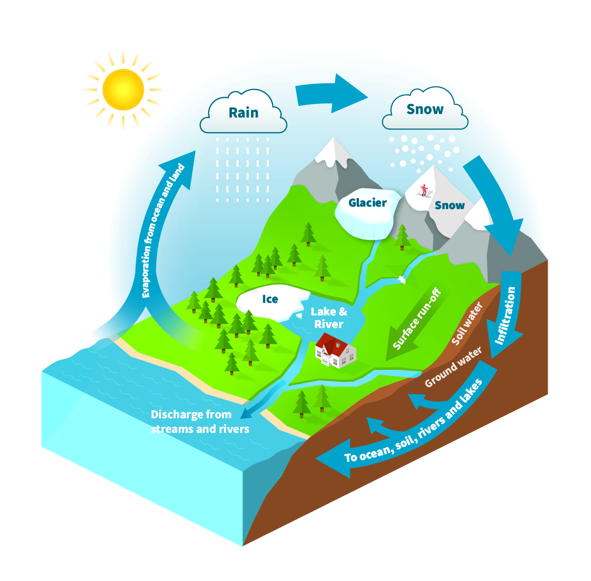{style="height: 160px; width: 100%; object-fit: cover; border-radius: 8px;"}

**NVE**
:::
::: {.column width="32%"}
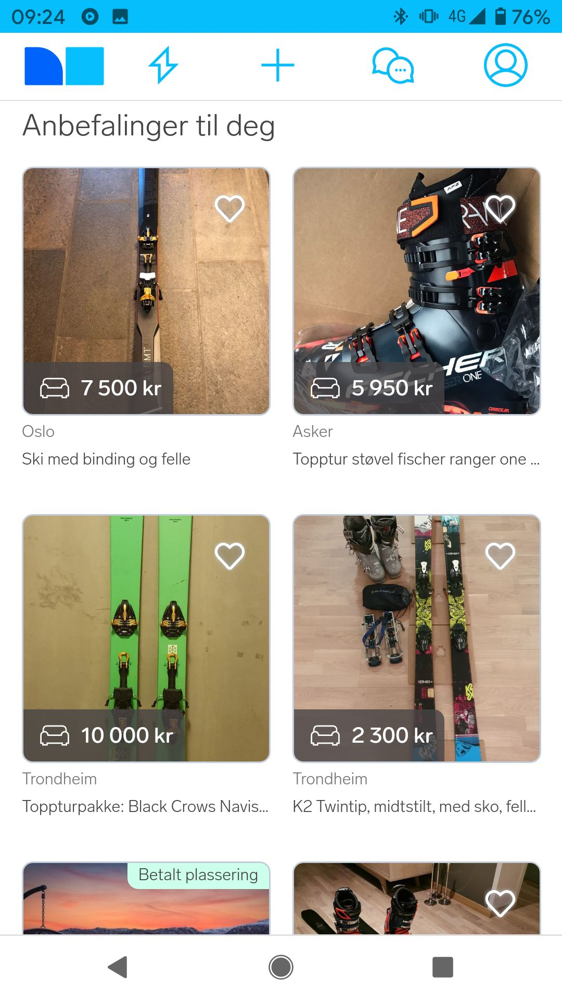{style="height: 160px; width: 100%; object-fit: cover; border-radius: 8px;"}

**Nettplattform**
:::
:::

**Gitt:**

::: {.columns}
::: {.column width="32%"}
::: {.callout-note appearance="simple" icon=false}
- jobbeskrivelse
- CV med personalia
:::
:::
::: {.column width="32%"}
::: {.callout-note appearance="simple" icon=false}
- vassdrag
- snømengde i fjellet
:::
:::
::: {.column width="32%"}
::: {.callout-note appearance="simple" icon=false}
- brukerens klikkhistorie
- annonser/filmer
:::
:::
:::

**Skal vi:**

::: {.columns}
::: {.column width="32%"}
::: {.callout-tip appearance="simple" icon=false}
ansette personen?
:::
:::
::: {.column width="32%"}
::: {.callout-tip appearance="simple" icon=false}
melde flomvarsel?
:::
:::
::: {.column width="32%"}
::: {.callout-tip appearance="simple" icon=false}
anbefale denne annonsen/filmen?
:::
:::
:::
# The Algorithm
{style="height: 420px; width: 100%; object-fit: contain;"}

## The Algorithm

::: {.columns}
::: {.column width="55%"}
1. **Data** - hva har vi lært av?
2. **Modell** - hva slags funksjon beskriver dataen?
3. **Trening** - hvordan finner vi parametrene?
4. **Handling** - hva GJØR vi med prediksjonen?
:::
::: {.column width="45%"}
{style="height: 420px; width: 100%; object-fit: contain;"}
:::
:::
# Data

## Høna eller egget?

- Data og modell henger sammen
- Du kan ikke samle data uten å vite hva du vil modellere
- Du kan ikke bygge modell uten å vite hva slags data du har
## Et datapunkt = en rad

```{=html}
<table style="margin: 0 auto; border-collapse: collapse; text-align: center;">
<thead>
<tr style="border-bottom: 1px solid #888;">
  <th style="padding: 6px 12px;">Fornavn</th>
  <th style="padding: 6px 12px;">Alder</th>
  <th style="padding: 6px 12px;">Kjønn</th>
  <th style="padding: 6px 12px;">Utdanning</th>
  <th style="padding: 6px 12px; border-right: 2px dashed #555;">Erfaring</th>
  <th style="padding: 6px 12px;"><b>Ansatt?</b></th>
</tr>
</thead>
<tbody>
<tr><td>Erik</td><td>32</td><td>M</td><td>NTNU</td><td style="border-right: 2px dashed #555;">5 år</td><td>ja</td></tr>
<tr><td>Ingrid</td><td>28</td><td>K</td><td>UiO</td><td style="border-right: 2px dashed #555;">2 år</td><td>nei</td></tr>
<tr><td>Lars</td><td>45</td><td>M</td><td>BI</td><td style="border-right: 2px dashed #555;">15 år</td><td>ja</td></tr>
<tr><td>Kari</td><td>24</td><td>K</td><td>HiOA</td><td style="border-right: 2px dashed #555;">0 år</td><td>nei</td></tr>
<tr><td>Magnus</td><td>38</td><td>M</td><td>NHH</td><td style="border-right: 2px dashed #555;">8 år</td><td>ja</td></tr>
<tr><td>...</td><td>...</td><td>...</td><td>...</td><td style="border-right: 2px dashed #555;">...</td><td>...</td></tr>
</tbody>
<tfoot>
<tr>
  <td colspan="5" style="border-top: 2px solid #555; padding-top: 8px; font-style: italic; text-align: center; border-right: 2px dashed #555;">x (features)</td>
  <td style="border-top: 2px solid #555; padding-top: 8px; font-style: italic; text-align: center;">y (label)</td>
</tr>
</tfoot>
</table>
```

- Tenk rader i regneark

- Ønsker å finne sannsynligheten for ansettelse gitt CV:
$$
P(\textit{ansatt}=\textit{ja} | \textit{alder, utdanning, erfaring)}
$$

- Trenger uavhengig og identisk distribuerte eksempler
  - "Mange like eksempler som ikke påvirker hverandre"

- Tips: Ikke se veldig nøye på innhold i dataene
## Klassifisering eller regresjon?

```{=html}
<div style="display: flex; gap: 40px; align-items: flex-start; margin-top: 8px;">
  <div style="flex: 1; min-width: 0;">
    <p class="fragment" data-fragment-index="1"><strong>Klassifisering:</strong> modellere en kategori</p>
    <ul class="fragment" data-fragment-index="1" style="font-size: 0.9em;">
      <li>Ansatt / ikke ansatt</li>
      <li>Hvilken film en person vil se</li>
    </ul>
    <svg class="fragment" data-fragment-index="2" viewBox="0 0 200 160" style="height: 320px; display: block; margin: 16px auto 0;">
      <line x1="20" y1="130" x2="190" y2="130" stroke="#888" stroke-width="1"/>
      <rect x="50" y="50" width="40" height="80" fill="#4a90e2"/>
      <text x="70" y="42" text-anchor="middle" font-size="12" fill="#333">0.67</text>
      <text x="70" y="148" text-anchor="middle" font-size="13" fill="#333">ja</text>
      <rect x="120" y="90" width="40" height="40" fill="#aaa"/>
      <text x="140" y="82" text-anchor="middle" font-size="12" fill="#333">0.33</text>
      <text x="140" y="148" text-anchor="middle" font-size="13" fill="#333">nei</text>
    </svg>
  </div>
  <div style="flex: 1; min-width: 0;">
    <p class="fragment" data-fragment-index="3"><strong>Regresjon:</strong> modellere et kontinuerlig tall</p>
    <ul class="fragment" data-fragment-index="3" style="font-size: 0.9em;">
      <li>Vannføring i elv</li>
      <li>Høyden på en person</li>
    </ul>
    <svg class="fragment" data-fragment-index="4" viewBox="0 0 200 160" style="height: 320px; display: block; margin: 16px auto 0;">
      <line x1="25" y1="135" x2="190" y2="135" stroke="#888" stroke-width="1"/>
      <line x1="25" y1="20" x2="25" y2="135" stroke="#888" stroke-width="1"/>
      <text x="107" y="155" text-anchor="middle" font-size="10" fill="#666">temperatur</text>
      <text x="14" y="78" text-anchor="middle" font-size="10" fill="#666" transform="rotate(-90 14 78)">vannføring</text>

      <circle cx="40" cy="125" r="3" fill="#4a90e2"/>
      <circle cx="55" cy="120" r="3" fill="#4a90e2"/>
      <circle cx="70" cy="115" r="3" fill="#4a90e2"/>
      <circle cx="85" cy="95" r="3" fill="#4a90e2"/>
      <circle cx="100" cy="65" r="3" fill="#4a90e2"/>
      <circle cx="115" cy="40" r="3" fill="#4a90e2"/>
      <circle cx="130" cy="35" r="3" fill="#4a90e2"/>
      <circle cx="150" cy="50" r="3" fill="#4a90e2"/>
      <circle cx="170" cy="65" r="3" fill="#4a90e2"/>

      <path d="M 35 128 C 70 125, 80 115, 95 80 C 110 45, 125 35, 140 38 C 160 50, 180 70, 185 75"
            stroke="#c0392b" stroke-width="2" fill="none"/>
    </svg>
  </div>
</div>
```
## Regresjon: NVE-flomvarsel

```{=html}
<table style="margin: 0 auto; border-collapse: collapse; text-align: center; font-size: 0.7em;">
<thead>
<tr style="border-bottom: 1px solid #888;">
  <th style="padding: 2px 8px;">Dato</th>
  <th style="padding: 2px 8px;">Nedbør</th>
  <th style="padding: 2px 8px;">Snømengde</th>
  <th style="padding: 2px 8px;">Temperatur</th>
  <th class="fragment" data-fragment-index="3" style="padding: 2px 8px; color: #c0392b;">Gårsdagens vannføring</th>
  <th style="padding: 2px 8px; border-left: 2px dashed #555;"><b>Vannføring (m³/s)</b></th>
</tr>
</thead>
<tbody>
<tr><td style="padding: 2px 8px;">1. mai</td><td style="padding: 2px 8px;">12 mm</td><td style="padding: 2px 8px;">80 cm</td><td style="padding: 2px 8px;">5°C</td><td class="fragment" data-fragment-index="3" style="padding: 2px 8px; color: #c0392b;">?</td><td style="padding: 2px 8px; border-left: 2px dashed #555;">45</td></tr>
<tr><td style="padding: 2px 8px;">2. mai</td><td style="padding: 2px 8px;">25 mm</td><td style="padding: 2px 8px;">75 cm</td><td style="padding: 2px 8px;">8°C</td><td class="fragment" data-fragment-index="3" style="padding: 2px 8px; color: #c0392b;">45</td><td style="padding: 2px 8px; border-left: 2px dashed #555;">78</td></tr>
<tr><td style="padding: 2px 8px;">3. mai</td><td style="padding: 2px 8px;">40 mm</td><td style="padding: 2px 8px;">60 cm</td><td style="padding: 2px 8px;">12°C</td><td class="fragment" data-fragment-index="3" style="padding: 2px 8px; color: #c0392b;">78</td><td style="padding: 2px 8px; border-left: 2px dashed #555;">145</td></tr>
<tr><td style="padding: 2px 8px;">4. mai</td><td style="padding: 2px 8px;">8 mm</td><td style="padding: 2px 8px;">55 cm</td><td style="padding: 2px 8px;">10°C</td><td class="fragment" data-fragment-index="3" style="padding: 2px 8px; color: #c0392b;">145</td><td style="padding: 2px 8px; border-left: 2px dashed #555;">112</td></tr>
<tr><td style="padding: 2px 8px;">...</td><td style="padding: 2px 8px;">...</td><td style="padding: 2px 8px;">...</td><td style="padding: 2px 8px;">...</td><td class="fragment" data-fragment-index="3" style="padding: 2px 8px; color: #c0392b;">...</td><td style="padding: 2px 8px; border-left: 2px dashed #555;">...</td></tr>
</tbody>
<tfoot>
<tr>
  <td colspan="5" style="border-top: 2px solid #555; padding-top: 4px; font-style: italic; text-align: center;">x (features)</td>
  <td style="border-top: 2px solid #555; padding-top: 4px; font-style: italic; text-align: center; border-left: 2px dashed #555;">y (label)</td>
</tr>
</tfoot>
</table>
```

::: {.fragment data-fragment-index="1"}
- Sannsynlighet for intervaller

$$
P(25 < y <26 | \textit{dato, nedbør, snømengde, temp})
$$
:::

::: {.fragment data-fragment-index="2"}
- Krever også mange like eksempler
  - Her en tidsserie, egentlig bare ètt eksempel
:::

::: {.fragment data-fragment-index="3"}
- **Løsning:** vi legger til gårsdagens vannføring på dagens rad. Antar at de er uavhengig nå
:::
## Anbefalingsmotor

```{=html}
<table style="margin: 0 auto; border-collapse: collapse; text-align: center;">
<thead>
<tr style="border-bottom: 1px solid #888;">
  <th style="padding: 6px 12px;">Bruker-id</th>
  <th style="padding: 6px 12px;">Siste sette filmer</th>
  <th style="padding: 6px 12px; border-left: 2px dashed #555;"><b>Neste film</b></th>
</tr>
</thead>
<tbody>
<tr><td>u_001</td><td>Star Wars, Interstellar, Arrival</td><td style="border-left: 2px dashed #555;">Dune 2</td></tr>
<tr><td>u_002</td><td>Friends, The Office, Brooklyn 99</td><td style="border-left: 2px dashed #555;">Seinfeld</td></tr>
<tr><td>u_003</td><td>Dune, Blade Runner 2049, Tenet</td><td style="border-left: 2px dashed #555;">Oppenheimer</td></tr>
<tr><td>u_004</td><td>Bridgerton, The Crown, Downton Abbey</td><td style="border-left: 2px dashed #555;">Pride & Prejudice</td></tr>
<tr><td>u_005</td><td>Avengers, Thor, Iron Man</td><td style="border-left: 2px dashed #555;">Spider-Man</td></tr>
<tr><td>...</td><td>...</td><td style="border-left: 2px dashed #555;">...</td></tr>
</tbody>
<tfoot>
<tr>
  <td colspan="2" style="border-top: 2px solid #555; padding-top: 8px; font-style: italic; text-align: center;">x (features)</td>
  <td style="border-top: 2px solid #555; padding-top: 8px; font-style: italic; text-align: center; border-left: 2px dashed #555;">y (label)</td>
</tr>
</tfoot>
</table>
```

::: {.incremental}
- Hver rad = én bruker med klikkhistorikk
- Klassifisering: hvilken film blir neste?
- y er kategorisk - én av mange mulige filmer
:::
# Modell

## Hvordan henger CV sammen med ansettelse?

::: {.fragment fragment-index=2}
$$P(\text{ansatt} = \text{ja} \mid \text{erfaring} = 5\text{år}) = 0.71$$
:::

::: {.fragment fragment-index=3}
### Sannsynlighetsfunksjonen

- Gitt et sett med parametere $\theta$
- Sannsynligheten for å observere **alle CV-ene og utfallene** i datasettet vårt

$$L(\theta) = P(\text{ansatt}=\text{ja} \mid \text{erfaring}=5\text{år};\, \theta) \cdot P(\text{ansatt}=\text{nei} \mid \text{erfaring}=2\text{år};\, \theta) \ldots$$

$$= 0.7 \cdot 0.65 \ldots = 0.00234$$

:::
## Hva modellerer vi egentlig?

::: {.columns}
::: {.column width="33%"}
::: {.fragment fragment-index=1}
::: {.callout-note appearance="simple" icon=false}
**Rekruttering**

Rekruttererens beslutningsprosess
:::
:::
:::
::: {.column width="33%"}
::: {.fragment fragment-index=2}
::: {.callout-note appearance="simple" icon=false}
**NVE**

Vannføring i elv gitt vær og vind
:::
:::
:::
::: {.column width="33%"}
::: {.fragment fragment-index=3}
::: {.callout-note appearance="simple" icon=false}
**Nettplattform**

Brukernes klikkevaner
:::
:::
:::
:::

::: {.fragment fragment-index=4}
### Men ikke:
:::

::: {.columns}
::: {.column width="33%"}
::: {.fragment fragment-index=5}
::: {.callout-important appearance="simple" icon=false}
**Rekruttering**

Hvilken kandidat som er best til jobben
:::
:::
:::
::: {.column width="33%"}
::: {.fragment fragment-index=6}
::: {.callout-important appearance="simple" icon=false}
**NVE**

En fysisk lov som er korrekt
:::
:::
:::
::: {.column width="33%"}
::: {.fragment fragment-index=7}
::: {.callout-important appearance="simple" icon=false}
**Nettplattform**

Hvilken film som er yndlingsfilmen til brukeren
:::
:::
:::
:::

::: {.fragment fragment-index=8 style="text-align: center; margin-top: 16px; font-size: 1.05em;"}
**En modell er en forenklet beskrivelse av virkeligheten**
:::

::: {.fragment fragment-index=9 style="text-align: center; margin-top: 18px;"}
*"All models are wrong, but some are useful."*

--- George Box, statistiker (1976)
:::
## NVE: vannføring som funksjon av temperatur

```{=html}
<div style="display: flex; gap: 40px; align-items: flex-start; margin-top: 8px;">
  <div style="flex: 1.1; min-width: 0;">
    <svg viewBox="0 0 400 280" style="width: 100%; max-width: 480px; display: block; margin: 0 auto;">
      <!-- Axes -->
      <line x1="55" y1="240" x2="385" y2="240" stroke="#333" stroke-width="1.5"/>
      <line x1="55" y1="20" x2="55" y2="240" stroke="#333" stroke-width="1.5"/>
      <text x="220" y="268" text-anchor="middle" font-size="13" fill="#333">Temperatur (°C)</text>
      <text x="18" y="130" text-anchor="middle" font-size="13" fill="#333" transform="rotate(-90 18 130)">Vannføring (m³/s)</text>

      <!-- 0°C reference line -->
      <line x1="149" y1="240" x2="149" y2="20" stroke="#ddd" stroke-width="1" stroke-dasharray="3 3"/>
      <text x="149" y="255" text-anchor="middle" font-size="11" fill="#888">0°C</text>

      <!-- Data points: winter flat (low), spring rise, summer plateau/decline -->
      <circle cx="70" cy="232" r="5" fill="#4a90e2" opacity="0.75"/>
      <circle cx="82" cy="208" r="5" fill="#4a90e2" opacity="0.75"/>
      <circle cx="95" cy="226" r="5" fill="#4a90e2" opacity="0.75"/>
      <circle cx="108" cy="195" r="5" fill="#4a90e2" opacity="0.75"/>
      <circle cx="122" cy="222" r="5" fill="#4a90e2" opacity="0.75"/>
      <circle cx="135" cy="200" r="5" fill="#4a90e2" opacity="0.75"/>
      <circle cx="148" cy="225" r="5" fill="#4a90e2" opacity="0.75"/>
      <circle cx="160" cy="180" r="5" fill="#4a90e2" opacity="0.75"/>
      <circle cx="173" cy="200" r="5" fill="#4a90e2" opacity="0.75"/>
      <circle cx="185" cy="160" r="5" fill="#4a90e2" opacity="0.75"/>
      <circle cx="198" cy="125" r="5" fill="#4a90e2" opacity="0.75"/>
      <circle cx="210" cy="95" r="5" fill="#4a90e2" opacity="0.75"/>
      <circle cx="223" cy="135" r="5" fill="#4a90e2" opacity="0.75"/>
      <circle cx="236" cy="70" r="5" fill="#4a90e2" opacity="0.75"/>
      <circle cx="249" cy="42" r="5" fill="#4a90e2" opacity="0.75"/>
      <circle cx="262" cy="78" r="5" fill="#4a90e2" opacity="0.75"/>
      <circle cx="275" cy="50" r="5" fill="#4a90e2" opacity="0.75"/>
      <circle cx="288" cy="80" r="5" fill="#4a90e2" opacity="0.75"/>
      <circle cx="301" cy="55" r="5" fill="#4a90e2" opacity="0.75"/>
      <circle cx="315" cy="92" r="5" fill="#4a90e2" opacity="0.75"/>
      <circle cx="328" cy="68" r="5" fill="#4a90e2" opacity="0.75"/>
      <circle cx="342" cy="130" r="5" fill="#4a90e2" opacity="0.75"/>
      <circle cx="358" cy="95" r="5" fill="#4a90e2" opacity="0.75"/>
      <circle cx="375" cy="138" r="5" fill="#4a90e2" opacity="0.75"/>

      <!-- Modell-kurve (fragment) -->
      <path class="fragment" data-fragment-index="2"
            d="M 65 220 C 130 220, 150 218, 165 200 C 185 175, 200 110, 230 60 C 245 50, 260 50, 275 60 C 305 80, 340 105, 380 120"
            stroke="#c0392b" stroke-width="2.5" fill="none"/>
    </svg>
  </div>
  <div style="flex: 1; min-width: 0; padding-top: 20px;">
    <p class="fragment" data-fragment-index="1" style="font-size: 0.9em;"><strong>Data:</strong> historiske dager med temperatur og vannføring</p>
    <p class="fragment" data-fragment-index="2" style="margin-top: 14px; font-size: 0.9em;"><strong>Modell:</strong> en kurve med parametere som forsøker å fange formen</p>
    <p class="fragment" data-fragment-index="4" style="margin-top: 18px; font-size: 0.9em; padding: 8px 12px; background: #fff4e6; border-left: 3px solid #f08c00;">
      <strong>Modellen er deskriptiv:</strong> den beskriver hva som er i dataen, ikke hva vi <em>bør</em> gjøre
    </p>
  </div>
</div>
```
## Modellkompleksitet


```{=html}
<div style="display: flex; gap: 12px; margin-top: 8px;">

  <div class="fragment" data-fragment-index="1" style="flex: 1; text-align: center;">
    <strong style="font-size: 0.95em;">Lineær</strong>
    <svg viewBox="0 0 400 280" style="width: 100%; max-height: 200px; display: block; margin: 0 auto;">
      <line x1="55" y1="240" x2="385" y2="240" stroke="#333" stroke-width="1.5"/>
      <line x1="55" y1="20" x2="55" y2="240" stroke="#333" stroke-width="1.5"/>
      <line x1="149" y1="240" x2="149" y2="20" stroke="#ddd" stroke-width="1" stroke-dasharray="3 3"/>
      <circle cx="70" cy="232" r="5" fill="#4a90e2" opacity="0.75"/><circle cx="82" cy="208" r="5" fill="#4a90e2" opacity="0.75"/><circle cx="95" cy="226" r="5" fill="#4a90e2" opacity="0.75"/><circle cx="108" cy="195" r="5" fill="#4a90e2" opacity="0.75"/><circle cx="122" cy="222" r="5" fill="#4a90e2" opacity="0.75"/><circle cx="135" cy="200" r="5" fill="#4a90e2" opacity="0.75"/><circle cx="148" cy="225" r="5" fill="#4a90e2" opacity="0.75"/><circle cx="160" cy="180" r="5" fill="#4a90e2" opacity="0.75"/><circle cx="173" cy="200" r="5" fill="#4a90e2" opacity="0.75"/><circle cx="185" cy="160" r="5" fill="#4a90e2" opacity="0.75"/><circle cx="198" cy="125" r="5" fill="#4a90e2" opacity="0.75"/><circle cx="210" cy="95" r="5" fill="#4a90e2" opacity="0.75"/><circle cx="223" cy="135" r="5" fill="#4a90e2" opacity="0.75"/><circle cx="236" cy="70" r="5" fill="#4a90e2" opacity="0.75"/><circle cx="249" cy="42" r="5" fill="#4a90e2" opacity="0.75"/><circle cx="262" cy="78" r="5" fill="#4a90e2" opacity="0.75"/><circle cx="275" cy="50" r="5" fill="#4a90e2" opacity="0.75"/><circle cx="288" cy="80" r="5" fill="#4a90e2" opacity="0.75"/><circle cx="301" cy="55" r="5" fill="#4a90e2" opacity="0.75"/><circle cx="315" cy="92" r="5" fill="#4a90e2" opacity="0.75"/><circle cx="328" cy="68" r="5" fill="#4a90e2" opacity="0.75"/><circle cx="342" cy="130" r="5" fill="#4a90e2" opacity="0.75"/><circle cx="358" cy="95" r="5" fill="#4a90e2" opacity="0.75"/><circle cx="375" cy="138" r="5" fill="#4a90e2" opacity="0.75"/>
      <line x1="65" y1="200" x2="380" y2="80" stroke="#c0392b" stroke-width="2.5"/>
    </svg>
    <p style="font-size: 0.85em; margin: 4px 0;">\(y = ax + b\)</p>
    <p style="font-size: 0.85em; color: #c0392b; margin: 0;"><strong>2 parametere</strong></p>
  </div>

  <div class="fragment" data-fragment-index="2" style="flex: 1; text-align: center;">
    <strong style="font-size: 0.95em;">Kvadratisk</strong>
    <svg viewBox="0 0 400 280" style="width: 100%; max-height: 200px; display: block; margin: 0 auto;">
      <line x1="55" y1="240" x2="385" y2="240" stroke="#333" stroke-width="1.5"/>
      <line x1="55" y1="20" x2="55" y2="240" stroke="#333" stroke-width="1.5"/>
      <line x1="149" y1="240" x2="149" y2="20" stroke="#ddd" stroke-width="1" stroke-dasharray="3 3"/>
      <circle cx="70" cy="232" r="5" fill="#4a90e2" opacity="0.75"/><circle cx="82" cy="208" r="5" fill="#4a90e2" opacity="0.75"/><circle cx="95" cy="226" r="5" fill="#4a90e2" opacity="0.75"/><circle cx="108" cy="195" r="5" fill="#4a90e2" opacity="0.75"/><circle cx="122" cy="222" r="5" fill="#4a90e2" opacity="0.75"/><circle cx="135" cy="200" r="5" fill="#4a90e2" opacity="0.75"/><circle cx="148" cy="225" r="5" fill="#4a90e2" opacity="0.75"/><circle cx="160" cy="180" r="5" fill="#4a90e2" opacity="0.75"/><circle cx="173" cy="200" r="5" fill="#4a90e2" opacity="0.75"/><circle cx="185" cy="160" r="5" fill="#4a90e2" opacity="0.75"/><circle cx="198" cy="125" r="5" fill="#4a90e2" opacity="0.75"/><circle cx="210" cy="95" r="5" fill="#4a90e2" opacity="0.75"/><circle cx="223" cy="135" r="5" fill="#4a90e2" opacity="0.75"/><circle cx="236" cy="70" r="5" fill="#4a90e2" opacity="0.75"/><circle cx="249" cy="42" r="5" fill="#4a90e2" opacity="0.75"/><circle cx="262" cy="78" r="5" fill="#4a90e2" opacity="0.75"/><circle cx="275" cy="50" r="5" fill="#4a90e2" opacity="0.75"/><circle cx="288" cy="80" r="5" fill="#4a90e2" opacity="0.75"/><circle cx="301" cy="55" r="5" fill="#4a90e2" opacity="0.75"/><circle cx="315" cy="92" r="5" fill="#4a90e2" opacity="0.75"/><circle cx="328" cy="68" r="5" fill="#4a90e2" opacity="0.75"/><circle cx="342" cy="130" r="5" fill="#4a90e2" opacity="0.75"/><circle cx="358" cy="95" r="5" fill="#4a90e2" opacity="0.75"/><circle cx="375" cy="138" r="5" fill="#4a90e2" opacity="0.75"/>
      <path d="M 65 220 Q 230 -40 380 145" stroke="#c0392b" stroke-width="2.5" fill="none"/>
    </svg>
    <p style="font-size: 0.85em; margin: 4px 0;">\(y = ax^2 + bx + c\)</p>
    <p style="font-size: 0.85em; color: #c0392b; margin: 0;"><strong>3 parametere</strong></p>
  </div>

  <div class="fragment" data-fragment-index="3" style="flex: 1; text-align: center;">
    <strong style="font-size: 0.95em;">Kubisk</strong>
    <svg viewBox="0 0 400 280" style="width: 100%; max-height: 200px; display: block; margin: 0 auto;">
      <line x1="55" y1="240" x2="385" y2="240" stroke="#333" stroke-width="1.5"/>
      <line x1="55" y1="20" x2="55" y2="240" stroke="#333" stroke-width="1.5"/>
      <line x1="149" y1="240" x2="149" y2="20" stroke="#ddd" stroke-width="1" stroke-dasharray="3 3"/>
      <circle cx="70" cy="232" r="5" fill="#4a90e2" opacity="0.75"/><circle cx="82" cy="208" r="5" fill="#4a90e2" opacity="0.75"/><circle cx="95" cy="226" r="5" fill="#4a90e2" opacity="0.75"/><circle cx="108" cy="195" r="5" fill="#4a90e2" opacity="0.75"/><circle cx="122" cy="222" r="5" fill="#4a90e2" opacity="0.75"/><circle cx="135" cy="200" r="5" fill="#4a90e2" opacity="0.75"/><circle cx="148" cy="225" r="5" fill="#4a90e2" opacity="0.75"/><circle cx="160" cy="180" r="5" fill="#4a90e2" opacity="0.75"/><circle cx="173" cy="200" r="5" fill="#4a90e2" opacity="0.75"/><circle cx="185" cy="160" r="5" fill="#4a90e2" opacity="0.75"/><circle cx="198" cy="125" r="5" fill="#4a90e2" opacity="0.75"/><circle cx="210" cy="95" r="5" fill="#4a90e2" opacity="0.75"/><circle cx="223" cy="135" r="5" fill="#4a90e2" opacity="0.75"/><circle cx="236" cy="70" r="5" fill="#4a90e2" opacity="0.75"/><circle cx="249" cy="42" r="5" fill="#4a90e2" opacity="0.75"/><circle cx="262" cy="78" r="5" fill="#4a90e2" opacity="0.75"/><circle cx="275" cy="50" r="5" fill="#4a90e2" opacity="0.75"/><circle cx="288" cy="80" r="5" fill="#4a90e2" opacity="0.75"/><circle cx="301" cy="55" r="5" fill="#4a90e2" opacity="0.75"/><circle cx="315" cy="92" r="5" fill="#4a90e2" opacity="0.75"/><circle cx="328" cy="68" r="5" fill="#4a90e2" opacity="0.75"/><circle cx="342" cy="130" r="5" fill="#4a90e2" opacity="0.75"/><circle cx="358" cy="95" r="5" fill="#4a90e2" opacity="0.75"/><circle cx="375" cy="138" r="5" fill="#4a90e2" opacity="0.75"/>
      <path d="M 65 220 C 130 220, 150 218, 165 200 C 185 175, 200 110, 230 60 C 245 50, 260 50, 275 60 C 305 80, 340 105, 380 120" stroke="#c0392b" stroke-width="2.5" fill="none"/>
    </svg>
    <p style="font-size: 0.85em; margin: 4px 0;">\(y = ax^3 + bx^2 + cx + d\)</p>
    <p style="font-size: 0.85em; color: #c0392b; margin: 0;"><strong>4 parametere</strong></p>
  </div>

</div>

<div style="display: flex; gap: 12px; margin-top: 12px; justify-content: center;">

  <div class="fragment" data-fragment-index="4" style="flex: 0 0 32%; text-align: center;">
    <strong style="font-size: 0.95em;">Flere input-variabler</strong>
    <svg viewBox="0 0 400 280" style="width: 100%; max-height: 200px; display: block; margin: 0 auto;">
      <!-- 3D axes (back-most, drawn first behind surface) -->
      <line x1="200" y1="250" x2="376" y2="170" stroke="#bbb" stroke-width="1"/>
      <line x1="200" y1="250" x2="24"  y2="170" stroke="#bbb" stroke-width="1"/>
      <line x1="200" y1="250" x2="200" y2="170" stroke="#bbb" stroke-width="1" stroke-dasharray="2 2"/>

      <!-- Smooth surface (64 quads, painter's algorithm back-to-front) -->
      <polygon points="200.0,62.8 222.0,61.6 200.0,48.8 178.0,50.0" fill="#1976d2" fill-opacity="0.66" stroke="#0d47a1" stroke-width="0.3"/>
      <polygon points="178.0,64.3 200.0,62.8 178.0,50.0 156.0,51.5" fill="#1976d2" fill-opacity="0.74" stroke="#0d47a1" stroke-width="0.3"/>
      <polygon points="222.0,75.6 244.0,74.4 222.0,61.6 200.0,62.8" fill="#1976d2" fill-opacity="0.64" stroke="#0d47a1" stroke-width="0.3"/>
      <polygon points="156.0,67.8 178.0,64.3 156.0,51.5 134.0,55.0" fill="#1976d2" fill-opacity="0.81" stroke="#0d47a1" stroke-width="0.3"/>
      <polygon points="200.0,77.2 222.0,75.6 200.0,62.8 178.0,64.3" fill="#1976d2" fill-opacity="0.72" stroke="#0d47a1" stroke-width="0.3"/>
      <polygon points="244.0,88.4 266.0,87.2 244.0,74.4 222.0,75.6" fill="#1976d2" fill-opacity="0.61" stroke="#0d47a1" stroke-width="0.3"/>
      <polygon points="134.0,86.4 156.0,67.8 134.0,55.0 112.0,73.6" fill="#1976d2" fill-opacity="0.80" stroke="#0d47a1" stroke-width="0.3"/>
      <polygon points="178.0,80.6 200.0,77.2 178.0,64.3 156.0,67.8" fill="#1976d2" fill-opacity="0.79" stroke="#0d47a1" stroke-width="0.3"/>
      <polygon points="222.0,90.0 244.0,88.4 222.0,75.6 200.0,77.2" fill="#1976d2" fill-opacity="0.69" stroke="#0d47a1" stroke-width="0.3"/>
      <polygon points="266.0,101.2 288.0,100.0 266.0,87.2 244.0,88.4" fill="#1976d2" fill-opacity="0.58" stroke="#0d47a1" stroke-width="0.3"/>
      <polygon points="112.0,113.3 134.0,86.4 112.0,73.6 90.0,100.5" fill="#1976d2" fill-opacity="0.68" stroke="#0d47a1" stroke-width="0.3"/>
      <polygon points="156.0,99.2 178.0,80.6 156.0,67.8 134.0,86.4" fill="#1976d2" fill-opacity="0.78" stroke="#0d47a1" stroke-width="0.3"/>
      <polygon points="200.0,93.4 222.0,90.0 200.0,77.2 178.0,80.6" fill="#1976d2" fill-opacity="0.76" stroke="#0d47a1" stroke-width="0.3"/>
      <polygon points="244.0,102.8 266.0,101.2 244.0,88.4 222.0,90.0" fill="#1976d2" fill-opacity="0.66" stroke="#0d47a1" stroke-width="0.3"/>
      <polygon points="288.0,114.1 310.0,112.8 288.0,100.0 266.0,101.2" fill="#1976d2" fill-opacity="0.56" stroke="#0d47a1" stroke-width="0.3"/>
      <polygon points="90.0,133.4 112.0,113.3 90.0,100.5 68.0,120.6" fill="#1976d2" fill-opacity="0.56" stroke="#0d47a1" stroke-width="0.3"/>
      <polygon points="134.0,126.1 156.0,99.2 134.0,86.4 112.0,113.3" fill="#1976d2" fill-opacity="0.66" stroke="#0d47a1" stroke-width="0.3"/>
      <polygon points="178.0,112.0 200.0,93.4 178.0,80.6 156.0,99.2" fill="#1976d2" fill-opacity="0.75" stroke="#0d47a1" stroke-width="0.3"/>
      <polygon points="222.0,106.2 244.0,102.8 222.0,90.0 200.0,93.4" fill="#1976d2" fill-opacity="0.73" stroke="#0d47a1" stroke-width="0.3"/>
      <polygon points="266.0,115.6 288.0,114.1 266.0,101.2 244.0,102.8" fill="#1976d2" fill-opacity="0.64" stroke="#0d47a1" stroke-width="0.3"/>
      <polygon points="310.0,126.9 332.0,125.6 310.0,112.8 288.0,114.1" fill="#1976d2" fill-opacity="0.53" stroke="#0d47a1" stroke-width="0.3"/>
      <polygon points="68.0,146.0 90.0,133.4 68.0,120.6 46.0,133.2" fill="#1976d2" fill-opacity="0.50" stroke="#0d47a1" stroke-width="0.3"/>
      <polygon points="112.0,146.2 134.0,126.1 112.0,113.3 90.0,133.4" fill="#1976d2" fill-opacity="0.53" stroke="#0d47a1" stroke-width="0.3"/>
      <polygon points="156.0,139.0 178.0,112.0 156.0,99.2 134.0,126.1" fill="#1976d2" fill-opacity="0.63" stroke="#0d47a1" stroke-width="0.3"/>
      <polygon points="200.0,124.8 222.0,106.2 200.0,93.4 178.0,112.0" fill="#1976d2" fill-opacity="0.72" stroke="#0d47a1" stroke-width="0.3"/>
      <polygon points="244.0,119.0 266.0,115.6 244.0,102.8 222.0,106.2" fill="#1976d2" fill-opacity="0.71" stroke="#0d47a1" stroke-width="0.3"/>
      <polygon points="288.0,128.4 310.0,126.9 288.0,114.1 266.0,115.6" fill="#1976d2" fill-opacity="0.61" stroke="#0d47a1" stroke-width="0.3"/>
      <polygon points="332.0,139.7 354.0,138.5 332.0,125.6 310.0,126.9" fill="#1976d2" fill-opacity="0.51" stroke="#0d47a1" stroke-width="0.3"/>
      <polygon points="46.0,156.5 68.0,146.0 46.0,133.2 24.0,143.6" fill="#1976d2" fill-opacity="0.49" stroke="#0d47a1" stroke-width="0.3"/>
      <polygon points="90.0,158.8 112.0,146.2 90.0,133.4 68.0,146.0" fill="#1976d2" fill-opacity="0.47" stroke="#0d47a1" stroke-width="0.3"/>
      <polygon points="134.0,159.1 156.0,139.0 134.0,126.1 112.0,146.2" fill="#1976d2" fill-opacity="0.51" stroke="#0d47a1" stroke-width="0.3"/>
      <polygon points="178.0,151.8 200.0,124.8 178.0,112.0 156.0,139.0" fill="#1976d2" fill-opacity="0.61" stroke="#0d47a1" stroke-width="0.3"/>
      <polygon points="222.0,137.7 244.0,119.0 222.0,106.2 200.0,124.8" fill="#1976d2" fill-opacity="0.70" stroke="#0d47a1" stroke-width="0.3"/>
      <polygon points="266.0,131.9 288.0,128.4 266.0,115.6 244.0,119.0" fill="#1976d2" fill-opacity="0.68" stroke="#0d47a1" stroke-width="0.3"/>
      <polygon points="310.0,141.2 332.0,139.7 310.0,126.9 288.0,128.4" fill="#1976d2" fill-opacity="0.59" stroke="#0d47a1" stroke-width="0.3"/>
      <polygon points="354.0,152.5 376.0,151.3 354.0,138.5 332.0,139.7" fill="#1976d2" fill-opacity="0.48" stroke="#0d47a1" stroke-width="0.3"/>
      <polygon points="68.0,169.3 90.0,158.8 68.0,146.0 46.0,156.5" fill="#1976d2" fill-opacity="0.46" stroke="#0d47a1" stroke-width="0.3"/>
      <polygon points="112.0,171.6 134.0,159.1 112.0,146.2 90.0,158.8" fill="#1976d2" fill-opacity="0.45" stroke="#0d47a1" stroke-width="0.3"/>
      <polygon points="156.0,171.9 178.0,151.8 156.0,139.0 134.0,159.1" fill="#1976d2" fill-opacity="0.48" stroke="#0d47a1" stroke-width="0.3"/>
      <polygon points="200.0,164.6 222.0,137.7 200.0,124.8 178.0,151.8" fill="#1976d2" fill-opacity="0.58" stroke="#0d47a1" stroke-width="0.3"/>
      <polygon points="244.0,150.5 266.0,131.9 244.0,119.0 222.0,137.7" fill="#1976d2" fill-opacity="0.67" stroke="#0d47a1" stroke-width="0.3"/>
      <polygon points="288.0,144.7 310.0,141.2 288.0,128.4 266.0,131.9" fill="#1976d2" fill-opacity="0.66" stroke="#0d47a1" stroke-width="0.3"/>
      <polygon points="332.0,154.0 354.0,152.5 332.0,139.7 310.0,141.2" fill="#1976d2" fill-opacity="0.56" stroke="#0d47a1" stroke-width="0.3"/>
      <polygon points="90.0,182.1 112.0,171.6 90.0,158.8 68.0,169.3" fill="#1976d2" fill-opacity="0.43" stroke="#0d47a1" stroke-width="0.3"/>
      <polygon points="134.0,184.4 156.0,171.9 134.0,159.1 112.0,171.6" fill="#1976d2" fill-opacity="0.42" stroke="#0d47a1" stroke-width="0.3"/>
      <polygon points="178.0,184.7 200.0,164.6 178.0,151.8 156.0,171.9" fill="#1976d2" fill-opacity="0.45" stroke="#0d47a1" stroke-width="0.3"/>
      <polygon points="222.0,177.4 244.0,150.5 222.0,137.7 200.0,164.6" fill="#1976d2" fill-opacity="0.55" stroke="#0d47a1" stroke-width="0.3"/>
      <polygon points="266.0,163.3 288.0,144.7 266.0,131.9 244.0,150.5" fill="#1976d2" fill-opacity="0.65" stroke="#0d47a1" stroke-width="0.3"/>
      <polygon points="310.0,157.5 332.0,154.0 310.0,141.2 288.0,144.7" fill="#1976d2" fill-opacity="0.63" stroke="#0d47a1" stroke-width="0.3"/>
      <polygon points="112.0,194.9 134.0,184.4 112.0,171.6 90.0,182.1" fill="#1976d2" fill-opacity="0.41" stroke="#0d47a1" stroke-width="0.3"/>
      <polygon points="156.0,197.2 178.0,184.7 156.0,171.9 134.0,184.4" fill="#1976d2" fill-opacity="0.39" stroke="#0d47a1" stroke-width="0.3"/>
      <polygon points="200.0,197.5 222.0,177.4 200.0,164.6 178.0,184.7" fill="#1976d2" fill-opacity="0.43" stroke="#0d47a1" stroke-width="0.3"/>
      <polygon points="244.0,190.2 266.0,163.3 244.0,150.5 222.0,177.4" fill="#1976d2" fill-opacity="0.53" stroke="#0d47a1" stroke-width="0.3"/>
      <polygon points="288.0,176.1 310.0,157.5 288.0,144.7 266.0,163.3" fill="#1976d2" fill-opacity="0.62" stroke="#0d47a1" stroke-width="0.3"/>
      <polygon points="134.0,207.7 156.0,197.2 134.0,184.4 112.0,194.9" fill="#1976d2" fill-opacity="0.38" stroke="#0d47a1" stroke-width="0.3"/>
      <polygon points="178.0,210.0 200.0,197.5 178.0,184.7 156.0,197.2" fill="#1976d2" fill-opacity="0.37" stroke="#0d47a1" stroke-width="0.3"/>
      <polygon points="222.0,210.3 244.0,190.2 222.0,177.4 200.0,197.5" fill="#1976d2" fill-opacity="0.40" stroke="#0d47a1" stroke-width="0.3"/>
      <polygon points="266.0,203.0 288.0,176.1 266.0,163.3 244.0,190.2" fill="#1976d2" fill-opacity="0.50" stroke="#0d47a1" stroke-width="0.3"/>
      <polygon points="156.0,220.5 178.0,210.0 156.0,197.2 134.0,207.7" fill="#1976d2" fill-opacity="0.35" stroke="#0d47a1" stroke-width="0.3"/>
      <polygon points="200.0,222.9 222.0,210.3 200.0,197.5 178.0,210.0" fill="#1976d2" fill-opacity="0.34" stroke="#0d47a1" stroke-width="0.3"/>
      <polygon points="244.0,223.1 266.0,203.0 244.0,190.2 222.0,210.3" fill="#1976d2" fill-opacity="0.37" stroke="#0d47a1" stroke-width="0.3"/>
      <polygon points="178.0,233.3 200.0,222.9 178.0,210.0 156.0,220.5" fill="#1976d2" fill-opacity="0.33" stroke="#0d47a1" stroke-width="0.3"/>
      <polygon points="222.0,235.7 244.0,223.1 222.0,210.3 200.0,222.9" fill="#1976d2" fill-opacity="0.32" stroke="#0d47a1" stroke-width="0.3"/>
      <polygon points="200.0,246.1 222.0,235.7 200.0,222.9 178.0,233.3" fill="#1976d2" fill-opacity="0.30" stroke="#0d47a1" stroke-width="0.3"/>

      <text x="380" y="195" font-size="16" font-weight="600" fill="#333">temp</text>
      <text x="20"  y="195" font-size="16" font-weight="600" fill="#333">nedbør</text>
    </svg>
    <p style="font-size: 0.85em; margin: 4px 0;">\(y = a \cdot t^3 + b \cdot t^2 + c \cdot t + d \cdot n + e\)</p>
    <p style="font-size: 0.85em; color: #c0392b; margin: 0;"><strong>5 parametere</strong></p>
  </div>

  <div class="fragment" data-fragment-index="5" style="flex: 0 0 32%; text-align: center;">
    <strong style="font-size: 0.95em;">Nevralt nett</strong>
    <svg viewBox="0 0 400 280" style="width: 100%; max-height: 200px; display: block; margin: 0 auto;">
      <!-- Connections: input → H1 -->
      <g stroke="#c0392b" stroke-width="0.8" opacity="0.45">
        <line x1="60" y1="100" x2="160" y2="40"/><line x1="60" y1="100" x2="160" y2="90"/><line x1="60" y1="100" x2="160" y2="140"/><line x1="60" y1="100" x2="160" y2="190"/><line x1="60" y1="100" x2="160" y2="240"/>
        <line x1="60" y1="180" x2="160" y2="40"/><line x1="60" y1="180" x2="160" y2="90"/><line x1="60" y1="180" x2="160" y2="140"/><line x1="60" y1="180" x2="160" y2="190"/><line x1="60" y1="180" x2="160" y2="240"/>
      </g>
      <!-- Connections: H1 → H2 -->
      <g stroke="#c0392b" stroke-width="0.8" opacity="0.45">
        <line x1="160" y1="40"  x2="260" y2="40"/><line x1="160" y1="40"  x2="260" y2="90"/><line x1="160" y1="40"  x2="260" y2="140"/><line x1="160" y1="40"  x2="260" y2="190"/><line x1="160" y1="40"  x2="260" y2="240"/>
        <line x1="160" y1="90"  x2="260" y2="40"/><line x1="160" y1="90"  x2="260" y2="90"/><line x1="160" y1="90"  x2="260" y2="140"/><line x1="160" y1="90"  x2="260" y2="190"/><line x1="160" y1="90"  x2="260" y2="240"/>
        <line x1="160" y1="140" x2="260" y2="40"/><line x1="160" y1="140" x2="260" y2="90"/><line x1="160" y1="140" x2="260" y2="140"/><line x1="160" y1="140" x2="260" y2="190"/><line x1="160" y1="140" x2="260" y2="240"/>
        <line x1="160" y1="190" x2="260" y2="40"/><line x1="160" y1="190" x2="260" y2="90"/><line x1="160" y1="190" x2="260" y2="140"/><line x1="160" y1="190" x2="260" y2="190"/><line x1="160" y1="190" x2="260" y2="240"/>
        <line x1="160" y1="240" x2="260" y2="40"/><line x1="160" y1="240" x2="260" y2="90"/><line x1="160" y1="240" x2="260" y2="140"/><line x1="160" y1="240" x2="260" y2="190"/><line x1="160" y1="240" x2="260" y2="240"/>
      </g>
      <!-- Connections: H2 → output -->
      <g stroke="#c0392b" stroke-width="0.8" opacity="0.45">
        <line x1="260" y1="40"  x2="360" y2="140"/><line x1="260" y1="90"  x2="360" y2="140"/><line x1="260" y1="140" x2="360" y2="140"/><line x1="260" y1="190" x2="360" y2="140"/><line x1="260" y1="240" x2="360" y2="140"/>
      </g>

      <!-- Input neurons -->
      <circle cx="60" cy="100" r="13" fill="#fff" stroke="#1976d2" stroke-width="2"/>
      <text x="60" y="104" text-anchor="middle" font-size="11" fill="#1976d2">temp</text>
      <circle cx="60" cy="180" r="13" fill="#fff" stroke="#1976d2" stroke-width="2"/>
      <text x="60" y="184" text-anchor="middle" font-size="10" fill="#1976d2">nedbør</text>

      <!-- Hidden layer 1 -->
      <circle cx="160" cy="40"  r="10" fill="#fff" stroke="#888" stroke-width="1.5"/>
      <circle cx="160" cy="90"  r="10" fill="#fff" stroke="#888" stroke-width="1.5"/>
      <circle cx="160" cy="140" r="10" fill="#fff" stroke="#888" stroke-width="1.5"/>
      <circle cx="160" cy="190" r="10" fill="#fff" stroke="#888" stroke-width="1.5"/>
      <circle cx="160" cy="240" r="10" fill="#fff" stroke="#888" stroke-width="1.5"/>

      <!-- Hidden layer 2 -->
      <circle cx="260" cy="40"  r="10" fill="#fff" stroke="#888" stroke-width="1.5"/>
      <circle cx="260" cy="90"  r="10" fill="#fff" stroke="#888" stroke-width="1.5"/>
      <circle cx="260" cy="140" r="10" fill="#fff" stroke="#888" stroke-width="1.5"/>
      <circle cx="260" cy="190" r="10" fill="#fff" stroke="#888" stroke-width="1.5"/>
      <circle cx="260" cy="240" r="10" fill="#fff" stroke="#888" stroke-width="1.5"/>

      <!-- Output -->
      <circle cx="360" cy="140" r="14" fill="#fff" stroke="#c0392b" stroke-width="2"/>
      <text x="360" y="144" text-anchor="middle" font-size="9" fill="#c0392b">vannfør.</text>

      <text x="60"  y="270" text-anchor="middle" font-size="10" fill="#666">input</text>
      <text x="210" y="270" text-anchor="middle" font-size="10" fill="#666">skjulte lag</text>
      <text x="360" y="270" text-anchor="middle" font-size="10" fill="#666">output</text>
    </svg>
    <p style="font-size: 0.85em; margin: 4px 0;">stable mange lag → mange parametere</p>
    <p style="font-size: 0.85em; color: #c0392b; margin: 0;"><strong>~51 params (GPT-5: 1000+ mrd)</strong></p>
  </div>

</div>
```
# Trening

## data + modell

```{=html}
<div style="display: flex; gap: 30px; align-items: center; margin-top: 8px;">
  <div style="flex: 1.2;">
    <svg viewBox="0 0 400 280" style="width: 100%; max-width: 520px; display: block; margin: 0 auto;">
      <!-- Axes -->
      <line x1="55" y1="240" x2="385" y2="240" stroke="#333" stroke-width="1.5"/>
      <line x1="55" y1="20" x2="55" y2="240" stroke="#333" stroke-width="1.5"/>
      <text x="220" y="268" text-anchor="middle" font-size="13" fill="#333">Temperatur (°C)</text>
      <text x="18" y="130" text-anchor="middle" font-size="13" fill="#333" transform="rotate(-90 18 130)">Vannføring (m³/s)</text>

      <!-- Mange mulige modeller (synlige hele tiden) -->
      <g>
        <path d="M 65 80 C 150 120, 250 160, 385 200" stroke="#bbb" stroke-width="1.5" fill="none" opacity="0.8"/>
        <path d="M 65 200 C 150 140, 250 100, 385 60"  stroke="#bbb" stroke-width="1.5" fill="none" opacity="0.8"/>
        <path d="M 65 150 C 130 90, 200 230, 385 80"   stroke="#bbb" stroke-width="1.5" fill="none" opacity="0.8"/>
        <path d="M 65 200 C 200 50, 280 70, 385 200"   stroke="#bbb" stroke-width="1.5" fill="none" opacity="0.8"/>
        <path d="M 65 80 C 150 200, 250 220, 385 100"  stroke="#bbb" stroke-width="1.5" fill="none" opacity="0.8"/>
        <path d="M 65 130 C 150 130, 250 130, 385 130" stroke="#bbb" stroke-width="1.5" fill="none" opacity="0.8"/>
        <path d="M 65 220 C 150 180, 250 60, 385 100"  stroke="#bbb" stroke-width="1.5" fill="none" opacity="0.8"/>
        <path d="M 65 100 C 200 30, 300 230, 385 180"  stroke="#bbb" stroke-width="1.5" fill="none" opacity="0.8"/>
        <path d="M 65 180 C 150 170, 280 150, 385 110" stroke="#bbb" stroke-width="1.5" fill="none" opacity="0.8"/>
      </g>

      <!-- Data points (fragment 1) -->
      <g class="fragment" data-fragment-index="1">
        <circle cx="74"  cy="216" r="5" fill="#4a90e2"/>
        <circle cx="93"  cy="222" r="5" fill="#4a90e2"/>
        <circle cx="121" cy="208" r="5" fill="#4a90e2"/>
        <circle cx="140" cy="214" r="5" fill="#4a90e2"/>
        <circle cx="159" cy="190" r="5" fill="#4a90e2"/>
        <circle cx="178" cy="155" r="5" fill="#4a90e2"/>
        <circle cx="197" cy="115" r="5" fill="#4a90e2"/>
        <circle cx="215" cy="75"  r="5" fill="#4a90e2"/>
        <circle cx="234" cy="60"  r="5" fill="#4a90e2"/>
        <circle cx="253" cy="50"  r="5" fill="#4a90e2"/>
        <circle cx="281" cy="62"  r="5" fill="#4a90e2"/>
        <circle cx="309" cy="80"  r="5" fill="#4a90e2"/>
        <circle cx="337" cy="105" r="5" fill="#4a90e2"/>
        <circle cx="365" cy="118" r="5" fill="#4a90e2"/>
      </g>

      <!-- Den valgte kurven (fragment 2) -->
      <path class="fragment" data-fragment-index="2"
            d="M 65 220 C 130 220, 150 218, 165 200 C 185 175, 200 110, 230 60 C 245 50, 260 50, 275 60 C 305 80, 340 105, 380 120"
            stroke="#c0392b" stroke-width="2.5" fill="none"/>

      <!-- Bayesiansk usikkerhetsbånd (vises ved "Gir usikkerhet i vannføring") -->
      <g class="fragment" data-fragment-index="6">
        <path d="M 65 200 C 130 200, 150 198, 165 180 C 185 155, 200 90, 230 40 C 245 30, 260 30, 275 40 C 305 60, 340 85, 380 100 L 380 140 C 340 125, 305 100, 275 80 C 260 70, 245 70, 230 80 C 200 130, 185 195, 165 220 C 150 238, 130 240, 65 240 Z"
              fill="#c0392b" opacity="0.18" stroke="none"/>
        <path d="M 65 210 C 130 210, 150 208, 165 190 C 185 165, 200 100, 230 50 C 245 40, 260 40, 275 50 C 305 70, 340 95, 380 110 L 380 130 C 340 115, 305 90, 275 70 C 260 60, 245 60, 230 70 C 200 120, 185 185, 165 210 C 150 228, 130 230, 65 230 Z"
              fill="#c0392b" opacity="0.18" stroke="none"/>
        <text x="290" y="35" font-size="11" font-style="italic" fill="#c0392b">~95% usikkerhetsbånd</text>
      </g>
    </svg>
  </div>
  <div style="flex: 1;">
    <p><strong>Modell:</strong> en familie av mulige kurver</p>
    <p style="font-size: 0.9em; color: #666;">Alle samme form (kubisk), men med ulike parametere</p>
    <p class="fragment" data-fragment-index="1" style="margin-top: 18px;"><strong>+ Data:</strong> observerte målinger</p>
    <p class="fragment" data-fragment-index="2" style="margin-top: 18px;"><strong>= Trening:</strong> velg den ene kurven som passer best</p>

  </div>
</div>
```


```{=html}
<ul>
  <li class="fragment" data-fragment-index="3">Gjør dette ved å finne parametere \(\theta\) som gir høyest sannsynlighet for å se dataene vi har
    <ul>
      <li class="fragment" data-fragment-index="4">"Maximum likelihood"</li>
      <li class="fragment" data-fragment-index="5">Bayesiansk alternativ: Hvilke parametere er sannsynlig gitt de dataene vi har sett?
        <ul>
          <li class="fragment" data-fragment-index="6">Gir usikkerhet i vannføring</li>
        </ul>
      </li>
    </ul>
  </li>
</ul>
```
## Overfitting

```{=html}
<div style="display: flex; gap: 30px; align-items: center; margin-top: 8px;">
  <div style="flex: 1.2;">
    <svg viewBox="0 0 400 280" style="width: 100%; max-width: 520px; display: block; margin: 0 auto;">
      <line x1="55" y1="240" x2="385" y2="240" stroke="#333" stroke-width="1.5"/>
      <line x1="55" y1="20" x2="55" y2="240" stroke="#333" stroke-width="1.5"/>
      <text x="220" y="268" text-anchor="middle" font-size="13" fill="#333">Temperatur (°C)</text>
      <text x="18" y="130" text-anchor="middle" font-size="13" fill="#333" transform="rotate(-90 18 130)">Vannføring (m³/s)</text>

      <!-- Treningsdata -->
      <circle cx="74"  cy="216" r="5" fill="#4a90e2"/>
      <circle cx="93"  cy="222" r="5" fill="#4a90e2"/>
      <circle cx="121" cy="208" r="5" fill="#4a90e2"/>
      <circle cx="140" cy="214" r="5" fill="#4a90e2"/>
      <circle cx="159" cy="190" r="5" fill="#4a90e2"/>
      <circle cx="178" cy="155" r="5" fill="#4a90e2"/>
      <circle cx="197" cy="115" r="5" fill="#4a90e2"/>
      <circle cx="215" cy="75"  r="5" fill="#4a90e2"/>
      <circle cx="234" cy="60"  r="5" fill="#4a90e2"/>
      <circle cx="253" cy="50"  r="5" fill="#4a90e2"/>
      <circle cx="281" cy="62"  r="5" fill="#4a90e2"/>
      <circle cx="309" cy="80"  r="5" fill="#4a90e2"/>
      <circle cx="337" cy="105" r="5" fill="#4a90e2"/>
      <circle cx="365" cy="118" r="5" fill="#4a90e2"/>

      <!-- Overfitted modell: jagged, går gjennom hvert treningspunkt men kaoser mellom -->
      <path class="fragment" data-fragment-index="1"
            d="M 74 216 L 80 248 L 85 188 L 89 240 L 93 222 L 100 248 L 108 190 L 114 245 L 121 208 L 127 240 L 133 188 L 140 214 L 146 170 L 152 225 L 159 190 L 164 138 L 170 178 L 174 130 L 178 155 L 184 95 L 190 148 L 194 88 L 197 115 L 203 60 L 209 100 L 215 75 L 220 35 L 226 78 L 230 38 L 234 60 L 240 25 L 247 72 L 253 50 L 259 90 L 266 28 L 274 88 L 281 62 L 289 115 L 296 45 L 303 100 L 309 80 L 316 142 L 322 70 L 330 145 L 337 105 L 345 152 L 352 85 L 359 145 L 365 118"
            stroke="#8e44ad" stroke-width="2" fill="none" stroke-linejoin="miter"/>

      <!-- Valideringsdata (grønn) -->
      <g class="fragment" data-fragment-index="2">
        <circle cx="105" cy="220" r="5" fill="#27ae60" stroke="#fff" stroke-width="1"/>
        <circle cx="168" cy="175" r="5" fill="#27ae60" stroke="#fff" stroke-width="1"/>
        <circle cx="206" cy="95"  r="5" fill="#27ae60" stroke="#fff" stroke-width="1"/>
        <circle cx="267" cy="55"  r="5" fill="#27ae60" stroke="#fff" stroke-width="1"/>
        <circle cx="323" cy="92"  r="5" fill="#27ae60" stroke="#fff" stroke-width="1"/>
        <circle cx="350" cy="112" r="5" fill="#27ae60" stroke="#fff" stroke-width="1"/>
      </g>

      <!-- God modell (rød kubisk) -->
      <path class="fragment" data-fragment-index="3"
            d="M 65 220 C 130 220, 150 218, 165 200 C 185 175, 200 110, 230 60 C 245 50, 260 50, 275 60 C 305 80, 340 105, 380 120"
            stroke="#c0392b" stroke-width="2.5" fill="none"/>
    </svg>
  </div>
  <div style="flex: 1;">
    <p><strong>Problem:</strong> for fleksibel modell går gjennom <em>alle</em> treningspunkter</p>
    <p class="fragment" data-fragment-index="1" style="font-size: 0.9em; color: #555;">→ fanger støy, ikke struktur</p>
    <p class="fragment" data-fragment-index="2" style="margin-top: 14px;"><strong>Løsning: valideringsdata</strong></p>
    <p class="fragment" data-fragment-index="2" style="font-size: 0.9em; color: #555;">Hold tilbake observasjoner modellen ikke får se under trening</p>
  </div>
</div>

<table class="fragment" data-fragment-index="3" style="margin: 18px auto 0; font-size: 0.85em; border-collapse: collapse;">
  <thead>
    <tr style="border-bottom: 2px solid #333;">
      <th style="padding: 6px 14px; text-align: left;">Modell</th>
      <th style="padding: 6px 14px;">Trening</th>
      <th style="padding: 6px 14px;">Validering</th>
    </tr>
  </thead>
  <tbody>
    <tr style="border-bottom: 1px solid #ddd;">
      <td style="padding: 6px 14px;"><span style="color: #c0392b;">●</span> God (kubisk)</td>
      <td style="padding: 6px 14px; text-align: center;">høy</td>
      <td style="padding: 6px 14px; text-align: center;">høy</td>
    </tr>
    <tr>
      <td style="padding: 6px 14px;"><span style="color: #8e44ad;">●</span> Overfit</td>
      <td style="padding: 6px 14px; text-align: center;"><strong>perfekt</strong></td>
      <td style="padding: 6px 14px; text-align: center; color: #c0392b;"><strong>lav</strong></td>
    </tr>
  </tbody>
</table>
```
# Handling

(Ingen grunn til å lage modeller som ikke fører til en handling)

## Hva er en handling?

```{=html}
<div style="display: flex; gap: 20px; margin-top: 24px; align-items: stretch;">

  <div class="fragment" data-fragment-index="1" style="flex: 1; border-top: 4px solid #4a90e2; background: #f5faff; border-radius: 8px; padding: 20px;">
    <div style="font-size: 0.78em; color: #4a90e2; font-weight: 700; letter-spacing: 0.08em; text-transform: uppercase; margin-bottom: 6px;">Rekruttering</div>
    <div style="font-size: 1.1em; font-weight: 600; line-height: 1.3; margin-bottom: 10px;">Hvem ansetter vi?<br>Hvem kaller vi inn?</div>
    <div style="font-size: 0.78em; color: #666;">Modellen sorterer - mennesket velger</div>
  </div>

  <div class="fragment" data-fragment-index="2" style="flex: 1; border-top: 4px solid #c0392b; background: #fff8f6; border-radius: 8px; padding: 20px;">
    <div style="font-size: 0.78em; color: #c0392b; font-weight: 700; letter-spacing: 0.08em; text-transform: uppercase; margin-bottom: 6px;">NVE</div>
    <div style="font-size: 1.1em; font-weight: 600; line-height: 1.3; margin-bottom: 10px;">Utløse flomvarsel?<br>Dimensjonere demning?</div>
    <div style="font-size: 0.78em; color: #666;">Terskel + automatisk varsling</div>
  </div>

  <div class="fragment" data-fragment-index="3" style="flex: 1; border-top: 4px solid #27ae60; background: #f5fbf5; border-radius: 8px; padding: 20px;">
    <div style="font-size: 0.78em; color: #27ae60; font-weight: 700; letter-spacing: 0.08em; text-transform: uppercase; margin-bottom: 6px;">Markedsplass</div>
    <div style="font-size: 1.1em; font-weight: 600; line-height: 1.3; margin-bottom: 10px;">Hva vises i feed?<br>I hvilken rekkefølge?</div>
    <div style="font-size: 0.78em; color: #666;">Top-K, hver gang en bruker laster siden</div>
  </div>

</div>
```

## Rekruttering {auto-animate="true"}

### Modellen gav oss en ansettelsessannsynlighet for alle søkere - hva nå? 

```{=html}
<table data-id="kandidat-tabell" style="margin: 14px auto 0; border-collapse: collapse; font-size: 0.9em;">
  <thead>
    <tr style="border-bottom: 2px solid #333;">
      <th style="padding: 8px 16px; text-align: left;">Kandidat</th>
      <th style="padding: 8px 16px; text-align: center;">Erfaring</th>
      <th style="padding: 8px 16px; text-align: center;">Utdanning</th>
      <th style="padding: 8px 16px; text-align: center;">P(ansatt)</th>
    </tr>
  </thead>
  <tbody>
    <tr data-id="row-erik"   style="border-bottom: 1px solid #eee;">
      <td style="padding: 6px 16px;">Erik</td>
      <td style="padding: 6px 16px; text-align: center;">5 år</td>
      <td style="padding: 6px 16px; text-align: center;">NTNU</td>
      <td style="padding: 6px 16px; text-align: center; font-weight: 600;">0.71</td>
    </tr>
    <tr data-id="row-ingrid" style="border-bottom: 1px solid #eee;">
      <td style="padding: 6px 16px;">Ingrid</td>
      <td style="padding: 6px 16px; text-align: center;">2 år</td>
      <td style="padding: 6px 16px; text-align: center;">UiO</td>
      <td style="padding: 6px 16px; text-align: center; font-weight: 600;">0.31</td>
    </tr>
    <tr data-id="row-lars"   style="border-bottom: 1px solid #eee;">
      <td style="padding: 6px 16px;">Lars</td>
      <td style="padding: 6px 16px; text-align: center;">15 år</td>
      <td style="padding: 6px 16px; text-align: center;">BI</td>
      <td style="padding: 6px 16px; text-align: center; font-weight: 600;">0.92</td>
    </tr>
    <tr data-id="row-kari"   style="border-bottom: 1px solid #eee;">
      <td style="padding: 6px 16px;">Kari</td>
      <td style="padding: 6px 16px; text-align: center;">0 år</td>
      <td style="padding: 6px 16px; text-align: center;">HiOA</td>
      <td style="padding: 6px 16px; text-align: center; font-weight: 600;">0.18</td>
    </tr>
    <tr data-id="row-magnus" style="border-bottom: 1px solid #eee;">
      <td style="padding: 6px 16px;">Magnus</td>
      <td style="padding: 6px 16px; text-align: center;">8 år</td>
      <td style="padding: 6px 16px; text-align: center;">NHH</td>
      <td style="padding: 6px 16px; text-align: center; font-weight: 600;">0.85</td>
    </tr>
    <tr data-id="row-sara"   style="border-bottom: 1px solid #eee;">
      <td style="padding: 6px 16px;">Sara</td>
      <td style="padding: 6px 16px; text-align: center;">7 år</td>
      <td style="padding: 6px 16px; text-align: center;">UiO</td>
      <td style="padding: 6px 16px; text-align: center; font-weight: 600;">0.43</td>
    </tr>
    <tr data-id="row-petter" style="border-bottom: 1px solid #eee;">
      <td style="padding: 6px 16px;">Petter</td>
      <td style="padding: 6px 16px; text-align: center;">3 år</td>
      <td style="padding: 6px 16px; text-align: center;">NTNU</td>
      <td style="padding: 6px 16px; text-align: center; font-weight: 600;">0.62</td>
    </tr>
    <tr data-id="row-hanne">
      <td style="padding: 6px 16px;">Hanne</td>
      <td style="padding: 6px 16px; text-align: center;">12 år</td>
      <td style="padding: 6px 16px; text-align: center;">NHH</td>
      <td style="padding: 6px 16px; text-align: center; font-weight: 600;">0.51</td>
    </tr>
  </tbody>
</table>
```

::: {.fragment style="text-align: center; margin-top: 18px;"}
**Bare en kolonne med prediksjoner, ikke noen handling**
:::


## Argmax: Ansett den modellen er mest sikker på {auto-animate="true"}

:::: {.columns}
::: {.column width="42%"}

::: {.incremental style="font-size: 0.85em;"}
- Riktig hvis du kun kan gjøre èn ting
- Noen som ser problemer her?
  - Vi modellerer **tidligere rekrutterere**
    - Er det en god representasjon på hva som er riktig?
  - Hva om modellen tar feil eller er usikker? Ingen utforskning
  - Topp-4 er alle menn
    - Er dataene reprentativ?
    - Er modellen feil?
    - Er det allikevel feil å sortere slik? (etikk, lover og regler)
:::

:::

::: {.column width="58%"}

```{=html}
<table data-id="kandidat-tabell" style="margin: 0 auto; border-collapse: collapse; font-size: 0.85em;">
  <thead>
    <tr style="border-bottom: 2px solid #333;">
      <th style="padding: 8px 16px; text-align: left;">Kandidat</th>
      <th style="padding: 8px 16px; text-align: center;">Erfaring</th>
      <th style="padding: 8px 16px; text-align: center;">Utdanning</th>
      <th style="padding: 8px 16px; text-align: center;">P(ansatt)</th>
    </tr>
  </thead>
  <tbody>
    <tr data-id="row-lars"   style="border-bottom: 1px solid #eee; background: #fff3b0;">
      <td style="padding: 6px 16px; font-weight: 700;">Lars ←</td>
      <td style="padding: 6px 16px; text-align: center;">15 år</td>
      <td style="padding: 6px 16px; text-align: center;">BI</td>
      <td style="padding: 6px 16px; text-align: center; font-weight: 700;">0.92</td>
    </tr>
    <tr data-id="row-magnus" style="border-bottom: 1px solid #eee;">
      <td style="padding: 6px 16px;">Magnus</td>
      <td style="padding: 6px 16px; text-align: center;">8 år</td>
      <td style="padding: 6px 16px; text-align: center;">NHH</td>
      <td style="padding: 6px 16px; text-align: center; font-weight: 600;">0.85</td>
    </tr>
    <tr data-id="row-erik"   style="border-bottom: 1px solid #eee;">
      <td style="padding: 6px 16px;">Erik</td>
      <td style="padding: 6px 16px; text-align: center;">5 år</td>
      <td style="padding: 6px 16px; text-align: center;">NTNU</td>
      <td style="padding: 6px 16px; text-align: center; font-weight: 600;">0.71</td>
    </tr>
    <tr data-id="row-petter" style="border-bottom: 1px solid #eee;">
      <td style="padding: 6px 16px;">Petter</td>
      <td style="padding: 6px 16px; text-align: center;">3 år</td>
      <td style="padding: 6px 16px; text-align: center;">NTNU</td>
      <td style="padding: 6px 16px; text-align: center; font-weight: 600;">0.62</td>
    </tr>
    <tr data-id="row-hanne"  style="border-bottom: 1px solid #eee;">
      <td style="padding: 6px 16px;">Hanne</td>
      <td style="padding: 6px 16px; text-align: center;">12 år</td>
      <td style="padding: 6px 16px; text-align: center;">NHH</td>
      <td style="padding: 6px 16px; text-align: center; font-weight: 600;">0.51</td>
    </tr>
    <tr data-id="row-sara"   style="border-bottom: 1px solid #eee;">
      <td style="padding: 6px 16px;">Sara</td>
      <td style="padding: 6px 16px; text-align: center;">7 år</td>
      <td style="padding: 6px 16px; text-align: center;">UiO</td>
      <td style="padding: 6px 16px; text-align: center; font-weight: 600;">0.43</td>
    </tr>
    <tr data-id="row-ingrid" style="border-bottom: 1px solid #eee;">
      <td style="padding: 6px 16px;">Ingrid</td>
      <td style="padding: 6px 16px; text-align: center;">2 år</td>
      <td style="padding: 6px 16px; text-align: center;">UiO</td>
      <td style="padding: 6px 16px; text-align: center; font-weight: 600;">0.31</td>
    </tr>
    <tr data-id="row-kari">
      <td style="padding: 6px 16px;">Kari</td>
      <td style="padding: 6px 16px; text-align: center;">0 år</td>
      <td style="padding: 6px 16px; text-align: center;">HiOA</td>
      <td style="padding: 6px 16px; text-align: center; font-weight: 600;">0.18</td>
    </tr>
  </tbody>
</table>
```

:::
::::
## Andre handlinger

```{=html}
<style>
.policy-card { padding: 14px 18px; border: 1px solid #ddd; border-radius: 8px; background: #fafafa; }
.policy-card h4 { margin: 0 0 8px 0; font-size: 0.95em; }
.policy-card .sub { color: #666; font-size: 0.78em; margin-bottom: 8px; }
.policy-card ul { margin: 0; padding-left: 18px; font-size: 0.82em; }
.policy-card li.picked { color: #c0392b; font-weight: 600; }
.policy-card li.dim { color: #bbb; }
</style>

<div style="display: grid; grid-template-columns: 1fr 1fr; gap: 14px; margin-top: 8px;">

  <div class="policy-card fragment" data-fragment-index="1">
    <h4>Top-K og vurder</h4>
    <p class="sub">Plukk K beste, la mennesker bestemme videre</p>
    <ul>
      <li class="picked">Lars (0.92)</li>
      <li class="picked">Magnus (0.85)</li>
      <li class="picked">Erik (0.71)</li>
      <li class="dim">Petter, Hanne, Sara, Ingrid, Kari</li>
    </ul>
  </div>

  <div class="policy-card fragment" data-fragment-index="2">
    <h4>Threshold: alle over en grense</h4>
    <p class="sub">Vurder alle med P(ansatt) &gt; 0.5</p>
    <ul>
      <li class="picked">Lars, Magnus, Erik, Petter, Hanne</li>
      <li class="dim">Sara, Ingrid, Kari (under 0.5)</li>
    </ul>
  </div>

  <div class="policy-card fragment" data-fragment-index="3">
    <h4>Exploration</h4>
    <p class="sub">Inkluder bevisst noen usikre - lær om "nei"-gruppen</p>
    <ul>
      <li class="picked">Lars, Magnus (top)</li>
      <li class="picked">Sara, Kari (utforsk)</li>
    </ul>
  </div>

  <div class="policy-card fragment" data-fragment-index="4">
    <h4>Kjønnsbalanse</h4>
    <p class="sub">Plukk topp-2 fra hver gruppe</p>
    <ul>
      <li class="picked">Lars, Magnus (menn)</li>
      <li class="picked">Hanne, Sara (kvinner)</li>
    </ul>
  </div>

</div>
```

# Feil vi kan gjøre

## Feedback loop: trene modell på data generert av modell

:::: {.columns}
::: {.column width="58%"}

::: {.incremental style="font-size: 0.92em;"}
- Vi bruker recruitAI i **ett år**
  - AI prioriterer topp 10, menneske vurderer
- Så skal vi trene på nytt. Tut og kjør?
- Det vi modellerer er nå noe annet:
  - **Før:** menneske vurderte alle søknader
  - **Nå:** modell vurderer alle, menneske ser bare toppen
:::

::: {.fragment style="margin-top: 20px; padding: 12px 18px; background: #fff3b0; border-left: 5px solid #c0392b; border-radius: 4px; font-size: 0.95em; font-weight: 600; line-height: 1.3;"}
Vi modellerer en annen prosess: Får bare feedback fra topplista men modellen tror den får vurdering på "hele"
:::

:::

::: {.column width="42%"}

```{=html}
<svg viewBox="0 0 280 280" style="width: 100%; max-width: 260px; display: block; margin: 0 auto;">
  <defs>
    <marker id="arrow" markerWidth="10" markerHeight="10" refX="8" refY="3" orient="auto" markerUnits="strokeWidth">
      <path d="M0,0 L0,6 L9,3 z" fill="#555"/>
    </marker>
  </defs>

  <g font-size="13" text-anchor="middle" fill="#333">
    <rect x="100" y="10" width="80" height="36" rx="6" fill="#e8f4ff" stroke="#4a90e2" stroke-width="1.5"/>
    <text x="140" y="33">Modell</text>

    <rect x="200" y="120" width="80" height="36" rx="6" fill="#fff3b0" stroke="#c0392b" stroke-width="1.5"/>
    <text x="240" y="143">Handling</text>

    <rect x="100" y="230" width="80" height="36" rx="6" fill="#e8f8e8" stroke="#27ae60" stroke-width="1.5"/>
    <text x="140" y="253">Ny data</text>

    <rect x="0" y="120" width="80" height="36" rx="6" fill="#f0f0f0" stroke="#888" stroke-width="1.5"/>
    <text x="40" y="143">Trening</text>
  </g>

  <g stroke="#555" stroke-width="2" fill="none">
    <path d="M 180 30 C 230 30, 240 80, 240 115" marker-end="url(#arrow)"/>
    <path d="M 240 160 C 240 200, 200 240, 185 245" marker-end="url(#arrow)"/>
    <path d="M 100 248 C 60 248, 40 200, 40 160" marker-end="url(#arrow)"/>
    <path d="M 40 115 C 40 70, 80 30, 95 28" marker-end="url(#arrow)"/>
  </g>
</svg>
```

:::
::::

::: {.fragment}
#### Også et stort problem i anbefalingssystemer

- Modellene antar brukeren vurderer alle filmer/annonser, 
- I realiteten ser brukeren bare toppen. 
- Skaper popularitetsbias. *(Eide et al. 2022)*
:::

## Hvor feiler vi i de fire stegene?

::: {.incremental}
1. **Data** - det vi lærer fra
    - Data er ikke representativt for det vi *tror det representerer i modellen*
2. **Modell** - strukturen til verden
    - Feil beskrivelse av verden
    - Modellen kommuniserer ikke usikkerhet
3. **Trening** - hvordan finner vi parametrene?
    - Feil/dårlig optimering, overfitting
4. **Handling** - hva GJØR vi med beskrivelsen av verden?
    - Feil bruk
    - Uetisk/ulovlig bruk
:::

## Hvor skal vi de-biase?

::: {.incremental}
- Feilen skjer som oftest når vi gjør en handling basert på feil tolkning av hva modellen gjør
- Data behøver ikke være 100% korrekt så lenge vi har en modell som kan håndtere det
:::

::: {.fragment}
#### Anbefaling

- Hold modell og trening deskriptiv, endre handling
- Da er valget synlig og inspiserbart
  - "Vekt opp kvinner 20% i techjobber"
  - "Ikke anbefal kategori våpen"
:::

::: {.fragment}
#### Slippery slope

- I praksis "tukler" folk også med data og modell 
  - (sampler opp kvinner i søknadsprosess)
- Det fungerer teknisk
- Men: det skjuler valget du faktisk gjør
:::


## Hjertesukk: Kvalitet kommer fra kvantitet (og iterasjon)

::: {.columns}
::: {.column width="68%"}

<!-- ::: {.fragment style="padding: 12px 18px; background: #f5f0e8; border-left: 4px solid #8a7a1f; border-radius: 4px; font-size: 0.9em; line-height: 1.4;"}
**Keramikkanekdoten** *(Art & Fear, 1993)*: en lærer delte klassen i to. Den ene gruppen ble bedømt på **vekt** av krukker, den andre på **én perfekt** krukke. De beste krukkene kom fra kvantitet-gruppen - de lærte gjennom iterasjon. De andre satt og teoretiserte.
::: -->

::: {.incremental style="margin-top: 14px;"}
- Keramikklæreren (Art & Fear, 1993)
  - Medisinsk utstyr
  - Forretningskritiske prosesser
- Vi må iterere mange ganger for å få noe perfekt
- Risikoaversjon ødelegger stopper innovasjon
- Da blir produktet dårligere *og* biasen vokser i det skjulte over tid
:::

:::

::: {.column width="32%"}
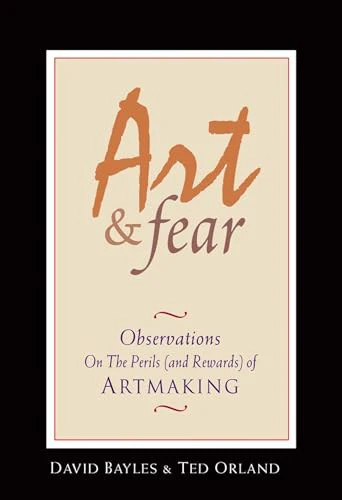{style="border-radius: 4px; max-height: 380px; display: block; margin: 0 auto;"}
:::
:::
  
# Bolk 2

Placeholder

# Bolk 3: Generativ AI og språkmodeller

##
<!-- ## DET ER NÅ DET SKJER!!! -->

```{=html}
<div style="display: flex; flex-direction: column; gap: 18px; margin-top: 18px;">

  <div class="fragment" data-fragment-index="1" style="padding: 14px 22px; background: linear-gradient(90deg, #c0392b, #e67e22); color: #fff; border-radius: 10px; transform: rotate(-1deg); box-shadow: 0 8px 20px rgba(0,0,0,0.25);">
    <span style="font-size: 0.7em; opacity: 0.85; letter-spacing: 0.1em;">2023 • SVEN (SJEFEN) PÅ ALLMØTE</span><br>
    <span style="font-size: 1.3em; font-weight: 800;">"DET ER NÅ DET SKJER! Er det ikke, Simen?"</span>
  </div>

  <div class="fragment" data-fragment-index="2" style="padding: 14px 22px; background: #2c3e50; color: #ecf0f1; border-radius: 10px; transform: rotate(0.8deg); box-shadow: 0 6px 16px rgba(0,0,0,0.25); align-self: flex-end; max-width: 80%;">
    <span style="font-size: 0.7em; opacity: 0.7; letter-spacing: 0.1em;">2023 • SIMEN, FAGEKSPERT</span><br>
    <span style="font-size: 1em; font-style: italic;">"Slapp av. Det er bare transformere fra 2017 med mer data. Imponerende forskning og lovende empirisk, men... [blablabla]"</span>
  </div>

  <div class="fragment" data-fragment-index="3" style="padding: 16px 24px; background: linear-gradient(90deg, #1e6fbf, #4a90e2); color: #fff; border-radius: 10px; transform: rotate(-0.5deg); box-shadow: 0 10px 24px rgba(30, 111, 191, 0.4); border: 3px solid #cfe3f7;">
    <span style="font-size: 0.7em; opacity: 0.85; letter-spacing: 0.1em;">MARS 2026 • SIMEN, FRA TALERSTOLEN I EN KIRKE I KRISTIANSAND</span><br>
    <span style="font-size: 1.5em; font-weight: 900;">"DET ER NÅ DET SKJER!!!"</span>
    <div style="margin-top: 6px; font-size: 0.85em; font-style: italic; opacity: 0.95;">- frelst AI-evangelist</div>
  </div>

</div>
```

## Hva har skjedd?

::: {.incremental}
- Software-aksjer faller når AI-selskaper kunngjør produkter
- **Før 2026:** Føltes som effektiv "auto-complete"
- **I 2026:** Skikkelige utviklere skriver ikke kode
  - Faktisk nyttige
:::

::: {.fragment style="text-align: center; margin-top: 18px;"}
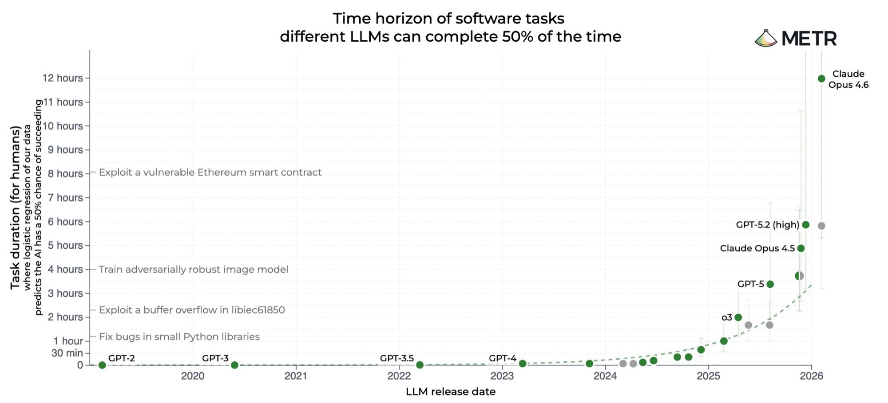{style="border-radius: 8px; max-height: 450px; display: block; margin: 0 auto;"}


:::


## Hva er egentlig en språkmodell?

::: {.incremental style="font-size: 0.95em;"}

1. Gir en **sannsynlighet** for hvert mulig neste ord
2. Trenes på store mengder tekst og bilder
:::

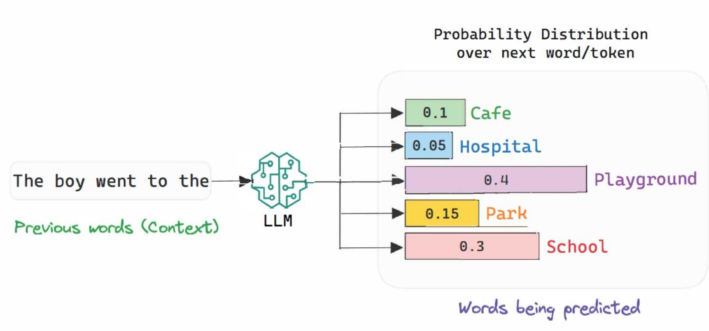{style="display: block; margin: 18px auto 0; max-width: 95%; border-radius: 8px;"}

# De fire knaggene på språkmodeller

## Data: hva trener vi på?

::: {.incremental}
- **Hele internett** - bøker, kode, forum, artikler, bilder
  - Kvalitetsinnhold prioriteres (Lovtekster > Kvinneguiden)
  - Egne datasett kan fintrene modellen til spesifikke oppgaver
  - Modellprodusentene lager nye, syntetiske datasett
  - Datasett vi vet svarene på men ikke veien:
    - "Når holdes AI kurset til JUS?"
  
:::

## Modell: en sannsynlighet over neste ord

$$P(w_3 = \text{"gøy"} \mid \text{"Juss er"};\, \theta)$$

::: {.incremental}
- Samme byggekloss som i bolk 1
- En **klassifiseringsmodell** der hver kategori er ett ord
- "Neste ord gitt forrige ord", med noen ukjente parametere $\theta$
- Forskjellen: **mange** flere parametere (100+ milliarder)
- Modellarkitektur/struktur: transformer (fra 2017)
:::

::: {.fragment style="margin-top: 18px; text-align: center; font-size: 0.9em; color: #555;"}
Samme prinsipp, bare mye, mye større
:::

## Hvordan modellen lærer

::: {.columns}
::: {.column width="50%"}

::: {.fragment fragment-index=1}
::: {style="padding: 6px 14px; background: #e8f4ff; border-left: 4px solid #4a90e2; border-radius: 4px; margin-bottom: 12px;"}
**Endring av parametere**
:::

::: {.callout-note appearance="simple" icon=false}
**1. Next-token prediction**

Modellen ser tekst, prøver å gjette neste ord. Korrigeres på avvik.
:::

::: {.callout-note appearance="simple" icon=false}
**2. Reinforcement learning**

Modellen genererer flere svar - vi premierer det beste (gjør det mer sannsynlig).

- Automatisk hvis svaret er kjent (verifiser)
- Menneske hvis vanskelig å måle
:::
:::

:::

::: {.column width="50%"}

::: {.fragment fragment-index=2}
::: {style="padding: 6px 14px; background: #fff3b0; border-left: 4px solid #c0392b; border-radius: 4px; margin-bottom: 12px;"}
**Endring av prompten (parametere ligger fast)**
:::

::: {.callout-note appearance="simple" icon=false}
**3. Bedre instruksjoner**

Vær mer presis i selve prompten - rolle, format, hva som er viktig.
:::

::: {.callout-note appearance="simple" icon=false}
**4. Few-shot prompting**

Gi modellen noen eksempler rett i prompten. Den "lærer" mønsteret uten retrening.
:::

::: {.callout-note appearance="simple" icon=false}
**5. Tool use**

Modellen kaller verktøy: `<tool: websearch, q: "...">`. Svaret kommer tilbake i tekstflyten.
:::
:::

:::
:::

::: {.fragment style="margin-top: 14px; text-align: center; font-size: 0.95em;"}
**Tool use** er det som låser opp agenter
:::

# Bruk: AI-agenter

## En agent er en språkmodell med verktøy

::: {.columns}
::: {.column width="55%"}
::: {.incremental}
- Modellen kan kalle verktøy: e-post, kalender, websøk, kode, BankID
- Appen rundt språkmodeller plukker opp at språkmodellen har kalt et verktøy, gjør kommandoen og returnerer svarer som ren tekst
- Deretter kaller man LLMen som da har infoen den trenger
:::
:::

::: {.column width="45%"}
{style="border-radius: 8px; max-height: 460px;"}

:::
:::

## Eksempel: en app på en uke

::: {.columns}
::: {.column width="50%"}
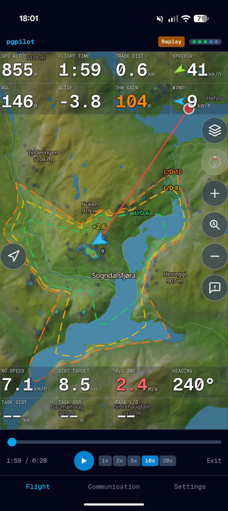{style="border-radius: 8px; max-height: 720px; width: auto; max-width: 100%; display: block; margin: 0 auto;"}
:::

::: {.column width="50%"}

```{=html}
<ul style="margin: 0; padding-left: 24px;">
  <li class="fragment" data-fragment-index="1">Paragliderapp du bruker mens du flyr</li>
  <li class="fragment" data-fragment-index="2">Kart, høyde, venners posisjon, kommunikasjon, +++</li>
  <li class="fragment" data-fragment-index="3">Første brukbare version: en uke med kodeagent</li>
  <li class="fragment" data-fragment-index="4">Live-testet i lufta over Colombia</li>
</ul>

<div class="fragment" data-fragment-index="4" style="display: flex; justify-content: center; margin-top: 16px;">
  
</div>
```

:::
:::

## ...også en personvernsgjennomgang av samme app

::: {.columns}
::: {.column width="55%"}

::: {.incremental style="font-size: 0.92em;"}
- Publisere app: Google og Apple klaget på manglende privacy policy
- Privacy policy er et tverrfaglig minefelt
- Stor kodebase og masse lover..?
- Avsjekk etterpå
- Tror dette ble *bedre*
:::

:::

::: {.column width="45%"}
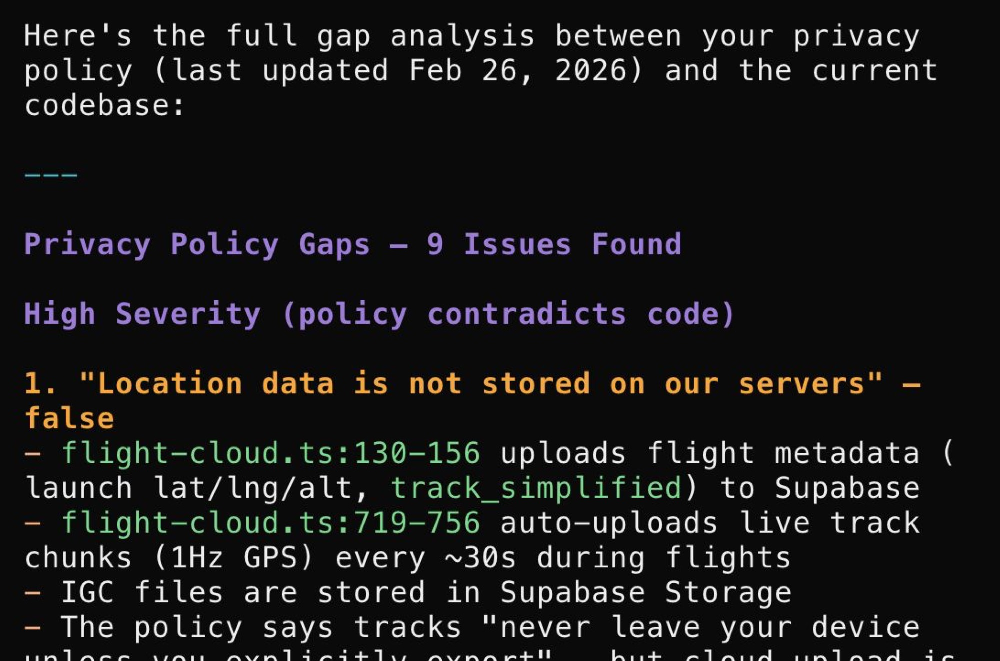{style="border-radius: 8px; max-height: 460px; display: block; margin: 0 auto;"}

:::
:::

## Flere eksempler

```{=html}
<div style="display: grid; grid-template-columns: 1fr 1fr 1fr; gap: 18px; margin-top: 8px; align-items: start;">

  <div class="fragment" data-fragment-index="1" style="display: flex; flex-direction: column;">
    <div style="height: 280px; display: flex; align-items: center; justify-content: center; overflow: hidden; border-radius: 8px;">
      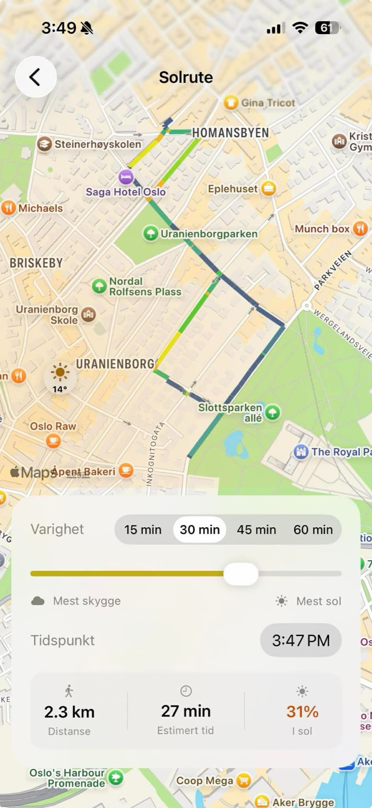
    </div>
    <div style="margin-top: 8px;"><strong>Solrute-app</strong></div>
    <div style="font-size: 0.8em; color: #555; margin-top: 4px;">Pappaperm-prosjekt: triller barnevogn på den solrike siden av gata</div>
  </div>

  <div class="fragment" data-fragment-index="2" style="display: flex; flex-direction: column;">
    <div style="height: 280px; display: flex; align-items: center; justify-content: center; overflow: hidden; border-radius: 8px;">
      
    </div>
    <div style="margin-top: 8px;"><strong>Vergeportalen</strong></div>
    <div style="font-size: 0.8em; color: #555; margin-top: 4px;">Innloggingsløsning for offentlige</div>
  </div>

  <div class="fragment" data-fragment-index="3" style="display: flex; flex-direction: column;">
    <div style="height: 280px; display: flex; align-items: center; justify-content: center; overflow: hidden; border-radius: 8px; background: #000;">
      <iframe src="https://www.youtube.com/embed/bemrcQcHmMk?rel=0&autoplay=1&mute=1&playsinline=1" style="width: 100%; height: 100%; border: 0;" allow="autoplay; encrypted-media; picture-in-picture" allowfullscreen></iframe>
    </div>
    <div style="margin-top: 8px;"><strong>Robotikk</strong></div>
    <div style="font-size: 0.8em; color: #555; margin-top: 4px;">"Neste robotbevegelse"</div>
  </div>

</div>
```

## "Toget har gått"

::: {.columns}
::: {.column width="50%"}
{style="border-radius: 8px; max-height: 720px; width: 100%; height: auto; display: block;"}
:::

::: {.column width="50%"}
::: {.incremental}
- Farfar Kjartan, 86
- Sluttet å kode i 1974
- Uferdig prosjekt fra Raufoss Våpenfabrikk
- Plukket opp igjen - med Claude som hjelper
- Koder COBOL, et språk knapt noen kan lenger
:::

:::
:::

## En dødelig treenighet

::: {.columns}
::: {.column width="50%"}
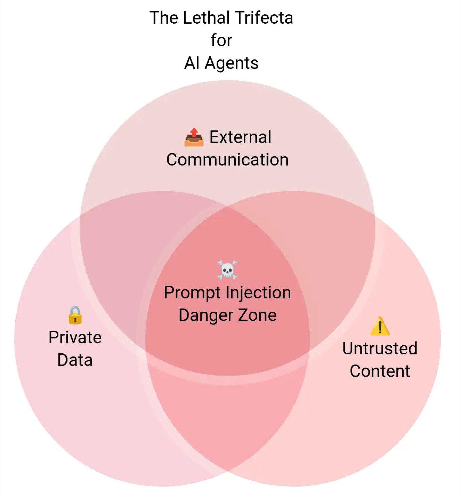{style="border-radius: 8px;"}
:::

::: {.column width="50%"}
::: {.incremental}
- LLM-en kan ikke skille **instruksjoner** fra **innhold**
- Hvis agenten har:
  1. Privat data
  2. Mottar untrusted innhold (web, e-post)
  3. Kan kommunisere utad
- ...kan ondsinnet tekst hijacke handlingene
:::

<!-- ::: {.fragment style="margin-top: 16px; font-size: 0.85em; color: #888;"}
Simon Willison: "the lethal trifecta"
::: -->
:::
:::

## Oppsummering: de fire knaggene

```{=html}
<table style="margin: 8px auto 0; border-collapse: collapse; font-size: 0.75em; width: 100%;">
  <thead>
    <tr style="border-bottom: 2px solid #333; background: #f8f8f8;">
      <th style="padding: 8px 10px; text-align: left;">Knagg</th>
      <th style="padding: 8px 10px; text-align: left;">Hva gjør den?</th>
      <th style="padding: 8px 10px; text-align: left;">Klassisk ML</th>
      <th style="padding: 8px 10px; text-align: left;">Språkmodell</th>
      <th style="padding: 8px 10px; text-align: left; background: #fff3b0;">Juridiske problemstillinger</th>
    </tr>
  </thead>
  <tbody>
    <tr class="fragment" data-fragment-index="1" style="border-bottom: 1px solid #eee;">
      <td style="padding: 8px 10px; font-weight: 700; color: #4a90e2;">Data</td>
      <td style="padding: 8px 10px;">Observasjoner vi kan lære av</td>
      <td style="padding: 8px 10px;">Tabell med rader</td>
      <td style="padding: 8px 10px;">Internett + kvalitetskilder</td>
      <td style="padding: 8px 10px; background: #fffaeb;">Personopplysninger, opphavsrett, dataminimering, "GDPR", ..</td>
    </tr>
    <tr class="fragment" data-fragment-index="2" style="border-bottom: 1px solid #eee;">
      <td style="padding: 8px 10px; font-weight: 700; color: #4a90e2;">Modell</td>
      <td style="padding: 8px 10px;">En antakelse om strukturen i verden</td>
      <td style="padding: 8px 10px;">$P(y \mid x)$</td>
      <td style="padding: 8px 10px;">$P(\text{neste ord} \mid \text{tidligere ord})$</td>
      <td style="padding: 8px 10px; background: #fffaeb;">Forklarbarhet, dokumentasjonsplikt, ...</td>
    </tr>
    <tr class="fragment" data-fragment-index="3" style="border-bottom: 1px solid #eee;">
      <td style="padding: 8px 10px; font-weight: 700; color: #4a90e2;">Trening</td>
      <td style="padding: 8px 10px;">Lære modellen hvordan verden er</td>
      <td style="padding: 8px 10px;">Maximum likelihood</td>
      <td style="padding: 8px 10px;">Next-token + RL + tool use + prompt</td>
      <td style="padding: 8px 10px; background: #fffaeb;">Valideringskrav, testing på separate data, overfitting, monitorering</td>
    </tr>
    <tr class="fragment" data-fragment-index="4">
      <td style="padding: 8px 10px; font-weight: 700; color: #4a90e2;">Handling</td>
      <td style="padding: 8px 10px;">Hva vi gjør med prediksjonen</td>
      <td style="padding: 8px 10px;">Argmax, top-K, threshold</td>
      <td style="padding: 8px 10px;">Agenter med verktøykall</td>
      <td style="padding: 8px 10px; background: #fffaeb;">Diskriminering, automatiserte beslutninger, feedback loop, ...</td>
    </tr>
  </tbody>
</table>
```

# Workshop: Bygg en LLM-klassifiserer

## Lær en språkmodell å lese terms of service

::: {.incremental}
- Datasett: LegalBench `unfair_tos` (Stanford)
- Klausuler fra Spotify, Netflix, eBay, Facebook
- Klassifiser hver som `fair` eller `unfair`
- Tre steg:
  1. **Zero-shot** - bare instruksjon
  2. **Few-shot** - legg til 10 ferdig-klassifiserte eksempler
  3. Sammenlign accuracy
:::

::: {.fragment style="margin-top: 18px; font-size: 0.9em;"}
Vi "trener" modellen ved å legge til data i prompten - samme prinsipp som når vi trener en AI-modell
:::

::: {.fragment style="margin-top: 30px; text-align: center; font-size: 1.3em; font-weight: 600;"}
Case-instruksjoner: [eide.ai/jus](https://eide.ai/jus/)
:::


# Diskusjon
