# Bli med på turen {.act-divider .hero-slide}

```{=html}
<div class="hero">
  
  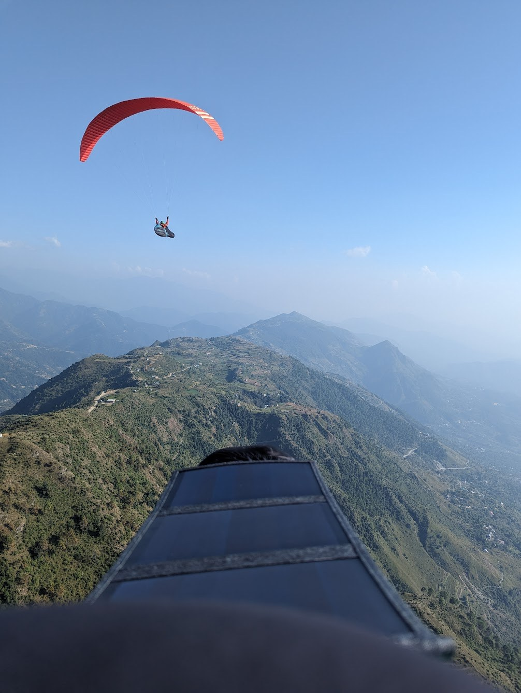
  <div class="hero-text">
    <p class="hero-kicker">pgpilot og India</p>
    <p class="hero-title">Bli med på turen</p>
  </div>
</div>
```

::: {.notes}
Samme apningsbilde som Loen-decket, sa de to henger sammen.

Ikke snakk lenge her. Bildet og setningen gjor jobben, sa gar du rett paa
"hvor er India?".
:::

## Hvor er India? Hvor er Bir?

```{=html}
<video class="fullbleed" src="voss-video/hvor-er-bir.mp4"
       poster="img/poster-hvor-er-bir.jpg"
       data-autoplay muted playsinline></video>
```

::: {.notes}
Klippet gjor hele bevegelsen: starter paa Voss med ring rundt, zoomer ut til
halve kloden, flytter seg ostover og lander med BAADE Bir og Delhi i bildet.

Det er poenget med sluttbildet: Delhi nede paa sletta, Bir oppe ved foten av
fjellkjeden. Da ser folk hvor langt inn i landet du maa for aa komme dit, og
hvor brat overgangen fra flatt til Himalaya er.

IKKE loop paa denne. Den skal bli staaende paa sluttbildet: Bir i ringen, med
Himalaya rett bak og slettene under. Det bildet ER argumentet for Bir, saa la
det staa mens du snakker.

Si avstanden hoyt mens den zoomer. Effekten er at avstanden blir fysisk i
stedet for et tall.
:::

## Hvorfor Bir?

```{=html}
<div class="two-img">
  
  
</div>
```

::: {.notes}
Svaret paa "hvorfor akkurat Bir". Geita og teen, i den rekkefolgen, er hele
poenget: det er ikke bare flyging, det er et sted aa vaere.

Dette er samme oppbygging som slide 47, 49 og 50 i Loen-decket, bare samlet
paa ett slide.

Ligger her, rett etter at folk har sett hvor Bir er, fordi det er da
sporsmaalet melder seg.
:::

##

```{=html}
<video class="fullbleed" src="voss-video/klipp-backcountry.mp4"
       poster="img/poster-backcountry.jpg"
       data-autoplay loop muted playsinline></video>
```

::: {.notes}
Og saann ser flygingen ut. Backcountry over de snodekte ryggene, hentet fra
Loen-decket.

Ingen tekst. La det ga mens du sier én setning om hvorfor du drar tilbake.
:::

##

```{=html}
<video class="fullbleed" src="voss-video/klipp-mat.mp4"
       poster="img/poster-mat.jpg"
       data-autoplay loop muted playsinline></video>
```

::: {.notes}
Maten, rett etter flygingen. Det er rekkefolgen en dag i Bir faktisk har:
du flyr, og saa sitter du og spiser.

La den ga mens du forteller kort om hvordan en dag der ser ut. Sa gaar du
videre til at de skal installere appen.
:::

# Installer appen {.act-divider}

[Akt 1]{.act-num}

::: {.notes}
Akten har EN jobb: at alle far appen pa telefonen. Ikke gruppa, ikke featurene.
Bare installasjonen. Gruppa kommer i akt 2, der den hoerer hjemme sammen med
PTT.

Meld i klubbkanalen kvelden for: "last ned pgpilot for du kommer". App
Store-nedlastingen er det eneste i hele opplegget du ikke kontrollerer.
:::

## Last ned

```{=html}
<div class="install">
  <div class="install-shot">
    
  </div>
  <div class="install-links">
    <div class="store">
      
      <div class="store-name">Android</div>
      <div class="store-sub">Google Play</div>
    </div>
    <div class="store">
      
      <div class="store-name">iPhone</div>
      <div class="store-sub">App Store</div>
    </div>
    <div class="store store-web">
      
      <div class="store-name">Eller bare</div>
      <div class="store-sub">pgpilot.app</div>
    </div>
  </div>
</div>
```

::: {.notes}
La denne staa lenge. Den er ikke en illustrasjon, den er en oppgave salen skal
gjore mens du snakker.

Tre veier, og den tredje er den viktigste for de som nler:
  - Google Play
  - App Store
  - pgpilot.app i nettleseren: visningsnavn og ingenting mer. Ingen e-post,
    ingen konto, ferdig paa under et halvt minutt.

Nettleserveien er redningen for alle som ikke gidder aa installere noe, og for
de som har fullt lager paa telefonen.
:::

## Planlegge flyturen

```{=html}
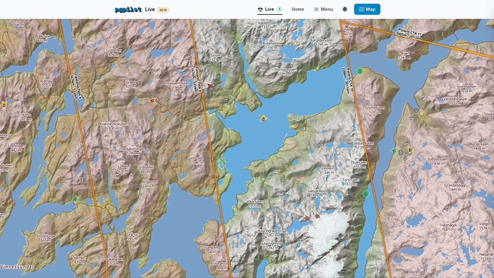
```

::: {.notes}
Vestlandet i appen. Alt dette er planlegging, og alt sammen funker hjemme:

  - **Startplassene** er de fargede merkene med tall. Fargen sier om stedet
    passer i dagens vind, tallet hvor mange som har flydd der.
  - **Luftrommet** ligger som gule linjer: Flesland TMA og Polaris CTA.
  - **Terreng og hoydekoter** under det hele.
  - **Vaervarsel og nedbor** kan legges paa som eget lag. Zoomer du ut ser du
    bygene komme.
  - **Vindstasjoner** viser hva det faktisk blaaser akkurat naa, ikke hva
    modellen tror.
  - **Ruter og oppgaver** tegnes rett i kartet og deles til gruppa.

Dette er sliden der du sier at appen er en planleggingsapp foer den er et
instrument. Og det er verdt aa merke seg til senere: **ingenting av dette
finnes over Bir.** Det kommer tilbake i akt 4.
:::

## Vind og varsel på Bavallen

```{=html}
<div class="two-up" style="justify-content:center">
  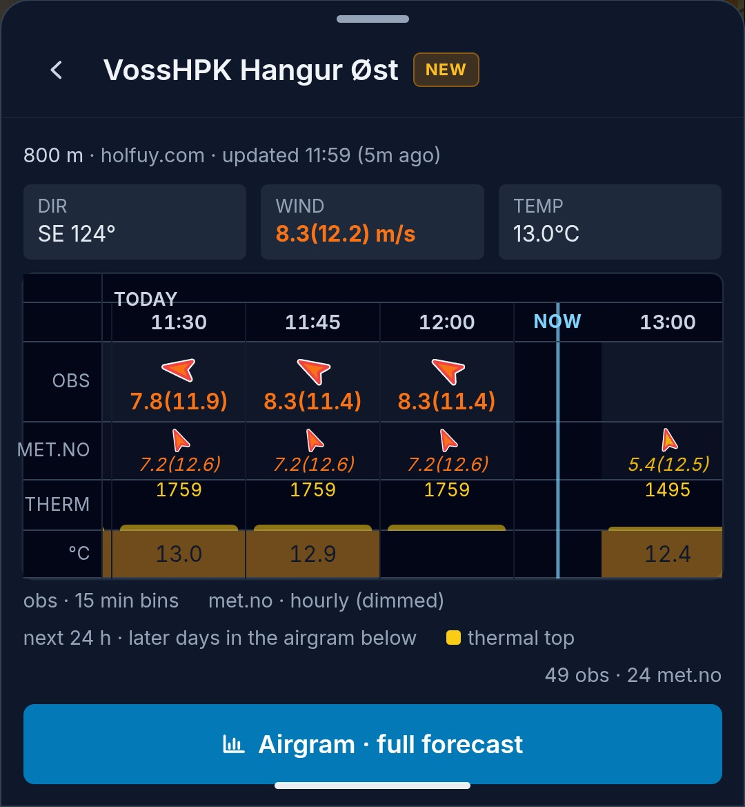
  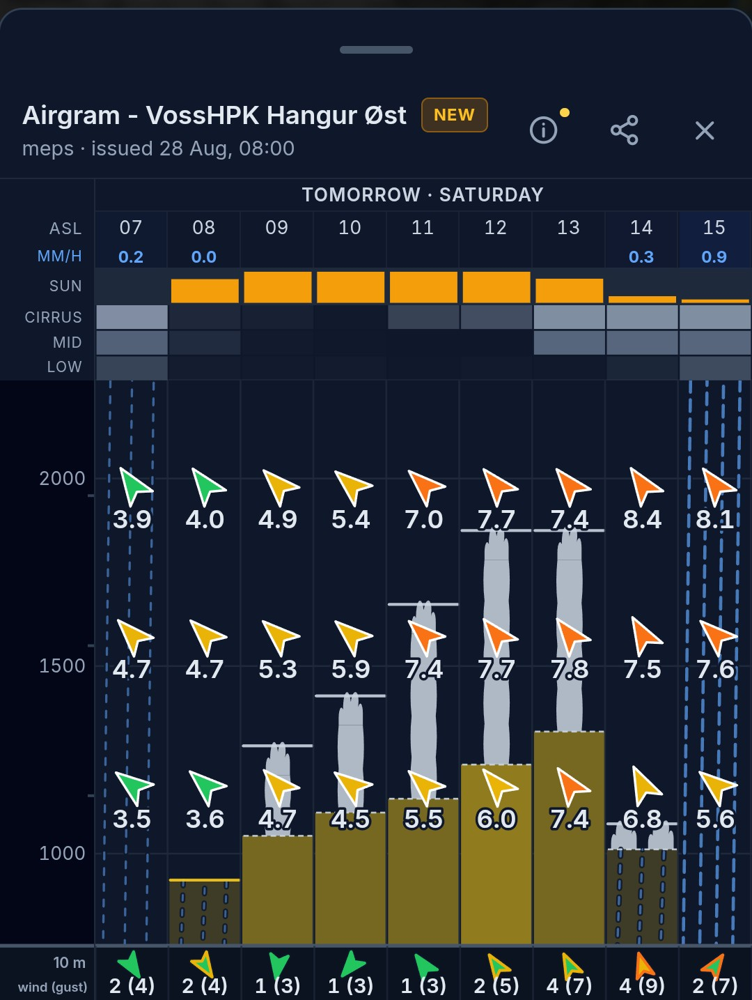
</div>
```

::: {.notes}
Ta det hjem til salen: dette er Bavallen, ikke et sted i India.

Du trykker på startplassmerket i kartet, og du får hele stedet: 805 moh, og
vindmåleren VossHPK Hangur Øst som står rett ved siden av.

Begge bildene er tatt i dag, fredag, rett for foredraget. Tallene er ekte og
ferske, og det er halve poenget: si det høyt.

**Venstre: det som faktisk har skjedd.** Hver rute er et 15-minutters snitt,
med kastet i parentes og pila som viser retningen. Akkurat nå står det SE 124
grader og 8.3 med kast 12.2, altså for mye for de fleste, og det er en fin ting
å innrømme foran salen: appen forteller deg like gjerne at du skal bli hjemme.
Den blå NOW-streken skiller målingene fra varselet, og met.no-raden under ligger
dempet ved siden av, så du ser med det samme om modellen traff dagen eller
bommet. Her ligger den på 7.2 mot målte 8.3, altså ganske nære.

**Høyre: airgrammet for i morgen, lørdag.** Merk at overskriften sier Hangur
Øst: du trykket deg hit fra vindmåleren, så varselet står der stasjonen står,
et steinkast fra Bavallen. De gule søylene er termikken, mørkere er sterkere,
og toppen av søyla er så høyt du kommer. Vindpiler oppover i høyden, skyer og
sol i radene øverst, regn som blå streker.

Les det høyt for dem, det er i morgen og de bryr seg:
  - en dråpe tidlig, så står sola på fra åtte
  - termikken jobber fra rundt ni til ett
  - opp mot 1300 meter når den er på sitt beste, ved ett-tida
  - svak vind på bakken, 1 til 2 sekundmeter midt på dagen
  - så tar den seg opp til 4 med kast 9, og det kommer en byge fra to-tida

Konklusjonen du kan si rett ut: i morgen tidlig er dagen, og den er kort.

Si at det er den samme knappen uansett hvor i verden du står. Det er det som
kommer tilbake i akt 4.
:::

## Koble på tjenestene

```{=html}
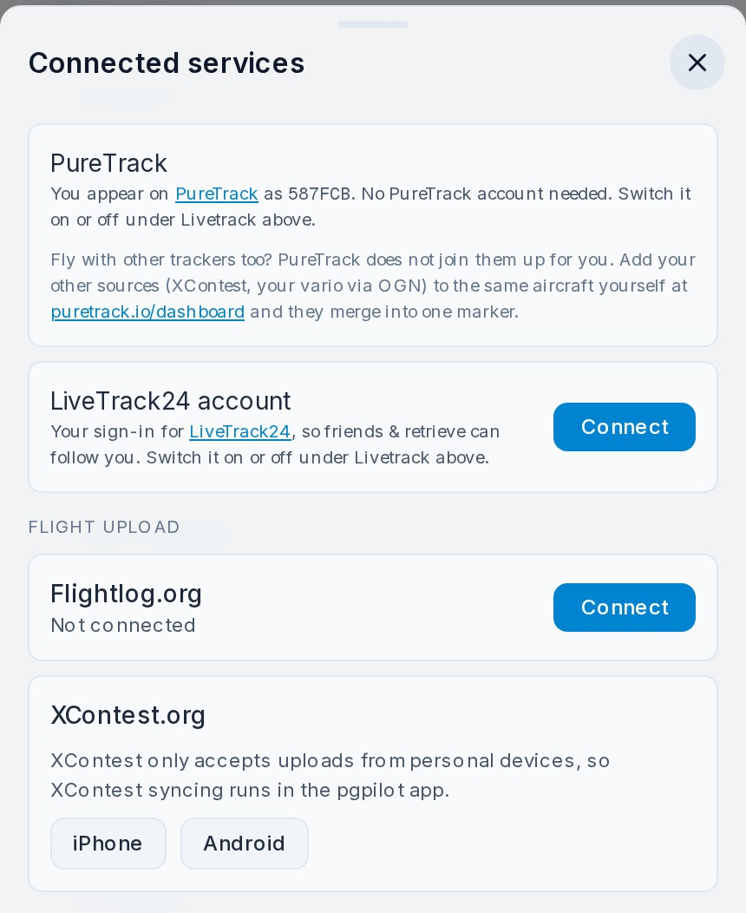
```

::: {.notes}
Menu, så **Connected services**. Alt som skal snakke med noe utenfor appen
ligger på én side.

Nederst, under **Flight upload**, står de to som klubben bryr seg om:
  - **Flightlog.org.** Koble til én gang, og turene går opp av seg selv.
    Den går via serveren vår, så telefonen slipper å gjøre noe.
  - **XContest.org.** Samme greia, men den må gå fra telefonen, for
    xcontest.org slipper ikke inn serveren vår. Derfor står det iPhone og
    Android der.

Over ligger livesporingen: OGN og FLARM, PureTrack, LiveTrack24, InReach.
Én posisjon ut fra telefonen, videre til alle nettene, uten ekstra batteri.

Poenget for en klubbkveld: ingen laster opp noe manuelt lenger, og turene
havner i statistikken uten at noen må mase om det.

Ikke bruk lang tid her. Vis at det finnes, si at det tar to minutter i sofaen,
og gå videre.
:::

# På startplassen i Billing {.act-divider}

[Akt 2]{.act-num}

::: {.notes}
Vi star pa 2428 meter. Sivilisasjonen rett nedenfor, og NETTET VIRKER. Sa her
gjor vi alt det vanlige, det de ville gjort pa Voss en tirsdag.

Hele denne akten er live app. Decket er bare hvilepute mellom punktene.
:::

## Hvor er vi

```{=html}
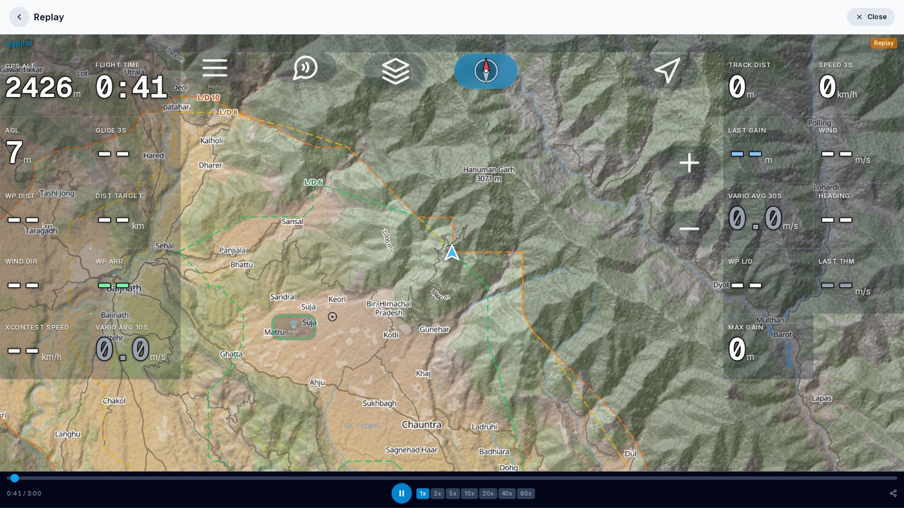
```

::: {.notes}
Dette er appen som staar paa startplassen i Billing, 2424 moh, hentet fra
pgpilot.app.

Alt er ekte: terrenget, hoydekotene, stedsnavnene nedover mot Bir og Gunehar,
og luftrommet i oransje og gult. Panelene rundt er instrumentet slik det ser ut
i lufta.

Zoomet to hakk ut, saa du ser dalen og fjellkjeden bak, ikke bare et utsnitt.

Glidekjeglene er synlige: L/D 6, 8 og 10 som stiplede linjer. De sier hvor langt
du rekker, og de er en gratis forsmak paa akt 3 klipp 4.

Termikk-overlegget (KK7) er paa, men det tegner tynt akkurat her. Det er et
globalt kart, saa dataene finnes, men Bir er ikke Alpene.

Ikke snakk om startplassdatabasen. Bare la kartet staa og fortell hvor vi er.
:::

##

```{=html}
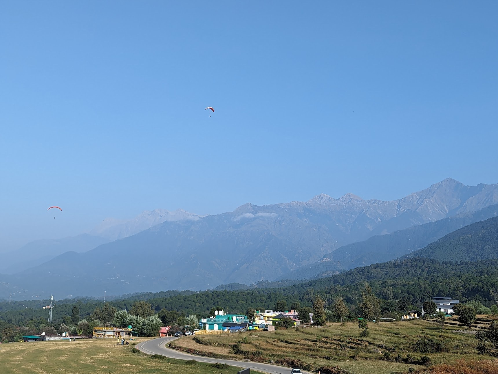
```

::: {.notes}
Og saa: sånn ser det faktisk ut derfra. Sliden foer er appens kart over Bir,
denne er det samme stedet med oynene. Kart, saa virkelighet. Si det omtrent
saann: "og det kartet, det ser slik ut naar du staar der."

To skjermer i lufta, bygda og terrassene rett under, og Dhauladhar-ryggen som
ligger der hele veien i bakgrunnen. Poenget er skalaen: det ser rolig ut, men
fjellene bak er over fire tusen meter. Det er DEN veggen vi flyr langs.

Ikke dvel. Ett pust, saa videre til maskinvaren.
:::

<!-- 1720x1295 i et 16:9-slide: cover skjuler ca 328 px hoyde. 60 % holder
     begge skjermene (y=378 og y=720) og bebyggelsen (y=1080) i ramma, og
     kutter det tomme jordet i forgrunnen i stedet. -->

## Koble på varioen

```{=html}
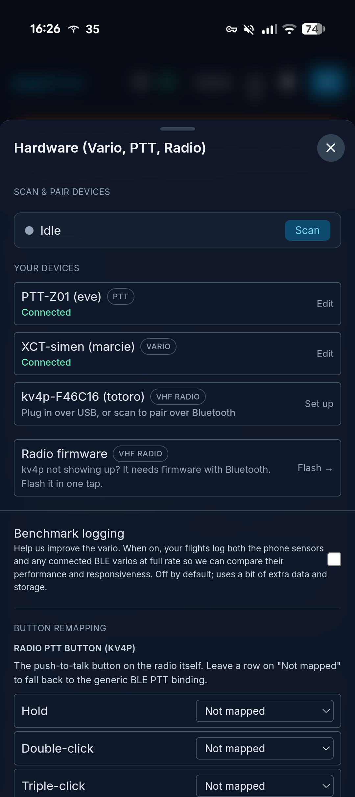
```

::: {.notes}
Skjermdump fra telefonen. Den finnes ikke i webversjonen i det hele tatt, fordi
BLE-koden er laast bak isNative().

Tre ting er tilkoblet samtidig her, og det er verdt aa peke paa: BLE-varioen,
PTT-knappen, og KV4P VHF-radioen. Det er hele maskinvarehistorien paa ett bilde.
:::

## Bli med i gruppa

```{=html}
<div class="joinbox">
  
  <div>
    <p class="join-url">pgpilot.app/join/<strong>voss</strong></p>
    <p class="join-sub">Skann, skriv navnet ditt, ferdig.</p>
  </div>
</div>
```

::: {.notes}
Flyttet hit fra akt 1 med vilje: gruppa gir ingen mening for de har appen, og
den hoerer sammen med PTT-demoen som kommer rett etterpaa.

GRUPPA LAGES NAAR DU RIGGER, IKKE FOR. Reaperen arkiverer grupper som har vaert
stille i fire timer, og join filtrerer paa archived=false, saa en gammel gruppe
gir en QR-kode som leder til ingenting. Join tupper aktiviteten, saa naar de
forste er inne holder den seg selv i live. Se STRUKTUR.md.

Si tydelig at de skal la appen ligge paa. Akt 4 avhenger av det.
:::

## Prat sammen

```{=html}
<div class="two-up">
  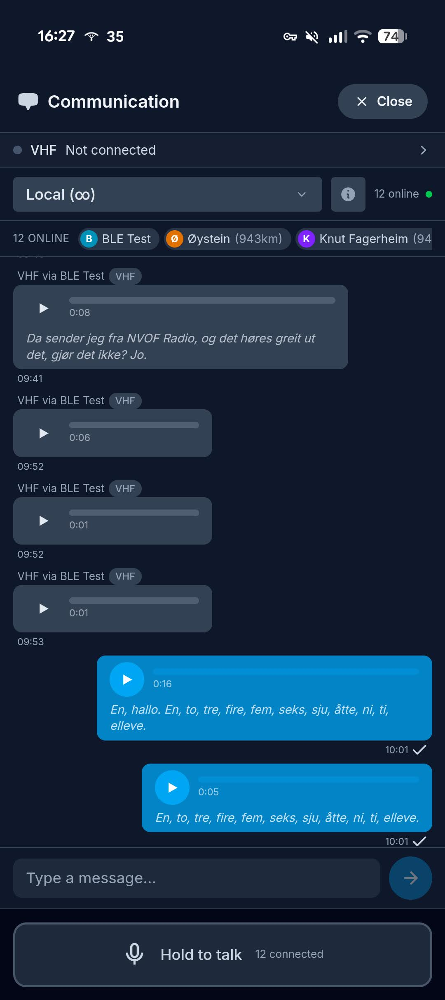
  <video class="clip-sm" src="voss-video/klipp-talking.mp4"
         poster="img/poster-talking.jpg"
         data-autoplay loop muted playsinline></video>
</div>
```

::: {.notes}
Si eksplisitt: ALLE LYTTER, EN SNAKKER. Ikke slipp tretti mikrofoner los.

Dette er oyeblikket der salen skjonner hva appen er: du sier noe, og det kommer
ut av tretti telefoner samtidig.
:::

## Lag tasken

```{=html}
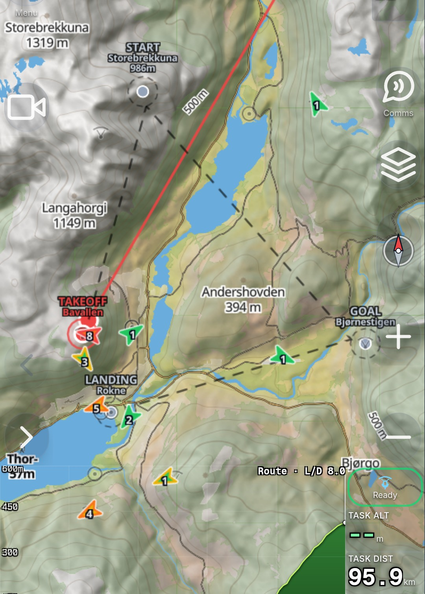
```

::: {.notes}
Det fineste oyeblikket i akten: de ser at DU gjorde noe og DERES telefon endret
seg. Sliden er ryggdekning, gjor det live pa telefonen.

Tasken pa bildet er ekte Voss-terreng, og det er hele poenget. Pek pa navnene,
de kjenner hvert eneste ett:
  - TAKEOFF Bavallen
  - START Storebrekkuna, 986 moh, sylinderen er den stiplede sirkelen
  - GOAL Bjornestigen
  - LANDING Rokne
  - TASK DIST 95.9 km, og L/D 8.0 pa ruta

Sylindrene og de stiplede beina tegnes rett i kartet. Sideview nederst viser
terrengprofilen under ruta, sa de ser hva de faktisk maa over.

Sa: send den til gruppa, og be dem se pa telefonen. Varselet heter "Load task".
Vent pa lyden i salen for du gar videre, det er den du er ute etter.
:::

# Vi tar av {.act-divider}

[Akt 3]{.act-num}

::: {.notes}
17. oktober 2024, Bir mot Saurkundi.

Formuleringen som gjor poenget uten a motsi videoen du staar og viser:

  "Dette er ikke en video av flyturen. Det er et opptak av APPEN som flyr den pa
   nytt. Alt dere ser av tall og piler regnes ut mens sporet spilles av."

Samme kode i replay som live. Si det rett ut, ingen gjetter det selv.

Tre minutter video i en akt pa fjorten. Klippene er illustrasjoner til det du
sier, ikke omvendt.
:::

## 1. Start fra Billing

```{=html}
<video class="clip" src="voss-video/klipp-start.mp4"
       poster="img/poster-start.jpg"
       data-autoplay playsinline></video>
```

::: {.notes}
Her staar vi. Terrassene under, fjellet som fortsetter bakover. Kartet er zoomet
ut, saa dere ser hele dalen vi skal ut i.

LYD PAA DENNE. Det er appens egen takeoff-lyd, den samme som gaar av i lomma
naar den skjonner at du har lettet. Ikke snakk over de forste sekundene, la den
komme.

Klippet looper ikke med vilje: lyden skal spille EN gang, saa blir bildet
staaende mens du snakker.
:::

## Vi flyr

```{=html}
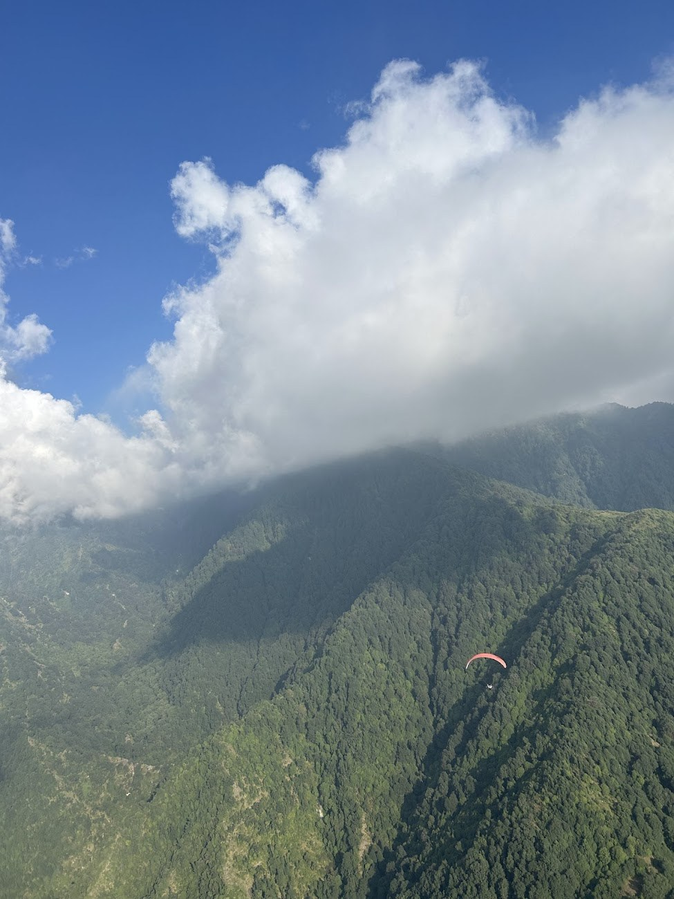
```

::: {.notes}
Her er det ekte. Ikke et kart, ikke et skjermopptak: dette er hva du faktisk ser
de foerste minuttene etter start.

Dette er FRONTRYGGEN rett over Bir, den groenne og skogkledde. Det er her du
soarer deg opp foer du gaar noe sted, og det er her salen kommer til aa vaere
hvis de blir med. Skyene ligger oppe paa ryggen, og terrassene ligger nede til
venstre.

Det snoedekte og hoye kommer senere. Ikke hopp dit enda.

La den staa noen sekunder foer du gaar videre til tallene.
:::

<!-- Portrettbilde (975x1300) i et 16:9-slide. Med object-fit: cover og
     standard 50% ble skjermen klippet helt bort og sliden viste bare sky og
     skogside. 78% holder skjermen, skyene paa ryggen og terrassene i ramma. -->

##

```{=html}
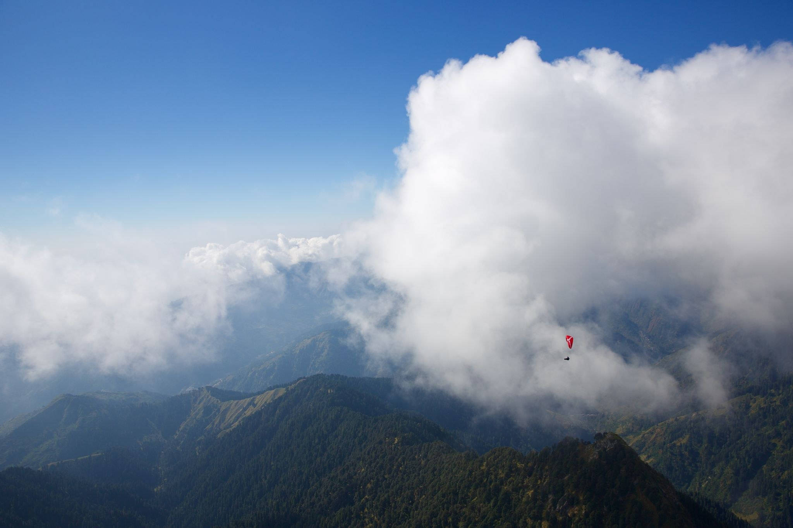
```

::: {.notes}
Og saa begynner vi aa komme opp. Her er skjermen liten og skya stor, og det er
akkurat den foelelsen: du er ikke stor i dette landskapet.

Dette er det siste ekte bildet foer vi gaar tilbake i appen. Bruk det til aa si
hvorfor tallene betyr noe: naar du staar her, med sky rundt og en rygg under,
er det ikke tid til aa gjette hoyde eller glidetall.
:::

<!-- 2048x1365: cover skjuler ca 213 px hoyde. 45 % holder toppen av skya inne
     og lar den moerke ryggen bli staaende nederst. Skjermen (y=886) er godt
     innenfor uansett. -->

## 2. Termikkboblen

```{=html}
<video class="clip" src="voss-video/klipp-termikk.mp4"
       poster="img/poster-termikk.jpg"
       data-autoplay loop muted playsinline></video>
```

::: {.notes}
Den mest overbevisende enkeltbiten, og de tre tingene hoerer sammen i samme
oyeblikk: varioen piper, appen tegner opp bobla, og vindpila strammer seg mens
du sirkler.

Si det som ett poeng: den vet ikke vinden naar du tar av. Den laerer den av
sirklene dine, og den husker hvor det steg.

Lyd paa dette klippet.
:::

## 3. Du ser de andre

```{=html}
<video class="clip" src="voss-video/klipp-tracking.mp4"
       poster="img/poster-tracking.jpg"
       data-autoplay loop muted playsinline></video>
```

::: {.notes}
Togga - Sota sæter, 18. august. Simen og Jorgen Sorenssen skrur i samme boble,
130 til 400 meter fra hverandre.

Se paa det cyan sporet: det VOKSER mens klippet gaar. Ett bilde per sekund av
flighten, saa man ser at posisjonen hans oppdaterer seg, ikke bare at han er der.

Det er dette som gjor at man holder sammen i lufta. Og det er det samme som
baerer over ryggen i India, der det ikke finnes bakkestasjoner i det hele tatt.
:::

## 4. Knappen på styrelinen

```{=html}
<div class="two-up">
  
  <video class="clip-sm" src="voss-video/klipp-knapp.mp4"
         poster="img/poster-knapp.jpg"
         data-autoplay loop muted playsinline></video>
  <div class="two-up-note">
    <ul>
      <li>Hold for å prate</li>
      <li>Dobbeltklikk for å zoome inn</li>
      <li>Trippelklikk for å zoome ut</li>
      <li>Tapp og hold for agenten</li>
    </ul>
  </div>
</div>
```

::: {.notes}
Den lille svarte knappen i lista, PTT-Z01, sitter festet paa styrelinen, innen
rekkevidde av tommelen. Det er hele poenget: hendene blir i bremsene, hanskene
blir paa, og telefonen blir der den er.

Fire trykk, og det er verdt aa vise dem med haanda mens du snakker:

  - **Hold inne: snakk.** Slipp, og du er ferdig. Samme PTT som de nettopp
    provde i akt 2, bare uten aa se paa skjermen.
  - **Dobbeltklikk: zoom inn.**
  - **Trippelklikk: zoom ut.**
  - **Tapp, sa hold: stemmeassistenten.** "Naviger til Jorgen", "hva er vinden".

Zoom er den de undervurderer i salen. I lufta er det ikke tallene du bytter, det
er utsnittet: inn naar du skrur i en boble, ut naar du skal velge hvor du gaar
videre. Det er den bevegelsen du gjor femti ganger paa en flytur, og det er den
som ellers koster deg en hanske.

Alle fire kan byttes om. Menyen har ogsaa: ta bilde, ta opp video, lyd av og
paa, neste og forrige vendepunkt, neste og forrige side, tilbake til
flyvisningen, og termikkassistent av og paa.

To ting som overrasker folk, si dem hvis du har tid:
  - Skjermen kan vaere dimmet. Holder du knappen litt lenger enn et halvt
    sekund vaakner skjermen OG sendingen starter, saa du trenger ikke vekke
    telefonen forst.
  - Knappen virker selv om pgpilot ikke ligger foran. Bluetooth gaar sin egen
    vei, saa du kan ha kart eller kamera oppe og fortsatt snakke.

Ingenting av dette finnes i nettleserversjonen. BLE-koden er laast bak
isNative(), saa dette er en av de faa tingene som krever appen.
:::

## 5. Sideview

```{=html}
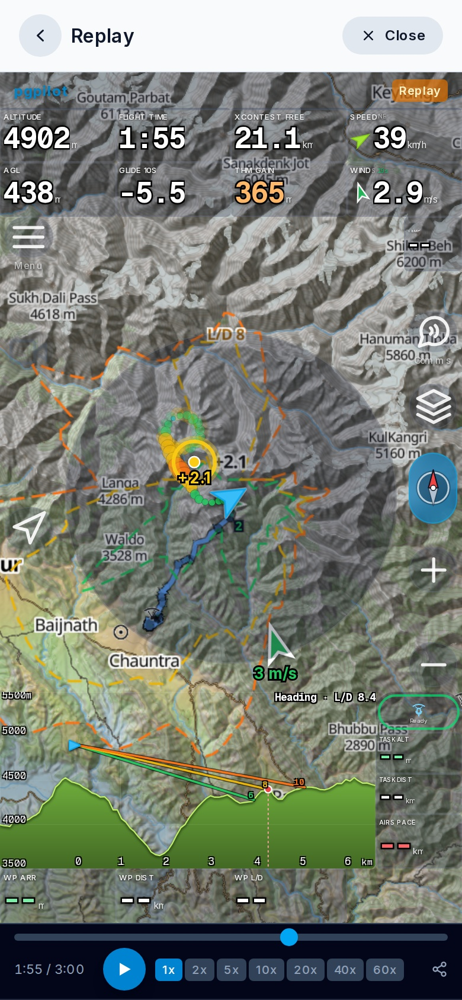
```

::: {.notes}
Zoomet langt nok ut til at profilen gaar til 6 km. Da ser man hva appen faktisk
sier: glidestraalene L/D 6, 8 og 10 treffer den stigende veggen rundt 4,5 km.
Det er DEN veggen du ikke kommer over.

Stillbilde, ikke klipp. Utzoomet kart med hoydekoter rendrer for tregt til aa
gi jevn video, og informasjonen her staar uansett stille.

Ellers i bildet: THM GAIN 365 m, WIND 2,9 m/s, termikkbobla, og glide
range-konturene paa kartet.
:::

## 6. Glide range på kartet

```{=html}
<video class="clip" src="voss-video/klipp-glide.mp4"
       poster="img/poster-glide.jpg"
       data-autoplay loop muted playsinline></video>
```

::: {.notes}
Glide range-konturene er de stiplede linjene rundt piloten: gronn L/D 6, gul
L/D 8, oransje L/D 10. De viser hvor langt du rekker fra der du er.

At de manglet foer var ikke en innstilling, men timing: useGlideRange returnerer
tidlig naar terrengflisene for hele rekkevidden ikke er cachet ennaa. Opptaket
venter naa til laget faktisk har data.

Glide range staar paa HOY kvalitet her, mot lav foer. Det er derfor konturene
folger rygger og renner i stedet for aa gaa i firkanter: cellene er 100 m i
stedet for 1000. Glidestraalene L/D 6, 8 og 10 treffer bakken ved 2,5 km med
stoppunktet markert.

Kartet er zoomet to hakk ut fra der replay foelger piloten, saa rekkevidden faar
plass i ramma. AA sette zoomen gjennom kartobjektet ble overstyrt av
foelg-logikken; minus-knappen mens replayet staar paa pause er det som sitter.
:::

::: {.notes}
Dette er ikke bare en feature, det er et SPORSMAL. Still det, la det henge, og
ga til akt 4 uten a svare. Det er der historien snur.
:::

# Innover i fjellene {.act-divider}

[Akt 4]{.act-num}

::: {.notes}
VENDEPUNKTET. Vi passerer siste rygg. Nettet dor.
:::

## Første flycamping

```{=html}

```

::: {.notes}
Introbildet til akten. Vi lander ikke og tar en taxi, vi slaar leir.

Solcellepanelet paa teltduken er verdt aa peke paa: alt som skal vare en uke
maa lades av sola.
:::

## Dit skal vi

```{=html}
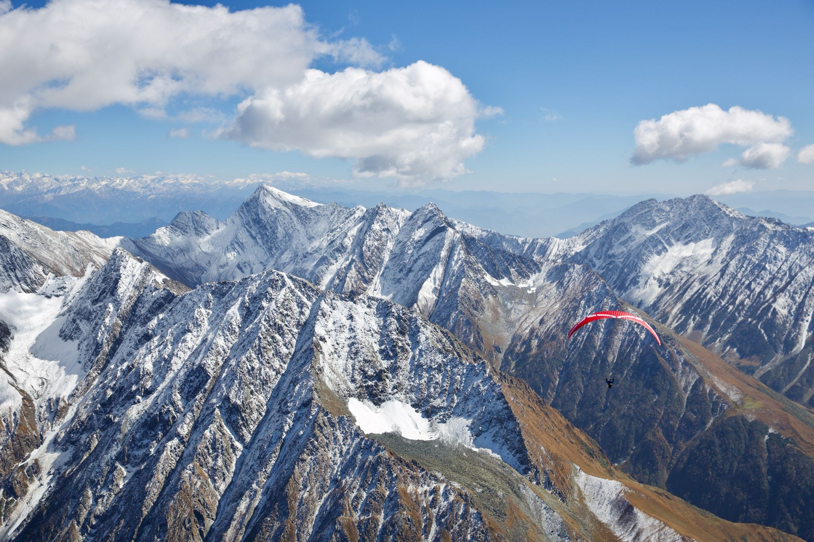
```

::: {.notes}
Bildet som viser hvilken vei vi gaar. Ikke si mer enn det.
:::

## Vi flyr innover

```{=html}
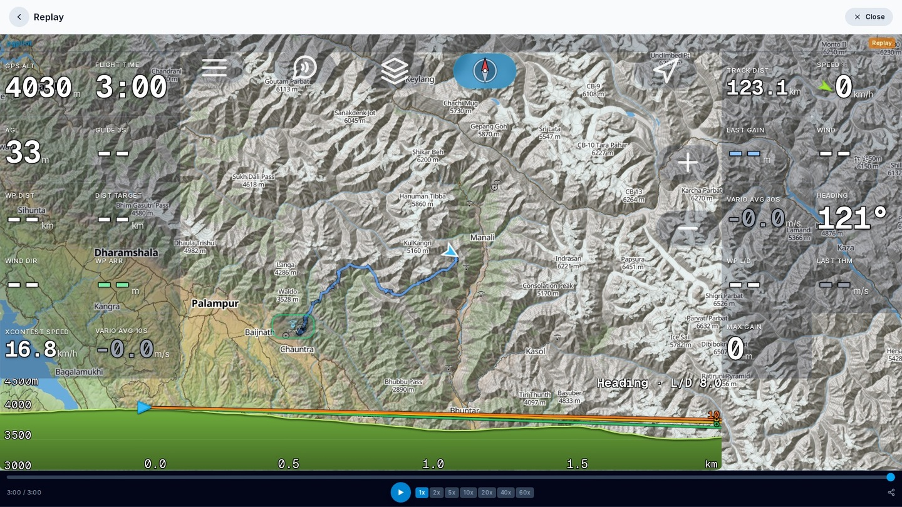
```

::: {.notes}
Dette erstatter XContest-bildene fra Loen-decket. Ekte spor i appen, ikke en
strek paa et fremmed kart.

123 km langs sporet, fra Bir opp mot Manali. Dharamshala og Palampur ligger
nede paa sletta til venstre, og resten er sekstusenmeterstopper.

Sammen med kartet fra startplassen i akt 2 er dette de to kartbildene som
forklarer hele turen. Trenger ikke flere.
:::

## Hele turen

```{=html}
<video class="fullbleed" src="voss-video/bir-3d.mp4"
       poster="img/poster-3d.jpg"
       data-autoplay muted playsinline></video>
```

::: {.notes}
Begge dagene i ett: ut fra Billing, ostover langs ryggen til 5516 meter, og hjem
igjen. Dag 2 starter i noyaktig samme punkt som dag 1 slutter, saa det er én
sammenhengende bivuakktur.

Sporet er farget etter hoyde: blaatt lavt, gjennom gronn og gul, roedt paa det
hoyeste.

IKKE loop. Den skal bli staaende paa sluttbildet der hele ut-og-hjem-loekka er i
ramma. Det bildet er turen.

Rendret mot ekte hoydemodell, ikke tegnet. Si det hvis noen spor.
:::

## Her er det ingenting

```{=html}
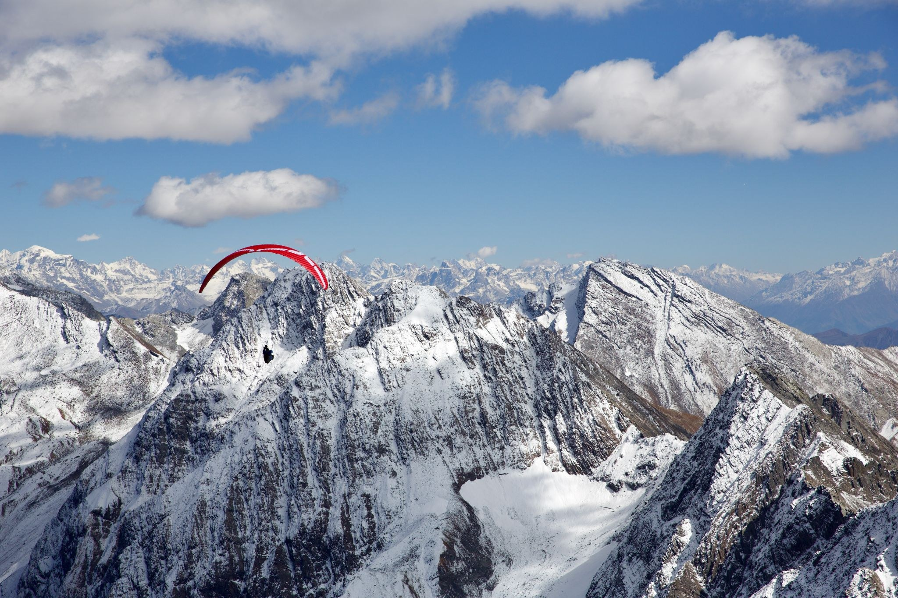
```

::: {.notes}
Naa er vi i storfjellene. Ingen vei, ingen bygd, ingen dekning.

Overgangen til neste slide: og da endrer flygingen seg.
:::

## Her mangler du tre ting

::: {.mangler .incremental}
- Internett
- Landinger
- Redning
:::

::: {.notes}
Tre ord er nok, og de er de tre som betyr noe. La dem komme én og én.

  - **Internett:** ingen varsel, ingen vindstasjoner, ingen luftromsdata, og
    ingen som ser hvor du er.
  - **Landinger:** ingen vei, ingen bygd, ingen flat mark. Floor is lava.
  - **Redning:** ingen som kommer og henter deg.

Si det langsomt. Dette er hele akten i tre ord.
:::

## Så da flyr du annerledes {.center}

::: {.mangler .incremental}
- Konservativt
- Samband som virker
- Satellittkommunikasjon
- Overlevelsesutstyr for en uke
:::

::: {.notes}
Loesningen paa de tre tingene som mangler. La dem komme én og én, saa henger
salen med i stedet for aa lese framover.

**Konservativt:** du gjor ikke ting i lufta du ikke ville gjort om du kunne
landet og tatt en taxi til pubben. Storre marginer, tidligere avgjorelser.

**Samband som virker:** radio i stedet for internett. VHF baerer mellom
piloter naar ingenting annet gjor det.

**Satellitt:** InReach naar det ikke er dekning i det hele tatt, og noen
hjemme som ser prikken bevege seg.

**Overlevelsesutstyr for en uke:** telt, sovepose, mat og vann. Du lander ikke
og gaar hjem, du lander og blir vaerende.

Sa gaar du videre og viser at det forste og andre er bygget inn i appen.
:::

## Hva pgpilot kan hjelpe deg med

```{=html}
<div class="two-up">
  <div class="two-up-note">
    <ul>
      <li>Se FLARM-buddies på kartet</li>
      <li>Koble InReach til kartet, så andre ser deg på pgpilot</li>
      <li>VHF direkte på mobilen</li>
    </ul>
  </div>
  
</div>
```

::: {.notes}
Samme skjerm som i akt 2, med vilje. Da handlet den om aa koble paa varioen.
Her handler den om hva som holder deg i kontakt naar det ikke finnes noe.

De tre punktene staar paa lerretet, i denne rekkefolgen. Snakk over dem, ikke
les dem opp:
  - **FLARM-buddies.** Andre som ligger paa FLARM eller OGN dukker opp som
    prikker i kartet ditt. Her hjemme er dekningen god.
  - **InReach.** Kobler du den til, gaar posisjonen din inn i pgpilot, saa de
    andre ser deg selv der det ikke finnes mobildekning i det hele tatt.
  - **VHF rett i mobilen.** Batteriet varer, og radioen sender selv om alt
    annet er dodt. VHF-broen mikser radioprat inn i gruppa, saa de med og uten
    radio hoerer hverandre.

Ground contact finnes ogsaa, men du sier selv den er mindre nyttig, saa nevn
den bare hvis noen spor.

Kontrasten til Bir er poenget i akten: OGN og FLARM-bakkestasjoner finnes knapt
i Himalaya, saa der nede baerer direkte pilot-til-pilot alt. Her hjemme kan du
lene deg paa nettet.
:::

# Landing og hjem {.act-divider}

[Akt 5]{.act-num}

::: {.notes}
Vi lander ved teltplassen. Dag 1 lander 200 meter fra der dag 2 starter, og det
er ikke tilfeldig, det er teltet.
:::

## Landing

```{=html}

```

## Framme

```{=html}

```

::: {.notes}
La de to bildene staa uten mye prat. Det er slutten paa flygingen.
:::

## Og så, etterpå

```{=html}
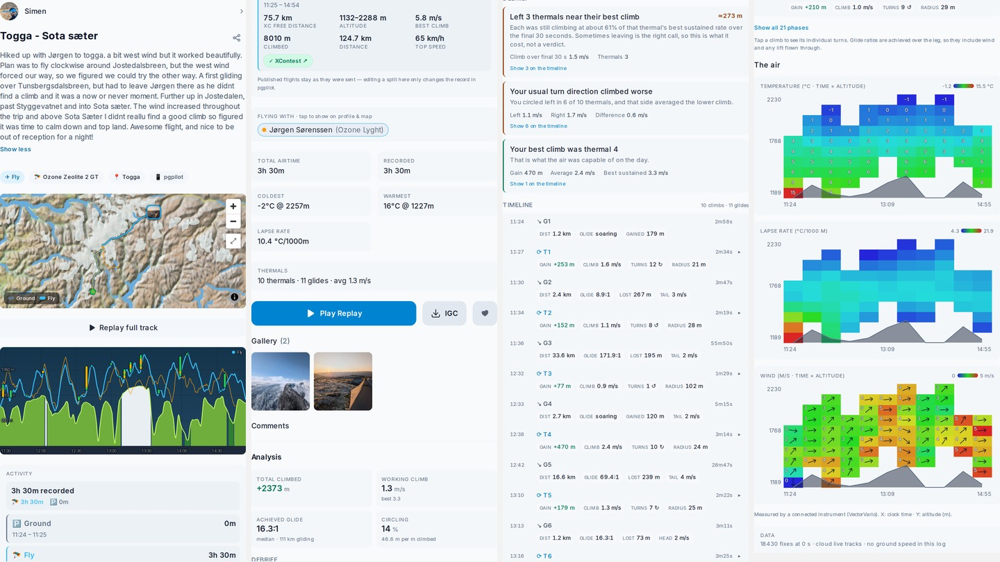
```

::: {.notes}
Togga - Sota sæter. Ett slide som gjoer fire jobber samtidig, saa du slipper
en slide per ting:

  - Se paa turen: kartet, sporet, hvor du fauk
  - Teksten og bildene du la inn selv
  - Segmentene: Ground og Fly skilt fra hverandre automatisk
  - Tallene: 75,7 km XC, 8010 m klatret, 124,7 km langs sporet

Snakk over den om det som skjer videre uten aa bytte slide: IGC ut, automatisk
opplasting til flightlog og XContest, og dedup mot det som alt ligger der.

Dette er grunnen til at de aapner appen igjen paa tirsdag.
:::

## AreaContest

```{=html}
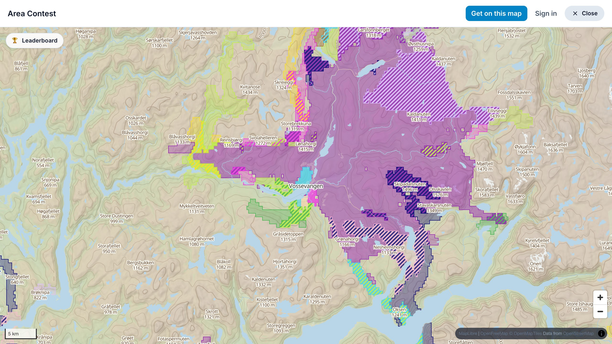
```

::: {.notes}
Beste retensjonsmekanikken du har, og et Voss-publikum er noyaktig folk som vil
krangle om dette.

GAA LIVE HER. Ha denne fanen aapen fra du rigger:

  pgpilot.app/areacontest#map=9/60.629/6.415

Den aapner seg noyaktig som bildet paa sliden, saa overgangen er usynlig.
Trykk `b` for aa svartlegge decket, alt-tab, panorer og zoom, alt-tab tilbake.
Er nettet daarlig blir du bare staaende paa bildet, og ingen merker noe.

Bildet er den samme sida, hentet i dobbel opplosning. Scoringen kjores om
natta, saa dette er stillingen fra i natt, ikke sanntid. Si det hvis noen spor
hvorfor kveldens tur ikke er med.

Pek paa fargene for du forklarer noe: det lilla er én pilot som eier det meste
rundt Voss, og rundt ligger gult, gront, cyan og morkeblatt. Da har du sagt hva
spillet er uten aa forklare regler. Navnene er deres egne: Storebrekkuna,
Lonahorgi, Skreieggi, Mjolfjell.

Reglene, kort:
  - Flyr du en lokke rundt et terreng, eier du det som ligger inni.
  - Flyr du rett fram, tar du et belte paa hver side av sporet, og beltet blir
    bredere jo lenger du toer aa dra fra startplassen.
  - Hver gang du dekker samme bakke igjen blir kravet ditt ett hakk sterkere.
    Den som eier en dal er altsaa den som blir ved aa fly den. Han heter Boss.
  - De stripete feltene er to piloter helt likt, da eier ingen bakken.

Det er derfor de kommer tilbake: eierskapet forvitrer ikke av seg selv, men
noen andre kan alltid fly det fra deg.
:::

# Bli med i 2026 {.act-divider}

[Akt 6]{.act-num}

## Sees vi?

```{=html}
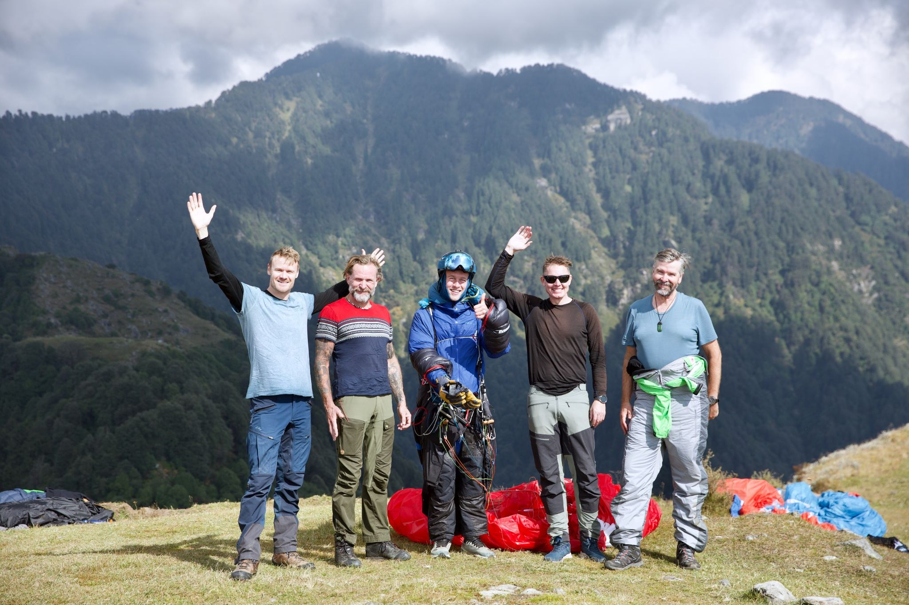

<div class="sesong">Oktober og april</div>
```

::: {.notes}
Rekrutteringssliden. I Loen-decket sto det "Oktober 2024?". Sesongen er
oktober OG april, saa begge staar naa.

Her sier du hva turen krever og hva den ikke krever. Hold det kort: dette er
ikke ekspedisjonsflyging, det er en uke med telt i selen og en fjellkjede som
ikke tar slutt.
:::

